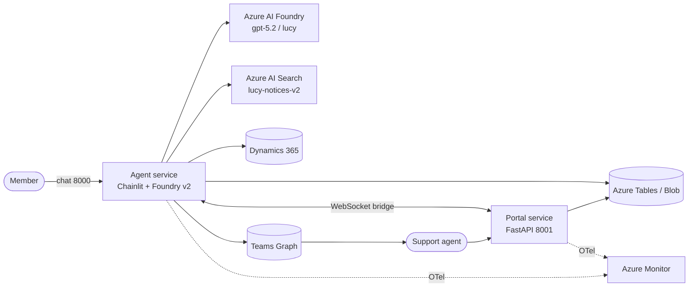

# Lucy — Class-Action Settlement Member-Support Agent

Lucy is a member-support AI assistant for class-action settlements. Settlement-class members chat with Lucy for grounded answers about their notice and claim status; when a question requires a human, Lucy hands the conversation off to an internal support agent through a dedicated portal that bridges to Microsoft Teams. The repository contains both halves of that system: a Chainlit-based agent service and a FastAPI handoff portal.

---

## Architecture in one diagram



A condensed architecture document with full diagrams lives at [`docs/system-architecture.md`](docs/system-architecture.md); the deep-dive is [`docs/architecture/architecture-overview.md`](docs/architecture/architecture-overview.md).

---

## Quickstart

Both services are Python 3.12 applications shipped as independent Docker images.

### 1. Configure environment

Copy each `.env.example` and fill in the values. Production should inject these from Azure Container Apps secrets or Key Vault references rather than committing real secrets.

```bash
cp agent/app/.env.example  agent/app/.env
cp portal/app/.env.example portal/app/.env
```

Critical variables:

- `AZURE_AI_FOUNDRY_PROJECT_ENDPOINT`, `MODEL_DEPLOYMENT_NAME=gpt-5.2`, `FOUNDRY_AGENT_NAME=lucy`, `USE_FOUNDRY_V2=true`
- `AI_SEARCH_INDEX_NAME=lucy-notices-v2`, `SEARCH_QUERY_TYPE=vector_semantic_hybrid`
- `D365_RESOURCE_URL` (+ tenant/client/secret)
- `TEAMS_WEBHOOK_URL`, `AGENT_PORTAL_ENABLED=true`
- `AZURE_STORAGE_CONNECTION_STRING`
- `AGENT_PORTAL_PORT=8001`, `AGENT_PORTAL_API_TOKEN=<strong random>`
- `ENABLE_DEBUG_ENDPOINTS=false` in production

### 2. Build the images

```bash
docker build -t lucy-agent  -f agent/app/Dockerfile  agent/app
docker build -t lucy-portal -f portal/app/Dockerfile portal/app
```

### 3. Run locally

```bash
# Agent: Chainlit chat on 8000, health on 8080
docker run --rm -p 8000:8000 -p 8080:8080 --env-file agent/app/.env  lucy-agent

# Portal: FastAPI on 8001
docker run --rm -p 8001:8001                --env-file portal/app/.env lucy-portal
```

Health endpoints (agent service): `GET /health`, `/health/ready`, `/health/live` on port 8080.

### 4. Run the test suite

```bash
uv run pytest -q
```

Tests live in `agent/tests/` and use Python's stdlib `unittest`. The portal currently has no automated tests.

---

## Repository layout

| Path | Contents |
|---|---|
| `agent/app/` | Chainlit + Foundry v2 agent service (entry: `apex.py`); Dockerfile; `.env.example`; `requirements.txt` |
| `agent/tests/` | unittest suite |
| `portal/app/` | FastAPI handoff/admin portal (entry: `agent_portal.py`); Dockerfile; templates; static assets; `.env.example`; `requirements.txt` |
| `docs/` | Architecture, integration, executive, handoff, and portal-guide documentation |
| `plans/` | Active spec-driven plan files (currently empty/uninitialized) |
| `state/` | `refactor-ledger.md` and other workflow state |
| `.agents/` | Local/custom agent skill workspace |
| `learn/` | Scout reports and autoresearch artifacts |
| `removal/` | Non-runtime artifacts moved out of the runtime surface |
| `AGENTS.md` | Spec-driven workflow contract — mandatory reading |
| `KNOWNS.md` | `knowns` CLI conventions |

---

## Documentation index

### Core (top-level)

| Document | Purpose |
|---|---|
| [`docs/project-overview-pdr.md`](docs/project-overview-pdr.md) | Mission, users, scope, out-of-scope |
| [`docs/codebase-summary.md`](docs/codebase-summary.md) | File inventory, dependencies, build & deploy |
| [`docs/code-standards.md`](docs/code-standards.md) | Module conventions, async, testing |
| [`docs/system-architecture.md`](docs/system-architecture.md) | Condensed architecture with Mermaid diagrams |

### Architecture deep-dive (`docs/architecture/`)

| Document | Purpose |
|---|---|
| [`architecture-overview.md`](docs/architecture/architecture-overview.md) | Full system architecture |
| [`authentication-architecture.md`](docs/architecture/authentication-architecture.md) | Member auth + D365 + learning cache |
| [`foundry-v2-implementation.md`](docs/architecture/foundry-v2-implementation.md) | Assistants → Foundry v2 migration |
| [`foundry-v2-registration-reset-2026-04-17.md`](docs/architecture/foundry-v2-registration-reset-2026-04-17.md) | Runtime ops rules |
| [`human-escalation-architecture.md`](docs/architecture/human-escalation-architecture.md) | Teams escalation flow |
| [`rag-search-architecture.md`](docs/architecture/rag-search-architecture.md) | RAG, hybrid search, OCR, scale |

### Integrations (`docs/integrations/`)

| Document | Purpose |
|---|---|
| [`azure-search-integration.md`](docs/integrations/azure-search-integration.md) | Azure AI Search (`lucy-notices-v2`) detail |
| [`dynamics365-integration.md`](docs/integrations/dynamics365-integration.md) | Dynamics 365 OAuth + entity access |
| [`teams-integration.md`](docs/integrations/teams-integration.md) | Microsoft Teams adaptive cards + Graph |

### Portal & operations

| Document | Purpose |
|---|---|
| [`docs/portal-guide/portal-user-guide.md`](docs/portal-guide/portal-user-guide.md) | Internal support-agent portal walkthrough |
| [`docs/executive/executive-summary.md`](docs/executive/executive-summary.md) | Executive narrative |
| [`docs/executive/system-capabilities-guide.md`](docs/executive/system-capabilities-guide.md) | Capability inventory |

### Handoff & compliance (`docs/handoff/`)

| Document | Purpose |
|---|---|
| [`SOC2_RENEWAL_SUPPORT.md`](docs/handoff/SOC2_RENEWAL_SUPPORT.md) | Compliance review notes |
| [`CRITICAL_ISSUES.md`](docs/handoff/CRITICAL_ISSUES.md) | Open critical items |
| [`DEPLOYMENT_POLICY_BASELINE.md`](docs/handoff/DEPLOYMENT_POLICY_BASELINE.md) | Deployment policy |
| [`GIT_HANDOFF_STRATEGY.md`](docs/handoff/GIT_HANDOFF_STRATEGY.md) | Git handoff strategy |
| [`HANDOFF_CLEANUP_SUMMARY.md`](docs/handoff/HANDOFF_CLEANUP_SUMMARY.md) | Cleanup summary |

---

## Workflow & contributing

This repository follows a **strict spec-driven workflow** defined in [`AGENTS.md`](AGENTS.md). Before any change:

1. Read `state/refactor-ledger.md`.
2. Pick the lowest-numbered incomplete plan in `plans/` (read **exactly one**).
3. Source-of-truth hierarchy: explicit user instruction → `AGENTS.md` → active plan → existing code patterns.
4. Produce a proposal-before-edit brief; make the smallest safe change; run targeted tests; update the ledger.

Scope is bounded to the Lucy go-live refactor (plans 001–005). Bank ingestion, Business Central, model-routing redesign, generalized payout calculator, broader rate-limiting, and Lucy architecture redesign are explicitly out of scope.

For non-runtime assets (deployment tooling, CI/CD, debug scripts, historical reports) see the `removal/` directory — items there were preserved rather than deleted to support a clean client handoff.

---

## License

License terms are governed by the client engagement and are not declared in this repository. Contact the project owner for redistribution and reuse permissions.
