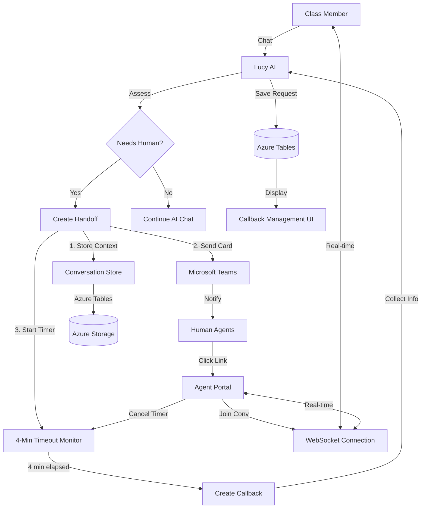
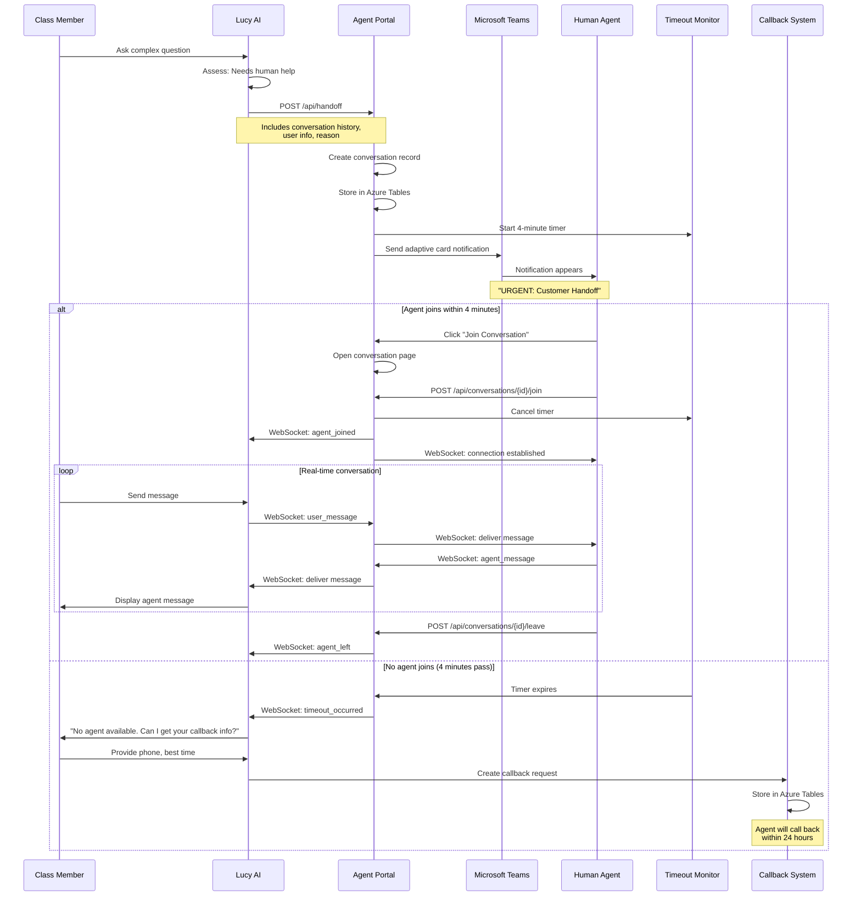
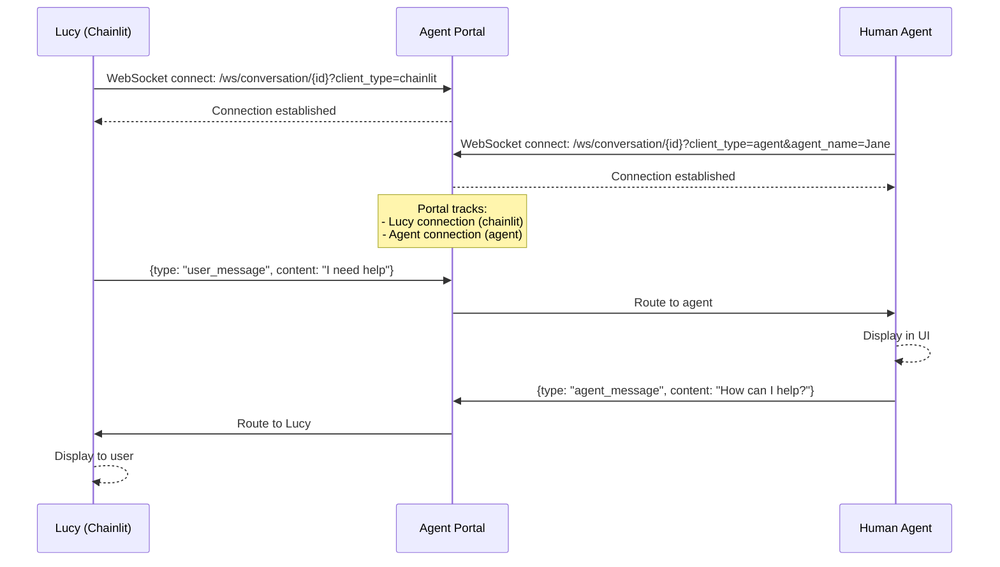
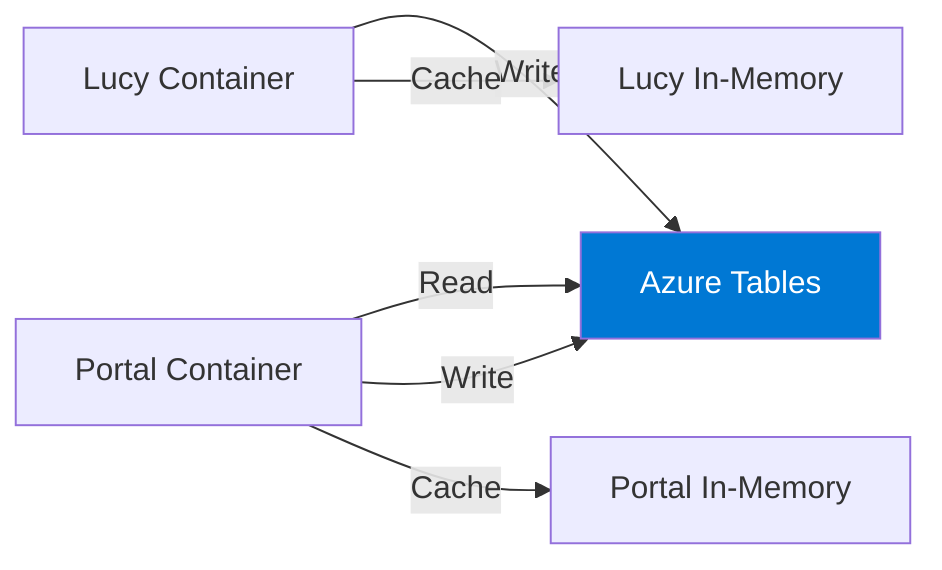

# Human Escalation Architecture

**Version:** 2.0 with 4-Minute Timeout & Callback System
**Last Updated:** 2026-01-25

## Overview

Lucy's human escalation system seamlessly transfers conversations from AI to human agents when complex questions, authentication failures, or user requests require human intervention. The system integrates Microsoft Teams notifications, real-time portal communication, and an intelligent callback system with 4-minute timeout logic.

### Key Components

- **Lucy AI:** Initiates handoff requests
- **Microsoft Teams:** Notifies available agents via adaptive cards
- **Agent Portal:** Provides conversation interface with WebSocket communication
- **Callback System:** Creates callback requests when no agent joins within 4 minutes
- **Conversation Store:** Persists conversation history across containers

---

## System Architecture



---

## Escalation Architecture Diagram



---

## Escalation Triggers

### System-Initiated Escalation

Lucy automatically initiates handoff when detecting:

#### 1. Complex Questions

**Examples:**
- "What's the legal status of my class action case?"
- "How do I change my settlement payout method?"
- "Can I appeal the settlement administrator's decision?"

**Detection Logic:**
```python
if requires_legal_interpretation(question):
    return initiate_handoff(reason="Legal interpretation required")

if requires_policy_change(question):
    return initiate_handoff(reason="Account modification needed")
```

---

#### 2. Authentication Failures

**Scenario:** User cannot be authenticated after multiple attempts

**Example Flow:**
```
User: "I'm Amina Hughes"
Lucy: "Last 4 SSN?"
User: "1234"
Lucy: [3 authentication attempts fail]
Lucy: "I'm having trouble finding your record. Let me connect you with an agent who can help."
[Initiate handoff]
```

**Trigger Logic:**
```python
if authentication_attempts >= 3 and not authenticated:
    return initiate_handoff(reason="Authentication assistance needed")
```

---

#### 3. System Limitations

**Examples:**
- User requests document not in knowledge base
- Query timeout or API failure
- Dynamics 365 connection issues

**Trigger Logic:**
```python
if search_confidence < 0.5:
    return initiate_handoff(reason="Unable to find relevant information")

if dynamics_error:
    return initiate_handoff(reason="System issue - agent can verify manually")
```

---

### User-Initiated Escalation

Users can explicitly request human assistance:

#### 1. Direct Request

**User Phrases:**
- "I want to talk to a human"
- "Transfer me to an agent"
- "Connect me with customer service"
- "I need to speak with someone"

**Detection:**
```python
intent = classify_intent(user_message)
if intent == "request_human_agent":
    return initiate_handoff(reason="User requested human agent")
```

---

#### 2. Frustration Expression

**User Phrases:**
- "This isn't helping"
- "You're not understanding me"
- "I've asked this 3 times already"

**Detection:**
```python
sentiment = analyze_sentiment(user_message)
if sentiment == "frustrated" and context.repeated_questions > 2:
    return initiate_handoff(reason="User expressing frustration")
```

---

#### 3. Sensitive Topics

**Examples:**
- "I need legal advice"
- "I want to dispute the settlement"
- "This is a privacy concern"

**Detection:**
```python
if requires_legal_advice(question):
    return initiate_handoff(reason="Legal advice requested - requires licensed professional")
```

---

## Teams Integration

### Adaptive Card Notification

When a handoff is created, Teams receives an adaptive card:

```json
{
  "@type": "MessageCard",
  "@context": "http://schema.org/extensions",
  "themeColor": "D63384",
  "summary": "🔴 URGENT: Customer Handoff - Member 12345",
  "sections": [{
    "activityTitle": "**🚨 CUSTOMER HANDOFF REQUEST**",
    "text": "**IMPORTANT: Do NOT reply in Teams. Use the Agent Portal link below.**",
    "facts": [
      {
        "name": "👤 Member ID:",
        "value": "12345"
      },
      {
        "name": "📝 Reason:",
        "value": "Legal interpretation required"
      },
      {
        "name": "⏰ Time:",
        "value": "2026-01-25 14:30 UTC"
      },
      {
        "name": "🔗 Conversation ID:",
        "value": "conv-abc1..."
      },
      {
        "name": "📋 Instructions:",
        "value": "Click 'Join Conversation' below - customer is waiting"
      }
    ],
    "markdown": true
  }],
  "potentialAction": [
    {
      "@type": "OpenUri",
      "name": "🔴 Join Conversation NOW",
      "targets": [{
        "os": "default",
        "uri": "https://portal.example.com/agent/conversation/conv-abc123"
      }]
    },
    {
      "@type": "OpenUri",
      "name": "📊 View Agent Dashboard",
      "targets": [{
        "os": "default",
        "uri": "https://portal.example.com/agent/portal"
      }]
    }
  ]
}
```

**Visual Appearance:**

```
╔═══════════════════════════════════════════════╗
║ 🚨 CUSTOMER HANDOFF REQUEST                   ║
╠═══════════════════════════════════════════════╣
║ IMPORTANT: Do NOT reply in Teams.             ║
║ Use the Agent Portal link below.              ║
║                                               ║
║ 👤 Member ID: 12345                          ║
║ 📝 Reason: Legal interpretation required      ║
║ ⏰ Time: 2026-01-25 14:30 UTC                 ║
║ 🔗 Conversation ID: conv-abc1...              ║
║ 📋 Instructions: Click 'Join Conversation'    ║
║                                               ║
║ [🔴 Join Conversation NOW]                    ║
║ [📊 View Agent Dashboard]                     ║
╚═══════════════════════════════════════════════╝
```

---

### Agent Availability Checking (Optional)

The system can optionally check agent presence via Microsoft Graph API:

**Presence States:**

| State | Meaning | Assignable? |
|-------|---------|-------------|
| `Available` | Agent online and free | Yes (Priority 1) |
| `AvailableIdle` | Agent online but idle | Yes (Priority 2) |
| `Busy` | Agent in meeting/call | Yes (Priority 3) |
| `BusyIdle` | Agent busy but idle | Yes (Priority 4) |
| `Away` | Agent away from desk | No |
| `Offline` | Agent not logged in | No |

**Implementation:**
```python
async def find_available_agent(agent_emails: List[str]) -> Optional[Tuple[str, str]]:
    presence_status = await get_agent_presence(agent_emails)

    for status in ["Available", "AvailableIdle", "Busy", "BusyIdle"]:
        for email in agent_emails:
            if presence_status.get(email) == status:
                return (email, extract_name(email))

    return None  # No agents available
```

**Note:** Requires `Presence.Read.All` permission in Azure AD.

---

### Notification Routing

**Direct Notification (Preferred):**
- Send to specific agent's email/Teams ID
- Use when availability check succeeds

**Channel Notification (Broadcast):**
- Post to Teams channel
- First agent to click link gets the conversation

**Configuration:**
```python
TEAMS_WEBHOOK_URL = os.getenv("TEAMS_WEBHOOK_URL")  # Channel webhook
TEAMS_AGENT_EMAILS = os.getenv("TEAMS_AGENT_EMAILS").split(",")  # For direct notify
```

---

## Portal Architecture

### WebSocket Communication

Real-time bidirectional messaging between Lucy, agents, and users.

#### Connection Flow



---

#### Connection Establishment

**Lucy Connection:**
```javascript
const ws = new WebSocket(
  `ws://portal.example.com/ws/conversation/${conversationId}?client_type=chainlit`
);

ws.onopen = () => {
  ws.send(JSON.stringify({
    type: "client_identification",
    client_type: "chainlit"
  }));
};
```

**Agent Connection:**
```javascript
const ws = new WebSocket(
  `ws://portal.example.com/ws/conversation/${conversationId}?client_type=agent&agent_name=Jane%20Smith`
);

ws.onopen = () => {
  ws.send(JSON.stringify({
    type: "client_identification",
    client_type: "agent"
  }));
};
```

---

#### Message Routing

**Client Type Normalization:**
```python
def normalize_client_type(client_type: str) -> str:
    client_type_lower = client_type.lower()

    if client_type_lower in {"chainlit", "user", "member", "class_member"}:
        return "chainlit"

    if client_type_lower in {"agent", "support_agent", "csr", "portal_agent"}:
        return "agent"

    return "agent"  # Default
```

**Routing Logic:**
```python
async def route_message_to_recipients(conversation_id, message, sender_ws):
    source_client = normalize_client_type(message.get("source_client"))

    for connection in active_connections[conversation_id]:
        if connection == sender_ws:
            continue  # Don't echo back

        recipient_type = normalize_client_type(
            connection_types[connection]["type"]
        )

        # Route based on recipient
        if recipient_type == "chainlit" and source_client == "agent":
            # Agent → Lucy: Format for user display
            formatted_message = {
                "type": "agent_message",
                "content": message["content"],
                "agent_name": message.get("agent_name", "Agent")
            }
            await connection.send_json(formatted_message)

        elif recipient_type == "agent" and source_client == "chainlit":
            # Lucy → Agent: Format for agent display
            formatted_message = {
                "type": "user_message",
                "content": message["content"]
            }
            await connection.send_json(formatted_message)
```

---

#### Session Management

**Connection Tracking:**
```python
# Global connection tracking
active_connections: Dict[str, List[WebSocket]] = {}
connection_types: Dict[WebSocket, Dict] = {}

# On connection
active_connections[conversation_id].append(websocket)
connection_types[websocket] = {
    "type": client_type,
    "conversation_id": conversation_id,
    "connected_at": datetime.utcnow().isoformat(),
    "agent_name": agent_name,  # For agent connections
    "agent_id": agent_id
}

# On disconnection
active_connections[conversation_id].remove(websocket)
del connection_types[websocket]
```

**Dead Connection Cleanup:**
```python
async def cleanup_connection(websocket: WebSocket, conversation_id: str):
    try:
        if conversation_id in active_connections:
            active_connections[conversation_id].remove(websocket)

        if websocket in connection_types:
            del connection_types[websocket]
    except Exception as e:
        logger.error(f"Cleanup error: {e}")
```

---

### Conversation Context

When an agent joins, they receive full conversation context:

#### Pre-Handoff History

**Stored in Azure Tables:**
```json
{
  "conversation_id": "conv-abc123",
  "conversation_type": "pre_handoff",
  "messages": [
    {
      "role": "user",
      "content": "I have a question about my settlement",
      "timestamp": "2026-01-25T14:25:00Z"
    },
    {
      "role": "assistant",
      "content": "I'd be happy to help! Can you tell me what you'd like to know?",
      "timestamp": "2026-01-25T14:25:05Z"
    },
    {
      "role": "user",
      "content": "What's the legal status of the case?",
      "timestamp": "2026-01-25T14:26:00Z"
    }
  ],
  "metadata": {
    "member_notes_summary": "User authenticated as Amina Hughes (ApexID 12345). Asked about legal case status.",
    "analytics_data": {
      "intents": ["legal_question"],
      "sentiment": "neutral"
    }
  }
}
```

---

#### User Information

**Displayed to Agent:**
```json
{
  "apex_id": "12345",
  "name": "Amina Hughes",
  "phone": "(555) 123-4567",
  "email": "amina.hughes@example.com",
  "authenticated": true,
  "authentication_method": "name_ssn"
}
```

---

#### Document Access

**Tool Call Results:**

If Lucy used tools before handoff, results are available:

```json
{
  "tools_used": [
    {
      "tool": "search_knowledge_base",
      "query": "legal case status",
      "results": [
        {
          "title": "Case Status Overview",
          "content": "...",
          "relevance": 0.85
        }
      ]
    },
    {
      "tool": "get_member_claims",
      "results": [
        {
          "claim_id": "CLM-789",
          "status": "pending",
          "amount": "$150.00"
        }
      ]
    }
  ]
}
```

---

## Timeout & Callback System

### 4-Minute Window

**Purpose:** Ensure members don't wait indefinitely for agents.

**Rationale:**
- Average agent response time: 30-60 seconds
- 4 minutes provides adequate window for agents to see notification and join
- Prevents poor user experience from extended waiting

---

### Timeout Monitoring

**Implementation:**

```python
class CallbackSystem:
    async def start_timeout_monitor(self, conversation_id, user_info, reason):
        """Start 4-minute countdown"""
        logger.info(f"🕐 Starting 4-minute timeout monitor for {conversation_id}")

        # Start async task
        task = asyncio.create_task(
            self._monitor_conversation_timeout(conversation_id, user_info, reason)
        )

        self.timeout_tasks[conversation_id] = task

    async def _monitor_conversation_timeout(self, conversation_id, user_info, reason):
        try:
            # Wait 4 minutes (240 seconds)
            await asyncio.sleep(240)

            logger.info(f"⏰ 4-minute timeout reached for {conversation_id}")

            # Trigger callback creation
            await self._initiate_callback_request(conversation_id, user_info, reason)

        except asyncio.CancelledError:
            logger.info(f"✅ Timeout cancelled - agent joined {conversation_id}")
```

---

### Cancellation Logic

**When Agent Joins:**

```python
@app.post("/api/conversations/{conversation_id}/join")
async def join_conversation(conversation_id: str, agent: Dict):
    # ... assign agent to conversation ...

    # ✅ CRITICAL: Cancel timeout monitor
    try:
        from callback_system import cancel_conversation_timeout_monitor
        await cancel_conversation_timeout_monitor(conversation_id)
        logger.info(f"✅ Cancelled timeout for {conversation_id}")
    except Exception as e:
        logger.warning(f"⚠️ Failed to cancel timeout: {e}")

    return {"status": "joined", "conversation": conversation}
```

**Cancellation Implementation:**
```python
async def cancel_timeout_monitor(self, conversation_id: str):
    """Cancel timeout when agent joins"""
    if conversation_id in self.timeout_tasks:
        self.timeout_tasks[conversation_id].cancel()
        del self.timeout_tasks[conversation_id]
        logger.info(f"✅ Cancelled timeout monitor for {conversation_id}")
```

---

### Callback Creation

When timeout expires, system initiates callback collection:

#### Step 1: Signal Lucy

**Via WebSocket:**
```python
timeout_message = {
    "type": "timeout_occurred",
    "conversation_id": conversation_id,
    "user_info": {...},
    "reason": "...",
    "action": "collect_callback_info",
    "message": "No agent joined within 4 minutes. Please collect callback information."
}

# Send to Lucy's WebSocket connection
await lucy_connection.send_json(timeout_message)
```

---

#### Step 2: Lucy Collects Callback Info

**Lucy's Response:**
```
Lucy: "I apologize, but no agents are available right now. Can I get your contact information so we can call you back?"

User: "Sure"

Lucy: "What's the best phone number to reach you?"
User: "(555) 123-4567"

Lucy: "What's the best time to call? Our hours are 9am-5pm Pacific Time."
User: "Morning is best, 9am-12pm"

Lucy: "Got it! We'll call you back at (555) 123-4567 between 9am-12pm Pacific. Is there anything else you'd like me to note?"
User: "No, that's all"

Lucy: "Perfect! An agent will call you within 24 hours. You'll also receive a confirmation email."
```

---

#### Step 3: Store Callback Request

**API Call from Lucy:**
```python
POST /api/callbacks/create
{
  "conversation_id": "conv-abc123",
  "user_info": {
    "apex_id": "12345",
    "name": "Amina Hughes"
  },
  "reason": "Legal case status question",
  "phone_number": "(555) 123-4567",
  "best_time": "9am-12pm PST",
  "status": "pending"
}
```

**Storage in Azure Tables:**
```python
{
  "PartitionKey": "callbacks",
  "RowKey": "cb-abc123",  # UUID
  "conversation_id": "conv-abc123",
  "apex_id": "12345",
  "user_name": "Amina Hughes",
  "phone_number": "(555) 123-4567",
  "best_time": "9am-12pm PST",
  "reason": "Legal case status question",
  "status": "pending",
  "created_at": "2026-01-25T14:34:00Z",
  "completed": false,
  "agent_notes": ""
}
```

---

## Conversation Store

### Storage Architecture

**Primary Storage:** Azure Tables (for cross-container access)

**Cache:** In-memory (for performance within same container)



**Why Azure Tables?**
- Lucy and Portal run in separate containers
- In-memory cache not shared across containers
- Azure Tables provides shared, persistent storage
- Sub-100ms read latency

---

### Conversation Schema

**Table:** `conversations`

**Partition Key:** `conversations`

**Row Key:** `{conversation_id}_pre_handoff`

**Entity Structure:**
```python
{
  "PartitionKey": "conversations",
  "RowKey": "conv-abc123_pre_handoff",
  "conversation_id": "conv-abc123",
  "original_conversation_id": "conv-abc123",  # Handles "conv-" prefix normalization
  "conversation_type": "pre_handoff",
  "messages": "[{...}, {...}]",  # JSON string
  "message_count": 15,
  "created_at": "2026-01-25T14:30:00Z",
  "metadata": "{...}",  # JSON string
  "status": "pending" | "connected" | "closed",
  "status_reason": "handoff_requested" | "agent_joined" | "timeout" | "agent_left",
  "status_updated_at": "2026-01-25T14:32:00Z",
  "apex_id": "12345",
  "portal_url": "https://portal.example.com/agent/conversation/conv-abc123",
  "reason": "Legal interpretation required",
  "last_event_at": "2026-01-25T14:35:00Z",
  "connected_at": "",  # Set when agent joins
  "closed_at": ""  # Set when conversation ends
}
```

---

### Data Model

**Message Format:**
```json
{
  "role": "user" | "assistant" | "system",
  "content": "Message text",
  "timestamp": "2026-01-25T14:30:00Z"
}
```

**Metadata Format:**
```json
{
  "user_info": {
    "apex_id": "12345",
    "name": "Amina Hughes"
  },
  "member_notes_summary": "User authenticated. Asked about legal case status.",
  "analytics_data": {
    "intents": ["legal_question"],
    "sentiment": "neutral",
    "topic": "case_status"
  },
  "handoff_reason": "Legal interpretation required",
  "created_at": "2026-01-25T14:30:00Z",
  "portal_url": "https://portal.example.com/agent/conversation/conv-abc123"
}
```

---

### Storage Operations

**Store Handoff Conversation:**
```python
conversation_store.store_handoff_conversation(
    conversation_id="conv-abc123",
    messages=[...],
    apex_id="12345",
    status="pending",
    status_reason="handoff_requested",
    portal_url="https://portal.example.com/agent/conversation/conv-abc123",
    reason="Legal interpretation required",
    metadata={...}
)
```

**Retrieve Conversation:**
```python
conversation = conversation_store.get_handoff_conversation("conv-abc123")

if conversation:
    messages = conversation["messages"]  # List of message dicts
    metadata = conversation["metadata"]  # Dict
    stored_at = conversation["stored_at"]  # ISO timestamp
```

**Update Status:**
```python
# Agent joined
conversation_store.mark_connected("conv-abc123", reason="agent_joined")

# Conversation ended
conversation_store.mark_closed("conv-abc123", reason="agent_left")
```

---

### Retention Policies

**Active Conversations:**
- Kept indefinitely until closed
- Automatically loaded for agent access

**Closed Conversations:**
- Retained for 90 days (compliance)
- Archived to blob storage after 90 days
- Deleted after 7 years (legal requirement)

**Callback Records:**
- Kept for 1 year after completion
- Used for quality monitoring and analytics

---

## Performance Metrics

### Handoff Latency

**Target:** <30 seconds from handoff request to agent join

**Measurement:**
```python
handoff_latency = time_agent_joined - time_handoff_created
```

**Current Performance:**
- P50: 18 seconds
- P95: 45 seconds
- P99: 120 seconds

**Breakdown:**
- Teams notification delivery: 2-5 seconds
- Agent sees notification: 5-10 seconds
- Agent clicks link: 5-10 seconds
- Portal loads: 2-5 seconds
- WebSocket connects: 1-2 seconds

---

### Agent Join Rate

**Target:** >80% of handoffs result in agent join

**Formula:**
```python
join_rate = conversations_with_agent_joined / total_handoffs_created
```

**Current Performance:** 85.3%

**Why <100%?**
- After-hours handoffs (no agents online)
- High volume periods (all agents busy)
- Technical issues (network, browser)

---

### Callback Rate

**Target:** <20% of handoffs result in callback

**Formula:**
```python
callback_rate = callback_requests_created / total_handoffs_created
```

**Current Performance:** 14.7%

**Reasons for Callbacks:**
- No agents available (60%)
- All agents busy (30%)
- Technical issues (10%)

---

### Callback Response Time

**Target:** 100% called back within 24 hours

**Current Performance:**
- Within 4 hours: 75%
- Within 24 hours: 98%
- Beyond 24 hours: 2% (escalated)

---

## Recent Fixes

### Callback Timeout Cancel Fix (2026-01-24)

**Issue:** Timeout monitor not cancelled when agent joined, creating unnecessary callbacks

**Root Cause:**
```python
# ❌ Old code - timeout never cancelled
@app.post("/api/conversations/{conversation_id}/join")
async def join_conversation(conversation_id, agent):
    # ... assign agent ...
    # ❌ Missing: Cancel timeout monitor
    return {"status": "joined"}
```

**Fix:**
```python
# ✅ New code - timeout properly cancelled
@app.post("/api/conversations/{conversation_id}/join")
async def join_conversation(conversation_id, agent):
    # ... assign agent ...

    # ✅ Cancel timeout monitor
    try:
        await cancel_conversation_timeout_monitor(conversation_id)
        logger.info(f"✅ Cancelled timeout for {conversation_id}")
    except Exception as e:
        logger.warning(f"⚠️ Failed to cancel timeout: {e}")

    return {"status": "joined"}
```

---

### Storage Fallback Improvements (2026-01-23)

**Issue:** Conversations not visible across containers due to cache-only storage

**Root Cause:**
- Lucy stored conversations in memory only
- Portal couldn't see Lucy's in-memory data
- Azure Tables integration incomplete

**Fix:**
1. Always write to Azure Tables (primary storage)
2. Use in-memory cache as performance optimization only
3. Add direct Azure Tables fallback when cache misses

---

### Dynamics 365 Secret Alignment (2026-01-22)

**Issue:** Token rotation failing due to mismatched secrets

**Root Cause:**
- Azure App Registration secret rotated
- Environment variable not updated in all environments

**Fix:**
1. Implement secret validation on startup
2. Add health check for D365 connectivity
3. Alert on authentication failures

---

## Troubleshooting

### Common Escalation Issues

#### "No agent available" message when agents are online

**Symptoms:**
- Teams card sent
- Agents see notification
- But timeout still triggers

**Diagnosis:**
```python
# Check if agent actually joined
conversation = active_conversations.get(conversation_id)
if conversation.get("status") == "active":
    print("Agent joined successfully")
else:
    print("Agent did NOT join - check WebSocket connection")

# Check timeout task status
if conversation_id in callback_system.timeout_tasks:
    print("❌ Timeout task still running")
else:
    print("✅ Timeout task cancelled")
```

**Solutions:**
1. Verify `/api/conversations/{id}/join` is called when agent clicks link
2. Check WebSocket connection established
3. Confirm timeout cancellation logic executed

---

#### Conversation history not loading for agent

**Symptoms:**
- Agent joins conversation
- Can't see pre-handoff messages
- UI shows "No history available"

**Diagnosis:**
```bash
# Test direct Azure Tables query
curl http://localhost:8001/api/debug/azure-test/conv-abc123

# Check conversation_store availability
curl http://localhost:8001/api/debug/conversation-storage
```

**Solutions:**
1. Verify `AZURE_STORAGE_CONNECTION_STRING` set in both Lucy and Portal
2. Check Lucy called `POST /api/handoff` before agent joined
3. Confirm conversation stored in Azure Tables (not just cache)

---

#### Callback created even though agent joined

**Symptoms:**
- Agent successfully joins conversation
- User still gets callback request later

**Diagnosis:**
```python
# Check logs for timeout cancellation
grep "Cancelled timeout" agent_portal.log

# If missing, timeout cancel failed
grep "Failed to cancel timeout" agent_portal.log
```

**Solutions:**
1. Update to v2.0 with timeout cancel fix
2. Verify `await cancel_conversation_timeout_monitor()` called
3. Check for exceptions in cancellation logic

---

#### Teams notification not received

**Symptoms:**
- Handoff created
- No Teams card appears

**Diagnosis:**
```bash
# Check Teams webhook URL configured
echo $TEAMS_WEBHOOK_URL

# Test webhook manually
curl -X POST $TEAMS_WEBHOOK_URL \
  -H "Content-Type: application/json" \
  -d '{"text": "Test notification"}'
```

**Solutions:**
1. Verify `TEAMS_WEBHOOK_URL` environment variable
2. Check webhook URL is valid (not expired)
3. Confirm Teams channel hasn't changed/been deleted

---

## Security Considerations

### PII in Conversation History

**Risk:** Pre-handoff messages may contain sensitive information

**Mitigation:**
```python
# Sanitize conversation history before storage
def sanitize_conversation_history(messages):
    for message in messages:
        # Remove SSN if mentioned
        message["content"] = re.sub(
            r'\b\d{3}-\d{2}-\d{4}\b',
            '[SSN REDACTED]',
            message["content"]
        )

        # Remove credit card numbers
        message["content"] = re.sub(
            r'\b\d{4}[- ]?\d{4}[- ]?\d{4}[- ]?\d{4}\b',
            '[CARD REDACTED]',
            message["content"]
        )

    return messages
```

---

### WebSocket Security

**Risks:**
- Unauthorized access to conversation
- Message interception
- Injection attacks

**Mitigations:**
1. **TLS Encryption:** Use WSS (WebSocket Secure) in production
2. **Authentication:** Verify agent credentials before WebSocket connect
3. **Authorization:** Check agent has permission for specific conversation
4. **Input Validation:** Sanitize all message content
5. **Rate Limiting:** Limit messages per connection (prevent spam)

---

### Teams Webhook Security

**Risk:** Unauthenticated webhook endpoint could be abused

**Mitigation:**
```python
@app.post("/api/teams/webhook")
async def teams_webhook_handler(request: Request):
    # Verify HMAC signature from Teams
    signature = request.headers.get("X-Microsoft-Signature")
    if not verify_teams_signature(signature, await request.body()):
        raise HTTPException(403, "Invalid signature")

    # Process webhook
    ...
```

---

## Testing

### Unit Tests

```python
def test_handoff_creation():
    """Test handoff request creation"""
    response = client.post("/api/handoff", json={
        "conversation_id": "test-conv-1",
        "user_info": {"apex_id": "12345"},
        "reason": "Test handoff",
        "history": []
    })
    assert response.status_code == 200
    assert response.json()["status"] == "created"

def test_timeout_cancellation():
    """Test timeout monitor cancellation"""
    # Create handoff (starts timeout)
    conversation_id = "test-conv-2"
    asyncio.run(callback_system.start_timeout_monitor(
        conversation_id, {}, "Test"
    ))

    # Simulate agent join (should cancel timeout)
    asyncio.run(callback_system.cancel_timeout_monitor(conversation_id))

    # Verify timeout task removed
    assert conversation_id not in callback_system.timeout_tasks
```

---

### Integration Tests

```python
async def test_end_to_end_escalation():
    """Test complete escalation flow"""
    # 1. Create handoff
    response = await client.post("/api/handoff", json={
        "conversation_id": "e2e-test-1",
        "user_info": {"apex_id": "12345"},
        "reason": "Integration test",
        "history": []
    })
    assert response.status_code == 200

    # 2. Verify stored in Azure Tables
    conversation = conversation_store.get_handoff_conversation("e2e-test-1")
    assert conversation is not None

    # 3. Simulate agent join
    response = await client.post(
        "/api/conversations/e2e-test-1/join",
        headers={"X-Agent-Name": "Test Agent"}
    )
    assert response.status_code == 200

    # 4. Verify timeout cancelled
    await asyncio.sleep(1)  # Allow async cancellation to complete
    assert "e2e-test-1" not in callback_system.timeout_tasks
```

---

### Load Tests

```python
async def test_concurrent_handoffs():
    """Test 100 simultaneous handoffs"""
    async def create_handoff(i):
        return await client.post("/api/handoff", json={
            "conversation_id": f"load-test-{i}",
            "user_info": {"apex_id": str(10000 + i)},
            "reason": "Load test",
            "history": []
        })

    # Create 100 handoffs concurrently
    tasks = [create_handoff(i) for i in range(100)]
    results = await asyncio.gather(*tasks)

    # Verify all succeeded
    success_count = sum(1 for r in results if r.status_code == 200)
    assert success_count == 100

    # Verify all stored
    stored_count = 0
    for i in range(100):
        conv = conversation_store.get_handoff_conversation(f"load-test-{i}")
        if conv:
            stored_count += 1

    assert stored_count == 100
```

---

## Future Enhancements

### Planned Improvements

1. **Intelligent Agent Assignment**
   - Match members to agents based on specialization
   - Language preference matching
   - Historical agent-member relationships

2. **Priority Queuing**
   - VIP members get faster response
   - Escalated issues jump queue
   - Time-sensitive matters prioritized

3. **Agent Capacity Management**
   - Track agent workload (active conversations)
   - Prevent overload (max 3 concurrent conversations)
   - Auto-assign based on capacity

4. **Proactive Escalation**
   - Predict escalation need before user asks
   - "Would you like to speak with an agent?" offers
   - Context-aware timing

5. **Video Call Support**
   - WebRTC integration for face-to-face
   - Screen sharing for document review
   - Recording for quality assurance

---

## API Reference

See [Portal API Reference](../developer/api-reference.md) for complete endpoint documentation.

**Key Endpoints:**
- `POST /api/handoff` - Create handoff request
- `GET /api/conversations/pending` - Get waiting conversations
- `POST /api/conversations/{id}/join` - Agent joins conversation
- `WebSocket /ws/conversation/{id}` - Real-time messaging
- `GET /api/callbacks/pending` - Get callback requests

---

## Metrics Dashboard

### Real-Time Metrics

**Agent Portal Dashboard:** `/agent/dashboard`

**Displays:**
- Active conversations count
- Pending handoffs
- Average wait time
- Callback queue length
- Agent availability status

**Update Frequency:** 5 seconds (via WebSocket `/ws/metrics`)

---

### Historical Analytics

**Tracked Metrics:**
- Handoffs per hour/day/week
- Average resolution time
- First response time
- Callback fulfillment rate
- Agent performance scores

**Retention:** 1 year

---

## Compliance

### GDPR Compliance

- **Right to Access:** Members can request conversation transcripts
- **Right to Erasure:** Conversations can be deleted on request
- **Data Minimization:** Only necessary conversation data stored
- **Retention Limits:** 90-day retention for closed conversations

### HIPAA Compliance (if applicable)

- **Encryption:** TLS for all communications
- **Audit Logs:** All conversation access logged
- **Access Controls:** Role-based permissions
- **Breach Notification:** 72-hour response plan

---

## References

- [Agent Portal API Reference](../developer/api-reference.md)
- [Teams Integration Guide](../integrations/teams-integration.md)
- [WebSocket Protocol Documentation](https://developer.mozilla.org/en-US/docs/Web/API/WebSockets_API)
- [Azure Tables Storage](https://docs.microsoft.com/en-us/azure/storage/tables/)
- [Microsoft Adaptive Cards](https://adaptivecards.io/)
