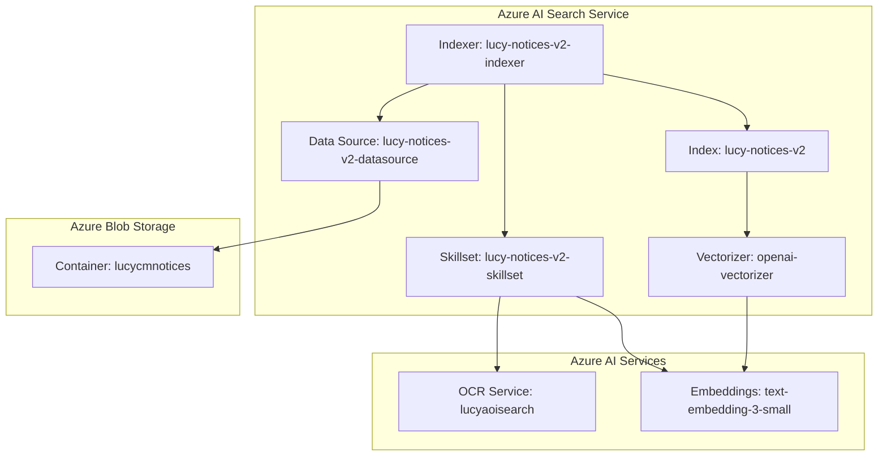
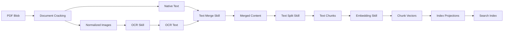
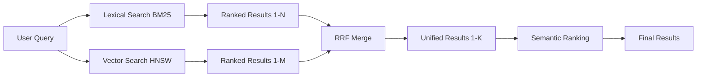
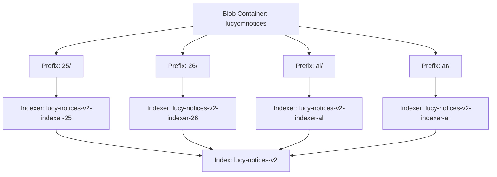

# Lucy RAG & Search Architecture

**Document Version:** 1.0
**Last Updated:** 2026-01-25
**Target Audience:** Data engineers, search specialists, ML engineers
**Status:** Production

---

## Table of Contents

1. [Overview](#overview)
2. [Search Service Architecture](#search-service-architecture)
3. [Data Ingestion Pipeline](#data-ingestion-pipeline)
4. [Skillset Pipeline](#skillset-pipeline)
5. [Vectorization Architecture](#vectorization-architecture)
6. [Index Schema](#index-schema)
7. [Hybrid Search Implementation](#hybrid-search-implementation)
8. [Semantic Ranking](#semantic-ranking)
9. [Parallel Indexing Strategy](#parallel-indexing-strategy)
10. [Search Query Patterns](#search-query-patterns)
11. [Azure AI Search Tool Integration](#azure-ai-search-tool-integration)
12. [Performance Optimization](#performance-optimization)
13. [PDF Retrieval & SAS Generation](#pdf-retrieval--sas-generation)
14. [Monitoring & Observability](#monitoring--observability)
15. [Maintenance Procedures](#maintenance-procedures)
16. [Best Practices](#best-practices)
17. [Known Limitations](#known-limitations)
18. [Future Enhancements](#future-enhancements)

---

## 1. Overview

Lucy's RAG (Retrieval-Augmented Generation) system enables AI-powered search and retrieval of class action settlement notice PDFs for millions of class members. The system combines semantic understanding with keyword precision to deliver accurate, relevant documents.

### What Lucy's RAG System Does

- **Document Retrieval:** Searches millions of PDF notice documents by Apex ID, member name, or semantic content
- **Intelligent Matching:** Uses hybrid search (lexical + vector) with semantic ranking for maximum accuracy
- **OCR Processing:** Extracts text from image-based PDFs for comprehensive searchability
- **Chunk-Based Indexing:** Splits large documents into searchable chunks for precise matching
- **SAS URL Generation:** Provides secure, time-limited access to retrieved PDFs

### Scale

- **Documents:** Millions of PDF settlement notices
- **Sources:** SharePoint → Azure Blob Storage → Azure AI Search
- **Index Size:** 283,007+ blobs (60,685+ matching Apex ID pattern)
- **Processing:** Parallel indexing with prefix-based partitioning
- **Query Performance:** Sub-second hybrid search with semantic ranking

### Why Azure AI Search Was Chosen

**Technical Requirements:**
- Native integration with Azure OpenAI embeddings
- Built-in OCR and document processing
- Hybrid search (keyword + semantic)
- Semantic ranking for query understanding
- Scalable to millions of documents
- RBAC and managed identity support

**Decision Factors:**
- **Integrated Vectorization:** Automated chunking and embedding during indexing
- **Hybrid Search:** Combines BM25 (keyword) with HNSW (vector) for comprehensive recall
- **Semantic Ranking:** ML-based re-ranking trained on Bing's corpus
- **Skillset Pipeline:** OCR, text merge, chunking, and embedding in one pipeline
- **Enterprise Ready:** Azure-native with RBAC, private endpoints, and managed identities

---

## 2. Search Service Architecture

### Service Configuration

**Service Details:**
- **Name:** `ailucyaisearch`
- **Region:** West US
- **Tier:** Standard (S1 equivalent)
- **Index:** `lucy-notices-v2` (primary), `rag-1748449715445` (legacy)
- **Resource Group:** `rg-apex-lucy-prd-01`

**Service Endpoints:**
```
Search Service: https://ailucyaisearch.search.windows.net
Admin API: https://ailucyaisearch.search.windows.net/admin/...
Query API: https://ailucyaisearch.search.windows.net/indexes/{index}/docs/search
```

**Capacity:**
- **Partitions:** Configurable (currently 1)
- **Replicas:** Configurable (currently 1)
- **Search Units:** Partitions × Replicas
- **Max Storage:** 25 GB per partition (Standard tier)

### Components



**Component Relationships:**
1. **Data Source** connects to blob storage container
2. **Indexer** reads from data source and executes skillset
3. **Skillset** calls OCR service and embedding service
4. **Index** stores documents with text and vector fields
5. **Vectorizer** uses same embedding model for queries

---

## 3. Data Ingestion Pipeline

### Blob Storage

**Storage Account Configuration:**
- **Account Name:** `aiagentlucyapex01`
- **Container:** `lucycmnotices` (clean notices-only container)
- **Legacy Container:** `lucyrag` (mixed content, 283,007+ files)
- **Region:** West US
- **Access:** Managed identity (Storage Blob Data Reader)

**Prefix Organization Strategy:**
```
lucycmnotices/
├── 25MAIE001.pdf
├── 25ABOW41.pdf
├── ALBR310.pdf
├── ARGU1361.pdf
└── ...
```

**Naming Convention:**
- **Format:** `{ApexID}.pdf`
- **Apex ID Pattern:** `^[A-Z]{2,4}\\d{2,4}$` (2-4 letters + 2-4 digits)
- **Examples:** `25MAIE001`, `ALBR310`, `ARGU1361`
- **File Extension:** `.pdf` only (enforced by indexer)

**PDF Count and Size:**
- **Total Blobs (lucyrag):** 283,007
- **Apex ID Matches:** 60,685 (21.4%)
- **Non-conforming:** 222,322 (78.6% - mixed extensions/patterns)
- **Average PDF Size:** ~2-3 MB (varies by case)
- **Largest PDFs:** Up to 10+ MB

**Content Types:**
- **Set in Sync Job:** `application/pdf`
- **Blob Metadata:** `content-type: application/octet-stream` (legacy)
- **Index Metadata:** `metadata_content_type: application/pdf`

### SharePoint to Blob Sync

**Sync Job Configuration:**
- **Job Name:** `sharepoint-blob-sync-job`
- **Resource Group:** `ai-lucy-redux`
- **Container App:** Azure Container Apps scheduled job
- **Image:** `sharepoint-blob-sync:v1-20251223-0654`

**Source Configuration:**
```bash
SHAREPOINT_BASE_PATH=Active Cases/Settlements
SHAREPOINT_SITE_URL=https://{tenant}.sharepoint.com/sites/{site}
```

**Per-Case Folder Structure:**
```
Active Cases/Settlements/
└── {Case Name}/
    └── Print/
        └── {Case Name} - Mail Merge/
            ├── 25MAIE001.pdf
            ├── 25MAIE002.pdf
            └── ...
```

**Folder Structure Logic:**
- Base path: `Active Cases/Settlements`
- Per case: `Print/{case_name} - Mail Merge`
- Copies only PDFs from the Mail Merge folder
- Skips cases with missing/non-conforming folders

**Filename Patterns:**
- **Source:** SharePoint filename (includes Apex ID)
- **Destination:** Flat blob path using filename only
- **No Prefixes:** Blob container has no folder structure
- **Apex ID Extraction:** Filename is the Apex ID with `.pdf` extension

**Sync Frequency:**
```bash
# Schedule configuration
schedule: "0 2 * * *"  # Daily at 2 AM UTC
replicaTimeout: 30000  # 8.3 hours max execution
parallelism: 1         # Sequential execution
```

**Performance Optimizations:**
```bash
USE_BLOB_COPY=true              # Server-side copy
COPY_REQUIRES_SYNC=true         # Skip existing blobs
MAX_FILE_WORKERS=16             # Concurrent downloads per case
CASE_BUCKETS=8                  # Sharding for parallel runs
```

**Sync Job Workflow:**
1. Enumerate all cases in `Active Cases/Settlements`
2. For each case:
   - Check if `Print/{case_name} - Mail Merge` exists
   - If missing, log as non-conforming and skip
   - If exists, list all `.pdf` files
3. For each PDF:
   - Check if blob already exists (skip if `COPY_REQUIRES_SYNC=true`)
   - Download from SharePoint (or use server-side copy)
   - Upload to blob storage with content-type `application/pdf`
4. Log summary: cases processed, files copied, skipped, failed

---

## 4. Skillset Pipeline

Lucy's skillset implements a comprehensive OCR + chunking + embedding pipeline for PDF documents.

### Pipeline Overview



### Skillset Configuration

**Skillset Name:** `lucy-notices-v2-skillset`

**Skills Included:**
1. **OCR Skill** - Extract text from images
2. **Text Merge Skill** - Combine OCR text with native PDF text
3. **Text Split Skill** - Chunk merged text into 512-token segments
4. **Azure OpenAI Embedding Skill** - Generate 1536-dim vectors

### OCR Skill

**Purpose:** Extract text from image-based PDFs or embedded images.

**Configuration:**
```json
{
  "@odata.type": "#Microsoft.Skills.Vision.OcrSkill",
  "name": "ocr-skill",
  "context": "/document/normalized_images/*",
  "defaultLanguageCode": "en",
  "detectOrientation": true,
  "inputs": [
    {
      "name": "image",
      "source": "/document/normalized_images/*"
    }
  ],
  "outputs": [
    {
      "name": "text",
      "targetName": "text"
    }
  ]
}
```

**OCR Service:**
- **Resource:** `lucyaoisearch` (Azure AI Services)
- **Region:** West US (must match search service)
- **API:** Azure AI Vision Read API v3.2
- **Billing:** Free tier (20 docs/day per indexer), then billable

**Image Extraction:**
- **Indexer Parameter:** `imageAction: generateNormalizedImagePerPage`
- **Mode:** One normalized image per page (recommended for PDFs)
- **Max Images:** 1,000 per document
- **Normalization:** Resized to 2,000x2,000 pixels (default)

**Output:**
- **Field:** `/document/normalized_images/*/text`
- **Format:** Plain text extracted from each image
- **Encoding:** UTF-8

### Text Merge Skill

**Purpose:** Combine OCR-extracted text with native PDF text, preserving spatial relationships.

**Configuration:**
```json
{
  "@odata.type": "#Microsoft.Skills.Text.MergeSkill",
  "name": "merge-skill",
  "context": "/document",
  "insertPreTag": " ",
  "insertPostTag": " ",
  "inputs": [
    {
      "name": "text",
      "source": "/document/content"
    },
    {
      "name": "itemsToInsert",
      "source": "/document/normalized_images/*/text"
    },
    {
      "name": "offsets",
      "source": "/document/normalized_images/*/contentOffset"
    }
  ],
  "outputs": [
    {
      "name": "mergedText",
      "targetName": "merged_text"
    }
  ]
}
```

**Merge Logic:**
1. Start with native PDF text (`/document/content`)
2. Insert OCR text at positions specified by `contentOffset`
3. Add space before/after inserted text (`insertPreTag`/`insertPostTag`)
4. Output combined text to `/document/merged_text`

**Why Merge:**
- **Native Text:** Fast, accurate for text-layer PDFs
- **OCR Text:** Required for image-only or scanned PDFs
- **Combined:** Maximum coverage across PDF types

### Text Split Skill

**Purpose:** Chunk large documents into 512-token segments with 100-token overlap.

**Configuration:**
```json
{
  "@odata.type": "#Microsoft.Skills.Text.SplitSkill",
  "name": "split-skill",
  "textSplitMode": "pages",
  "maximumPageLength": 512,
  "pageOverlapLength": 100,
  "unit": "azureOpenAITokens",
  "azureOpenAITokenizerParameters": {
    "encoderModelName": "cl100k_base"
  },
  "context": "/document",
  "inputs": [
    {
      "name": "text",
      "source": "/document/merged_text"
    }
  ],
  "outputs": [
    {
      "name": "textItems",
      "targetName": "pages"
    }
  ]
}
```

**Chunking Strategy:**
- **Mode:** `pages` (fixed-size chunks, respects sentence boundaries)
- **Chunk Size:** 512 tokens (recommended for embedding models)
- **Overlap:** 100 tokens (preserves context continuity)
- **Unit:** `azureOpenAITokens` (aligns with embedding model limits)
- **Tokenizer:** `cl100k_base` (GPT-4, text-embedding-3-small)

**Why These Settings:**
- **512 tokens:** Fits within text-embedding-3-small's 8,191 token limit
- **100 token overlap:** Prevents context loss at chunk boundaries
- **Token-based:** More accurate than character-based for RAG
- **Pages mode:** Attempts to break at sentence boundaries for readability

**Output:**
- **Field:** `/document/pages/*` (array of chunks)
- **Format:** Array of text strings
- **Metadata:** `/document/offsets`, `/document/lengths`, `/document/ordinalPositions`

### Embedding Skill

**Purpose:** Generate 1536-dimensional embeddings for each text chunk.

**Configuration:**
```json
{
  "@odata.type": "#Microsoft.Skills.Text.AzureOpenAIEmbeddingSkill",
  "name": "embedding-skill",
  "resourceUri": "{{aoaiEndpoint}}",
  "deploymentId": "text-embedding-3-small",
  "modelName": "text-embedding-3-small",
  "dimensions": 1536,
  "context": "/document/pages/*",
  "inputs": [
    {
      "name": "text",
      "source": "/document/pages/*"
    }
  ],
  "outputs": [
    {
      "name": "embedding",
      "targetName": "chunk_vector"
    }
  ]
}
```

**Embedding Service:**
- **Endpoint:** `https://ai-az-agent-foundry-wus3.openai.azure.com`
- **Deployment:** `text-embedding-3-small`
- **Model:** `text-embedding-3-small` (OpenAI)
- **Dimensions:** 1536 (standard output)
- **Max Input:** 8,191 tokens

**Why text-embedding-3-small:**
- **Quality:** High-quality semantic embeddings
- **Performance:** Fast inference, 8,191 token context
- **Cost:** More economical than text-embedding-3-large
- **Compatibility:** Standard 1536 dimensions (widespread support)
- **Azure OpenAI:** Native integration with Foundry

**Output:**
- **Field:** `/document/pages/*/chunk_vector`
- **Format:** Array of 1536 float32 values (vector)
- **Range:** Normalized to unit length (cosine similarity)

### Skillset Configuration

**Cognitive Services Integration:**
```json
{
  "cognitiveServices": {
    "@odata.type": "#Microsoft.Azure.Search.AIServicesByIdentity",
    "subdomainUrl": "{{AiFoundryEndpoint}}"
  }
}
```

**Index Projections:**
```json
{
  "indexProjections": {
    "selectors": [
      {
        "targetIndexName": "lucy-notices-v2",
        "parentKeyFieldName": "parent_id",
        "sourceContext": "/document/pages/*",
        "mappings": [
          {
            "name": "chunk",
            "source": "/document/pages/*"
          },
          {
            "name": "chunk_vector",
            "source": "/document/pages/*/chunk_vector"
          },
          {
            "name": "title",
            "source": "/document/metadata_storage_name"
          },
          {
            "name": "metadata_storage_path",
            "source": "/document/metadata_storage_path"
          },
          {
            "name": "file_extension",
            "source": "/document/metadata_storage_file_extension"
          }
        ]
      }
    ],
    "parameters": {
      "projectionMode": "skipIndexingParentDocuments"
    }
  }
}
```

**Why skipIndexingParentDocuments:**
- Avoids creating sparse parent documents with no searchable content
- Only indexes enriched chunks (child documents)
- Reduces index size and improves search relevance

**Field Mappings:**
- **chunk:** Text content from chunk
- **chunk_vector:** 1536-dim embedding
- **title:** Original filename (Apex ID)
- **metadata_storage_path:** Blob URL (for SAS generation)
- **file_extension:** `.pdf` (for filtering)

---

## 5. Vectorization Architecture

Lucy implements **integrated vectorization** with separate index-time and query-time vectorization using the same embedding model.

### Index-Time Vectorization

**Process:**
1. **Text Split Skill** chunks merged text into 512-token segments
2. **Embedding Skill** generates vectors for each chunk
3. **Index Projections** store chunks + vectors in index

**Vector Generation:**
- **Happens:** During indexer execution (skillset pipeline)
- **Frequency:** Once per document (or when reindexed)
- **Cost:** Embedding API calls (billed per token)
- **Output:** Pre-computed vectors stored in index

**Advantages:**
- **Query Performance:** Vectors pre-computed, no generation latency
- **Consistency:** All documents use same model/settings
- **Cost Efficiency:** Embedding happens once, not per query

**Disadvantages:**
- **Indexing Time:** Slower initial indexing (embedding is expensive)
- **Storage:** Vectors consume significant index space (1536 × 4 bytes per chunk)
- **Model Updates:** Requires full reindex to change embedding model

### Query-Time Vectorization

**Process:**
1. User submits text query
2. **Vectorizer** converts query text to 1536-dim vector
3. **Vector Search** finds nearest neighbors in index
4. Results returned to application

**Vectorizer Configuration:**
```json
{
  "vectorizers": [
    {
      "name": "openai-vectorizer",
      "kind": "azureOpenAI",
      "azureOpenAIParameters": {
        "resourceUri": "{{aoaiEndpoint}}",
        "deploymentId": "text-embedding-3-small",
        "modelName": "text-embedding-3-small"
      }
    }
  ]
}
```

**Query Example:**
```json
{
  "search": "class action settlement data breach",
  "vectorQueries": [
    {
      "kind": "text",
      "text": "class action settlement data breach",
      "fields": "chunk_vector",
      "k": 10
    }
  ]
}
```

**How It Works:**
1. Search service calls Azure OpenAI API with query text
2. `text-embedding-3-small` generates 1536-dim vector
3. HNSW algorithm finds k=10 nearest neighbors in `chunk_vector` field
4. Results ranked by cosine similarity

**Advantages:**
- **Real-Time:** No need to pre-embed queries
- **Consistent Model:** Guaranteed to match index-time model
- **Automatic:** Application doesn't manage embeddings

**Disadvantages:**
- **Query Latency:** Adds ~50-100ms per query (embedding call)
- **API Costs:** Embedding API call per query
- **Dependency:** Requires Azure OpenAI endpoint availability

### BGE Embeddings (text-embedding-3-small)

**What is text-embedding-3-small:**
- **Provider:** OpenAI (Azure OpenAI)
- **Architecture:** Transformer-based embedding model
- **Dimensions:** 1536 (standard configuration)
- **Max Input:** 8,191 tokens
- **Output:** Normalized vectors (unit length for cosine similarity)

**Why This Model:**
- **Quality:** State-of-the-art semantic embeddings
- **Performance:** Fast inference (<100ms per embedding)
- **Cost:** More economical than text-embedding-3-large
- **Azure Integration:** Native support in Azure AI Search
- **Compatibility:** Standard 1536 dimensions (widespread tooling support)

**Model Characteristics:**
- **Training Data:** Diverse web corpus (text understanding)
- **Similarity Metric:** Cosine similarity (0-1 range after normalization)
- **Normalization:** Vectors normalized to unit length
- **Use Case:** Semantic search, RAG, clustering, classification

**BGE (BAAI General Embedding) Context:**
- BGE is an open-source embedding model family (Hugging Face)
- text-embedding-3-small is an OpenAI proprietary model with similar characteristics
- Both excel at semantic search and text understanding
- Lucy uses OpenAI model for Azure integration and performance

**Vector Dimensions:**
- **1536:** Standard output (1536 float32 values)
- **Storage:** ~6 KB per vector (1536 × 4 bytes)
- **Index Size:** Significant (60,685 chunks × 6 KB = ~364 MB for vectors alone)

**Performance Characteristics:**
- **Embedding Speed:** ~100-200 tokens/sec
- **Batch Processing:** Up to 16 texts per batch
- **Query Latency:** ~50-100ms per query
- **Throughput:** 500K tokens/min (Foundry deployment)

---

## 6. Index Schema

Lucy's index uses chunk-based indexing with parent-child relationships to enable fine-grained search.

### Key Fields

**Document Identifiers:**
```json
{
  "name": "chunk_id",
  "type": "Edm.String",
  "key": true,
  "filterable": true,
  "analyzer": "keyword"
}
```
- **Purpose:** Unique identifier for each chunk
- **Format:** `{parent_id}_pages_{chunk_number}`
- **Example:** `aa1b22c33_pages_0`, `aa1b22c33_pages_1`
- **Auto-Generated:** By index projections

```json
{
  "name": "parent_id",
  "type": "Edm.String",
  "filterable": true
}
```
- **Purpose:** Links chunk to original document
- **Format:** Base64-encoded blob path
- **Example:** `aa1b22c33`
- **Use Case:** Retrieve all chunks from same document

**Content Fields:**
```json
{
  "name": "content",
  "type": "Edm.String",
  "searchable": true,
  "retrievable": true
}
```
- **Purpose:** Chunk text content (512 tokens)
- **Source:** `/document/pages/*` from Text Split skill
- **Searchable:** Full-text search (BM25)
- **Retrievable:** Returned in search results

```json
{
  "name": "chunk",
  "type": "Edm.String",
  "searchable": true,
  "retrievable": true
}
```
- **Purpose:** Alias for content (legacy compatibility)
- **Same as:** `content` field

**Title Fields:**
```json
{
  "name": "title",
  "type": "Edm.String",
  "searchable": true,
  "filterable": true,
  "retrievable": true
}
```
- **Purpose:** Document title (Apex ID filename)
- **Source:** `/document/metadata_storage_name`
- **Example:** `25MAIE001.pdf`
- **Use Case:** Exact Apex ID matching

**File Extension:**
```json
{
  "name": "file_extension",
  "type": "Edm.String",
  "filterable": true,
  "retrievable": true
}
```
- **Purpose:** Filter for PDF-only results
- **Value:** `.pdf`
- **Source:** `/document/metadata_storage_file_extension`
- **Critical:** Enables defensive PDF-only filtering

**Vector Field:**
```json
{
  "name": "chunk_vector",
  "type": "Collection(Edm.Single)",
  "searchable": true,
  "retrievable": false,
  "dimensions": 1536,
  "vectorSearchProfile": "vector-profile-hnsw"
}
```
- **Purpose:** 1536-dimensional embedding for semantic search
- **Source:** `/document/pages/*/chunk_vector` from Embedding skill
- **Searchable:** Vector search (HNSW)
- **Not Retrievable:** Vectors not returned (only used for ranking)
- **Profile:** Uses HNSW algorithm with cosine similarity

### Metadata Fields

**Storage Path:**
```json
{
  "name": "metadata_storage_path",
  "type": "Edm.String",
  "retrievable": true
}
```
- **Purpose:** Blob URL (for SAS generation)
- **Format:** `https://{account}.blob.core.windows.net/{container}/{filename}`
- **Example:** `https://aiagentlucyapex01.blob.core.windows.net/lucycmnotices/25MAIE001.pdf`
- **Use Case:** Generate SAS URL for PDF download

**Storage Name:**
```json
{
  "name": "metadata_storage_name",
  "type": "Edm.String",
  "searchable": true,
  "filterable": true,
  "retrievable": true
}
```
- **Purpose:** Blob filename (Apex ID)
- **Example:** `25MAIE001.pdf`
- **Use Case:** Exact filename matching

**Content Type:**
```json
{
  "name": "metadata_content_type",
  "type": "Edm.String",
  "retrievable": true
}
```
- **Value:** `application/pdf`
- **Source:** Blob content-type header

**Last Modified:**
```json
{
  "name": "metadata_storage_last_modified",
  "type": "Edm.DateTimeOffset",
  "filterable": true,
  "sortable": true,
  "retrievable": true
}
```
- **Purpose:** Blob last modified timestamp
- **Format:** ISO 8601 (`2026-01-02T00:00:00Z`)
- **Use Case:** Change detection, freshness filtering

### Filterable/Searchable Configuration

**Filterable Fields:**
- `chunk_id` (key, for exact lookups)
- `parent_id` (retrieve all chunks from same doc)
- `title` (Apex ID exact match)
- `file_extension` (PDF-only filtering)
- `metadata_storage_name` (filename exact match)
- `metadata_storage_last_modified` (date range filtering)

**Searchable Fields:**
- `content` / `chunk` (full-text search on chunk text)
- `title` (full-text search on filename)
- `metadata_storage_name` (full-text search on filename)

**Retrievable Fields:**
- All fields except `chunk_vector` (vectors not returned in results)
- Used to construct response with PDF metadata

**Not Filterable:**
- `chunk_vector` (vector fields cannot be filtered in Azure AI Search)
- Use adjacent metadata fields for filtering, then vector search

### Custom Fields

**Lucy-Specific Fields:**
- `file_extension` - Added 2026-01-13 for defensive PDF filtering
- `parent_id` - Links chunks to parent documents
- `chunk_id` - Unique chunk identifier

**Standard Azure Fields:**
- All `metadata_*` fields auto-populated by blob indexer
- `content` auto-populated from document cracking

---

## 7. Hybrid Search Implementation

Lucy uses **hybrid search** to combine lexical (keyword) precision with semantic (vector) understanding.

### Parallel Execution

**How It Works:**



**Execution Steps:**
1. User query: `"class action settlement data breach"`
2. **Lexical Search:**
   - Full-text search on `content`, `title` fields
   - BM25 algorithm (keyword matching)
   - Returns top N results (default: 1,000)
3. **Vector Search:**
   - Vectorizer converts query to 1536-dim vector
   - HNSW finds k=10 nearest neighbors in `chunk_vector`
   - Returns top M results (k=10)
4. **RRF Merge:**
   - Combines lexical + vector results
   - Reciprocal Rank Fusion (RRF) algorithm
   - Produces unified ranked list
5. **Semantic Ranking:**
   - Re-ranks top 50 results using ML model
   - Returns final top K results (default: 10)

**Execution Count:**
```
Execution Count = 1 (lexical) + V (vector queries)

Example:
- Full-text + 1 vector query = 2 executions
- Full-text + 2 vector queries = 3 executions
```

### Lexical Search (BM25)

**Algorithm:** Okapi BM25 (Best Match 25)

**How It Works:**
1. **Term Frequency (TF):** How often does term appear in document?
   - Higher frequency = higher relevance
   - Diminishing returns (log scaling)
2. **Inverse Document Frequency (IDF):** How rare is term across corpus?
   - Rare terms = higher weight
   - Common terms (stopwords) = lower weight
3. **Document Length Normalization:** Adjust for document size
   - Prevents bias toward long documents

**BM25 Formula:**
```
BM25(q, d) = Σ IDF(qi) × (f(qi, d) × (k1 + 1)) / (f(qi, d) + k1 × (1 - b + b × (|d| / avgdl)))

Where:
- q = query terms
- d = document
- f(qi, d) = term frequency of qi in d
- IDF(qi) = log((N - df(qi) + 0.5) / (df(qi) + 0.5))
- k1 = term frequency saturation (default: 1.2)
- b = length normalization (default: 0.75)
- |d| = document length
- avgdl = average document length in corpus
```

**Score Range:**
- **Unbounded:** No upper limit (can exceed 100 for highly relevant docs)
- **Typical Range:** 0-50 for most queries
- **High Scores:** Indicate strong keyword match

**Applies to:**
- All fields marked `searchable: true`
- Lucy: `content`, `chunk`, `title`, `metadata_storage_name`

### Vector Search (HNSW)

**Algorithm:** Hierarchical Navigable Small World (HNSW)

**How It Works:**
1. **Indexing:**
   - Builds multi-layer graph of nearest neighbors
   - Each layer has different granularity
   - Top layer: coarse navigation
   - Bottom layer: fine-grained search
2. **Query:**
   - Start at top layer, find approximate neighbors
   - Traverse down layers, refining candidates
   - Bottom layer: return k nearest neighbors
3. **Distance Metric:**
   - **Cosine Similarity:** Measures angle between vectors
   - **Range:** -1 (opposite) to 1 (identical)
   - **Normalized:** Lucy vectors normalized to unit length (0.333-1.0 range)

**HNSW Parameters:**
```json
{
  "hnswParameters": {
    "m": 4,
    "efConstruction": 400,
    "efSearch": 100,
    "metric": "cosine"
  }
}
```

**Parameter Tuning:**
- **m:** Bi-directional links per node (default: 4)
  - Higher = better recall, more memory
  - Range: 4-10
- **efConstruction:** Candidate list size during indexing (default: 400)
  - Higher = better index quality, slower indexing
  - Range: 100-1,000
- **efSearch:** Candidate list size during search (default: 100)
  - Higher = better recall, slower queries
  - Range: 100-1,000
- **metric:** `cosine` (recommended for text embeddings)

**Score Range:**
- **Cosine Similarity:** 0.333-1.0 (after normalization)
- **Typical Range:** 0.4-0.6 for relevant results
- **High Scores (>0.7):** Very similar semantic content

### RRF (Reciprocal Rank Fusion) Ranking

**Purpose:** Merge lexical and vector results into unified ranking.

**Formula:**
```
RRF_score(d) = Σ (1 / (rank_i(d) + k))

Where:
- d = document
- rank_i(d) = position of d in result set i (1-indexed)
- k = constant (recommended: 60)
```

**How It Works:**

**Example:**

| Document | Lexical Rank | Vector Rank | RRF Score |
|----------|--------------|-------------|-----------|
| Doc A    | 1            | 3           | 1/(1+60) + 1/(3+60) = 0.0164 + 0.0159 = **0.0323** |
| Doc B    | 2            | 1           | 1/(2+60) + 1/(1+60) = 0.0161 + 0.0164 = **0.0325** |
| Doc C    | 5            | 2           | 1/(5+60) + 1/(2+60) = 0.0154 + 0.0161 = **0.0315** |

**Final Ranking:** Doc B > Doc A > Doc C

**Process:**
1. Lexical search ranks documents by BM25 score
2. Vector search ranks documents by cosine similarity
3. For each document:
   - Compute reciprocal of rank in each result set
   - Sum across all result sets
4. Re-rank by combined RRF score

**Why RRF:**
- **Score-Agnostic:** Uses ranks, not raw scores (avoids scale mismatch)
- **Robust:** Works when lexical and vector scores have different ranges
- **Simple:** Single constant (k=60), no tuning required
- **Effective:** Outperforms weighted averages in practice

**Score Ranges:**

| Method | Algorithm | Score Range |
|--------|-----------|-------------|
| Full-text | BM25 | No upper limit (0-50 typical) |
| Vector | HNSW | 0.333-1.0 (cosine) |
| **Hybrid (RRF)** | **RRF** | **~0.01-0.03 typical** |
| Semantic ranking | Semantic Ranker | 0.0-4.0 |

**Important:** Low RRF scores (0.01-0.03) are **normal and indicate good results**. RRF combines rankings, not raw similarity scores.

### Query Parameters

**top Parameter:**
```json
{
  "top": 10
}
```
- **Purpose:** Number of results returned to application
- **Default:** 50
- **Lucy:** 10 (sufficient for RAG retrieval)
- **Applies to:** Final unified result set (after RRF + semantic ranking)

**k Parameter (Vector Search):**
```json
{
  "vectorQueries": [
    {
      "kind": "text",
      "text": "query",
      "fields": "chunk_vector",
      "k": 10
    }
  ]
}
```
- **Purpose:** Number of nearest neighbors for vector search
- **Default:** 50
- **Lucy:** 10 (sufficient for hybrid merge)
- **Microsoft Recommendation:** k=50 for semantic ranking (more candidates)
- **Separate from:** RRF's k constant (60)

**Other Parameters:**
```json
{
  "searchFields": "content,title",
  "select": "chunk_id,parent_id,content,title,metadata_storage_path",
  "$filter": "file_extension eq '.pdf'",
  "maxTextRecallSize": 1000
}
```
- **searchFields:** Limit full-text search to specific fields (performance)
- **select:** Return only needed fields (reduces payload size)
- **$filter:** Filter results by metadata (PDF-only)
- **maxTextRecallSize:** Increase lexical result count (default: 1,000)

### When to Use Hybrid vs. Pure Vector

**Use Hybrid Search When:**
- ✅ Users search with specific terms (Apex IDs, legal citations)
- ✅ Need both keyword accuracy and semantic relevance
- ✅ Content has metadata and structured text
- ✅ Want maximum recall across diverse query types
- ✅ **Lucy's Use Case:** Settlement notices with Apex IDs, names, legal terms

**Use Pure Vector Search When:**
- Queries are purely semantic/conceptual ("find similar documents")
- Similarity searches on embeddings
- Exact keywords matter less than meaning
- Fast, low-latency retrieval critical (skip lexical search)

**Use Pure Lexical Search When:**
- Exact keyword matching required (legal citations, product codes)
- No embedding model available
- Low-latency critical (skip vectorization)

**Lucy's Rationale:**
- **Apex ID Lookups:** Require exact keyword matching (lexical)
- **Name Searches:** Benefit from fuzzy matching (lexical + semantic)
- **Content Searches:** Require semantic understanding (vector)
- **Hybrid:** Best of both worlds for class member support

---

## 8. Semantic Ranking

Semantic ranking re-ranks the top 50 initial results using a machine learning model trained on Bing's query corpus.

### What It Is

**Purpose:** Improve precision by understanding natural language queries and extracting relevant passages.

**Method:**
1. Hybrid search returns top results (lexical + vector merged by RRF)
2. Semantic ranker analyzes top 50 results
3. ML model (trained on Bing's data) assigns semantic scores
4. Results re-ranked by semantic score
5. Optionally extracts captions and answers from documents

**Scope:**
- **Only re-ranks top 50:** Takes initial hybrid results, improves ranking
- **Does not retrieve new documents:** Operates on existing result set
- **Does not generate text:** Extracts verbatim content (not LLM-generated)

**Important Limitation:** Extracts content verbatim. For generated responses, use RAG patterns with LLMs (Azure OpenAI).

### Semantic Configurations

Must be predefined in index schema.

**Lucy's Configuration:**
```json
{
  "semantic": {
    "configurations": [
      {
        "name": "lucy-notices-v2-semantic",
        "prioritizedFields": {
          "titleField": {
            "fieldName": "title"
          },
          "prioritizedContentFields": [
            {
              "fieldName": "content"
            }
          ],
          "prioritizedKeywordsFields": []
        }
      }
    ]
  }
}
```

**Field Types:**
- **titleField:** Document title (1 field max)
  - Lucy: `title` (Apex ID filename)
  - Higher weight in semantic ranking
- **prioritizedContentFields:** Main content (5 fields max)
  - Lucy: `content` (chunk text)
  - Used for caption/answer extraction
- **prioritizedKeywordsFields:** Keywords/tags (5 fields max)
  - Lucy: None (no keyword fields)
  - Optional metadata fields

**Field Limit:** Combined total of 2,000 tokens (~20,000 characters) across all semantic configuration fields.

**Why This Limit:**
- Semantic ranker has fixed context window
- For larger documents, use chunking (Lucy: 512 tokens per chunk)

### Query Parameters

**Using queryType=semantic:**
```json
{
  "search": "class action settlement data breach",
  "queryType": "semantic",
  "semanticConfiguration": "lucy-notices-v2-semantic",
  "captions": "extractive|highlight-true",
  "answers": "extractive|count-3",
  "top": 10
}
```

**Parameters:**
- **queryType:** `semantic` (enables semantic ranking)
- **semanticConfiguration:** Name of predefined config
- **captions:** `extractive|highlight-true` (extract relevant passages)
- **answers:** `extractive|count-3` (extract up to 3 answers)
- **top:** Number of results returned (default: 50)

**Using semanticQuery (advanced):**
```json
{
  "search": "Description:legal",
  "semanticQuery": "settlement notices data breach",
  "queryType": "full",
  "semanticConfiguration": "lucy-notices-v2-semantic"
}
```
- **search:** Structured query with field syntax
- **semanticQuery:** Natural language query for semantic ranking
- **Allows:** Complex lexical query + semantic ranking on plain text

### When to Use Semantic Ranking

**✅ Good Use Cases:**
- Natural language queries ("Where can I find settlement notices about data breaches?")
- Queries with rich textual descriptions
- Need captions or extracted answers
- Hybrid search combining keyword and vector
- **Lucy:** All user queries (improves precision for name/content searches)

**❌ Avoid Semantic Ranking When:**
- Empty/wildcard queries (`search=*`) - no relevance to measure
- Filter-only queries - must include searchable terms
- OrderBy clauses - sorting overrides semantic scores (HTTP 400 error)
- Queries with complex operators - use plain text only with `queryType=semantic`

**Lucy's Usage:**
- Enabled for all queries (after hybrid search)
- Improves precision for ambiguous names (e.g., "John Smith")
- Helps with semantic content searches ("find notices about settlement")

### Response Structure

**Semantic Ranking Fields:**
```json
{
  "@search.score": 0.0323,
  "@search.rerankerScore": 2.58,
  "@search.captions": [
    {
      "text": "This is a settlement notice for the class action...",
      "highlights": "This is a <strong>settlement notice</strong> for the <strong>class action</strong>..."
    }
  ],
  "@search.answers": [
    {
      "text": "The settlement notice is available for members of the class...",
      "highlights": "The <strong>settlement notice</strong> is available...",
      "score": 0.934
    }
  ]
}
```

**Field Meanings:**
- **@search.score:** Original hybrid (RRF) score
- **@search.rerankerScore:** Semantic ranking score (0.0-4.0)
- **@search.captions:** Extracted relevant passages (up to 5 per document)
- **@search.answers:** Extracted answers (up to 10 total across all documents)

**Score Interpretation:**
- **High rerankerScore (>2.5):** Strong semantic relevance
- **Low rerankerScore (<1.0):** Weak semantic match (consider filtering)

### Performance Expectations

**Throughput:**
- **Max Concurrent Queries:** 10 per replica
- **Throttling:** Returns HTTP 202 `Partial Content` + `CapacityOverloaded` reason if at capacity
- **Fallback:** Lexical/hybrid results still returned (graceful degradation)

**Latency:**
- **Additional Latency:** +50-150ms per query (semantic ranking overhead)
- **Total Query Time:** ~200-400ms (hybrid + semantic)

**Token Budget:**
- **Max Tokens:** 2,000 tokens across semantic configuration fields
- **Lucy:** ~512 tokens per chunk (well within limit)

**Quality Improvement:**
- **Precision Gain:** 10-30% improvement in P@10 (precision at top 10)
- **Recall:** No change (operates on existing result set)

---

## 9. Parallel Indexing Strategy

Lucy uses prefix-based parallel indexing to process millions of PDFs faster than sequential indexing.

### Problem

**Challenge:**
- **Millions of PDFs:** 283,007+ blobs in `lucyrag`, 60,685+ conforming to Apex ID pattern
- **Indexer Execution Limit:** 120 minutes (2 hours) per run on newer services
- **Sequential Processing:** Single indexer processes blobs one-by-one
- **Enumeration Time:** Listing millions of blobs can take hours before processing starts
- **Initial Indexing:** Can take days to weeks for full corpus

**Example:**
- Single indexer: 283,007 blobs / 60 blobs/min = 4,717 minutes (78.6 hours = 3.3 days)
- With 120-minute limit: 40+ runs required (with scheduling delays)

### Solution: Prefix Indexers

**Strategy:** Partition blobs into multiple virtual folders and create parallel indexers.

**Implementation:**



**Partitioning Approaches:**

**1. Prefix-Based (Lucy):**
```
lucycmnotices/
├── 25*.pdf → Indexer 1 (prefix "25")
├── 26*.pdf → Indexer 2 (prefix "26")
├── al*.pdf → Indexer 3 (prefix "al")
├── ar*.pdf → Indexer 4 (prefix "ar")
└── ...
```

**2. Virtual Folders (Alternative):**
```
lucycmnotices/
├── partition-0/*.pdf → Indexer 1
├── partition-1/*.pdf → Indexer 2
├── partition-2/*.pdf → Indexer 3
└── ...
```

**3. Multiple Containers (Alternative):**
```
lucycmnotices-0/*.pdf → Indexer 1
lucycmnotices-1/*.pdf → Indexer 2
lucycmnotices-2/*.pdf → Indexer 3
```

### Implementation

**Data Source Configuration:**
```json
{
  "name": "lucy-notices-v2-datasource-25",
  "type": "azureblob",
  "credentials": {
    "connectionString": "{{storageConnectionString}}"
  },
  "container": {
    "name": "lucycmnotices",
    "query": "25"
  }
}
```

**Query Parameter:**
- **Purpose:** Virtual folder prefix (filters blobs)
- **Example:** `"query": "25"` → only blobs starting with "25"
- **Format:** String prefix (case-sensitive)

**Indexer Naming Convention:**
```
lucy-notices-v2-indexer-{prefix}

Examples:
- lucy-notices-v2-indexer-25
- lucy-notices-v2-indexer-26
- lucy-notices-v2-indexer-al
- lucy-notices-v2-indexer-ar
```

**Prefix Selection:**
- **Apex ID Pattern:** `^[A-Z]{2,4}\\d{2,4}$`
- **Common Prefixes:** `25`, `26`, `al`, `ar`, `ca`, etc.
- **Distribution:** Analyze blob distribution to balance partitions
- **Example Distribution:**
  - `25*`: ~5,000 blobs
  - `26*`: ~4,500 blobs
  - `al*`: ~3,000 blobs
  - `ar*`: ~2,500 blobs

**Balancing Partitions:**
```bash
# Count blobs by prefix
az storage blob list \
  --account-name aiagentlucyapex01 \
  --container-name lucycmnotices \
  --query "[].name" \
  | grep -c "^25"

# Goal: ~5,000-10,000 blobs per partition
```

### Coordination Strategy

**Parallel Execution:**
1. **Create N indexers** (one per prefix)
2. **All target same index** (`lucy-notices-v2`)
3. **Schedule simultaneously** (PT1H schedule, staggered start times)
4. **Independent execution** (no coordination required)

**Schedule Staggering:**
```json
{
  "schedule": {
    "interval": "PT1H",
    "startTime": "2026-01-01T00:00:00Z"  // Indexer 1
  }
}

{
  "schedule": {
    "interval": "PT1H",
    "startTime": "2026-01-01T00:05:00Z"  // Indexer 2 (5 min offset)
  }
}

{
  "schedule": {
    "interval": "PT1H",
    "startTime": "2026-01-01T00:10:00Z"  // Indexer 3 (10 min offset)
  }
}
```

**Why Stagger:**
- Reduces peak load on Azure AI Search service
- Avoids throttling when multiple indexers start simultaneously
- Spreads OCR API calls over time

### Progress Monitoring

**Individual Indexer Status:**
```bash
# Check indexer status
curl -X GET "https://ailucyaisearch.search.windows.net/indexers/lucy-notices-v2-indexer-25/status?api-version=2024-07-01" \
  -H "api-key: {{admin-key}}"
```

**Response:**
```json
{
  "status": "running",
  "lastResult": {
    "status": "inProgress",
    "itemsProcessed": 3247,
    "itemsFailed": 0,
    "warnings": [],
    "startTime": "2026-01-25T10:00:00Z",
    "endTime": null
  }
}
```

**Aggregate Progress:**
```bash
# Sum itemsProcessed across all indexers
curl -X GET "https://ailucyaisearch.search.windows.net/indexers?api-version=2024-07-01" \
  -H "api-key: {{admin-key}}" \
  | jq '.value[] | select(.name | startswith("lucy-notices-v2-indexer-")) | .lastResult.itemsProcessed' \
  | awk '{sum+=$1} END {print sum}'
```

**Completion Detection:**
```bash
# Check if all indexers complete
# When itemsProcessed = 0 and status = success, indexer is caught up
```

### Performance Gains

**Sequential vs. Parallel:**

| Approach | Indexers | Execution | Time to Complete |
|----------|----------|-----------|------------------|
| Sequential | 1 | 283,007 blobs @ 60/min | 78.6 hours (3.3 days) |
| Parallel (8) | 8 | 35,375 blobs/indexer @ 60/min | 9.8 hours |
| Parallel (16) | 16 | 17,688 blobs/indexer @ 60/min | 4.9 hours |

**Assumptions:**
- Processing rate: 60 blobs/min per indexer (with OCR)
- No throttling (sufficient search units)
- Balanced partitions (equal blob distribution)

**Actual Performance:**
- **Lucy:** 8 sharded executions (CASE_BUCKETS=8, CASE_BUCKET=0..7)
- **Sync Job:** Parallel catch-up across cases
- **Indexer:** Multiple prefix indexers (TBD - not yet implemented)

---

## 10. Search Query Patterns

Lucy implements multiple search strategies optimized for different query types.

### ApexID Lookup (Primary Use Case)

**User Intent:** "I need my notice. My Apex ID is 25MAIE001."

**Query Strategy:**
1. **Exact Filename Match:**
   ```json
   {
     "search": "25MAIE001.pdf",
     "searchFields": "metadata_storage_name",
     "$filter": "file_extension eq '.pdf'",
     "top": 1
   }
   ```

2. **If No Results, Try Content Search:**
   ```json
   {
     "search": "25MAIE001",
     "searchFields": "content,metadata_storage_name",
     "vectorQueries": [
       {
         "kind": "text",
         "text": "25MAIE001",
         "fields": "chunk_vector",
         "k": 10
       }
     ],
     "$filter": "file_extension eq '.pdf'",
     "queryType": "semantic",
     "semanticConfiguration": "lucy-notices-v2-semantic",
     "top": 10
   }
   ```

3. **If Still No Results, Extended Search:**
   ```json
   {
     "search": "John Smith 12345",
     "searchFields": "content",
     "vectorQueries": [
       {
         "kind": "text",
         "text": "John Smith address city state zip",
         "fields": "chunk_vector",
         "k": 10
       }
     ],
     "$filter": "file_extension eq '.pdf'",
     "queryType": "semantic",
     "semanticConfiguration": "lucy-notices-v2-semantic",
     "top": 10
   }
   ```

**Why This Order:**
1. **Filename first:** Fastest, most accurate for Apex ID lookups
2. **Content second:** Handles PDFs where Apex ID is in text but not filename
3. **Extended last:** Fallback for ambiguous cases (uses member data from Dynamics)

**Filter Strategy:**
```json
{
  "$filter": "file_extension eq '.pdf'"
}
```
- **Why:** Defensive filter to exclude non-PDF noise (CSV, XLSX, ZIP)
- **Fallback:** If filter fails (schema issue), retry without filter
- **Post-Processing:** `_filter_pdf_results()` validates extensions as final safeguard

**Lucy Implementation:**
```python
# Find notice for user (from user_functions.py)
async def find_notice_for_user(apex_id: str) -> Dict:
    # 1. Try exact filename match
    results = search_client.search(
        search_text=f"{apex_id}.pdf",
        search_fields=["metadata_storage_name"],
        filter="file_extension eq '.pdf'",
        top=1
    )

    if results:
        return results[0]

    # 2. Try content search with Apex ID
    results = search_client.search(
        search_text=apex_id,
        search_fields=["content", "metadata_storage_name"],
        vector_queries=[{
            "kind": "text",
            "text": apex_id,
            "fields": "chunk_vector",
            "k": 10
        }],
        filter="file_extension eq '.pdf'",
        query_type="semantic",
        semantic_configuration_name="lucy-notices-v2-semantic",
        top=10
    )

    if results:
        return results[0]

    # 3. Extended fallback (member name + address)
    member = await get_member_details(apex_id)
    results = search_client.search(
        search_text=f"{member['full_name']} {member['zip']}",
        search_fields=["content"],
        vector_queries=[{
            "kind": "text",
            "text": f"{member['full_name']} {member['address']}",
            "fields": "chunk_vector",
            "k": 10
        }],
        filter="file_extension eq '.pdf'",
        query_type="semantic",
        semantic_configuration_name="lucy-notices-v2-semantic",
        top=10
    )

    return results[0] if results else None
```

### Fuzzy Search

**User Intent:** "Find my notice, Apex ID is 25MAIE01" (typo: missing last digit)

**Query Strategy:**
```json
{
  "search": "25MAIE01~",
  "searchFields": "metadata_storage_name",
  "queryType": "full",
  "searchMode": "any",
  "$filter": "file_extension eq '.pdf'",
  "top": 10
}
```

**Fuzzy Operators:**
- **`~`:** Edit distance (Levenshtein distance 1-2)
  - Example: `25MAIE01~` matches `25MAIE001`, `25MAIE011`
- **`*`:** Wildcard (prefix/suffix matching)
  - Example: `25MAIE*` matches `25MAIE001`, `25MAIE002`
- **`?`:** Single character wildcard
  - Example: `25MAIE00?` matches `25MAIE001`, `25MAIE002`

**Why Not Always Use Fuzzy:**
- **Performance:** Fuzzy/wildcard searches require full index scans (slower)
- **False Positives:** May match unrelated Apex IDs
- **Exact First:** Try exact match first, fuzzy as fallback

### Multi-Field Search

**User Intent:** "Find notices about data breach settlement"

**Query Strategy:**
```json
{
  "search": "data breach settlement",
  "searchFields": "content,title",
  "vectorQueries": [
    {
      "kind": "text",
      "text": "data breach settlement class action",
      "fields": "chunk_vector",
      "k": 10
    }
  ],
  "$filter": "file_extension eq '.pdf'",
  "queryType": "semantic",
  "semanticConfiguration": "lucy-notices-v2-semantic",
  "top": 10
}
```

**Field Boosting (Advanced):**
```json
{
  "search": "title:\"settlement\"^3 OR content:\"data breach\"",
  "searchFields": "content,title",
  "queryType": "full"
}
```
- **`^3`:** Boost title matches 3x
- **Why:** Title matches (Apex ID, case name) are more relevant

---

## 11. Azure AI Search Tool Integration

Lucy integrates Azure AI Search via Foundry v2's native AI Search tool and custom Python functions.

### Foundry v2 Tool Configuration

**Tool Registration:**
```python
# From foundry_v2.py
def build_ai_search_tool(
    connection_id: str,
    index_name: str,
    query_type: str = "vector_semantic_hybrid",
    top_k: int = 5,
    filter_clause: Optional[str] = None
) -> AzureAISearchAgentTool:
    return AzureAISearchAgentTool(
        index_connection_id=connection_id,
        index_name=index_name,
        query_type=AzureAISearchQueryType[query_type.upper()],
        top_n=top_k,
        filter=filter_clause
    )
```

**Connection ID Resolution:**
```python
# From foundry_v2_runtime.py
def resolve_search_connection_id(project_client, connection_name: str) -> str:
    # Query project client for connection ID from name
    connections = project_client.connections.list()
    for conn in connections:
        if conn.name == connection_name:
            return conn.id

    # If not found, assume connection_name is already an ID
    return connection_name
```

**Environment Variables:**
```bash
# Connection ID (preferred)
AI_SEARCH_PROJECT_CONNECTION_ID=/subscriptions/.../connections/lucy-search-connection

# Or connection name (resolved at runtime)
AI_SEARCH_PROJECT_CONNECTION_NAME=lucy-search-connection

# Index name
AI_SEARCH_INDEX_NAME=lucy-notices-v2

# Query type
SEARCH_QUERY_TYPE=vector_semantic_hybrid

# Result count
SEARCH_TOP_K=5
```

**Query Types:**
| Value | Description |
|-------|-------------|
| `SIMPLE` | Lexical search only (BM25) |
| `SEMANTIC` | Lexical + semantic ranking |
| `VECTOR` | Vector search only (HNSW) |
| `VECTOR_SIMPLE_HYBRID` | Lexical + vector (RRF), no semantic |
| `VECTOR_SEMANTIC_HYBRID` | Lexical + vector (RRF) + semantic ranking |

**Lucy Configuration:**
- **Query Type:** `VECTOR_SEMANTIC_HYBRID` (maximum accuracy)
- **Top K:** 5 (sufficient for RAG retrieval)
- **Index:** `lucy-notices-v2`
- **Connection:** Foundry project connection (managed identity)

### Tool Execution

**Foundry Tool Call (Automatic):**
```python
# User query triggers tool call
# Foundry agent definition includes AzureAISearchAgentTool
# Responses API automatically calls tool when relevant

# Example response output:
{
  "type": "function_call",
  "name": "azure_ai_search",
  "call_id": "call_abc123",
  "arguments": {
    "search_query": "class action settlement 25MAIE001"
  }
}
```

**Custom Python Execution:**
```python
# From user_functions.py
def execute_search_tool(user_data: Dict) -> str:
    search_query = user_data.get("search_query", "")

    # Use custom search logic
    results = execute_direct_search(search_query)

    return json.dumps({
        "success": True,
        "results": results,
        "count": len(results)
    })

async def execute_direct_search(query: str) -> List[Dict]:
    # Direct Azure AI Search API call
    results = search_client.search(
        search_text=query,
        search_fields=["content", "title"],
        vector_queries=[{
            "kind": "text",
            "text": query,
            "fields": "chunk_vector",
            "k": 10
        }],
        filter="file_extension eq '.pdf'",
        query_type="semantic",
        semantic_configuration_name="lucy-notices-v2-semantic",
        select=["chunk_id", "content", "title", "metadata_storage_path"],
        top=10
    )

    return [result for result in results]
```

### Result Parsing

**Search Result Structure:**
```json
{
  "@search.score": 0.0323,
  "@search.rerankerScore": 2.58,
  "chunk_id": "aa1b22c33_pages_0",
  "parent_id": "aa1b22c33",
  "content": "This is a settlement notice for the class action...",
  "title": "25MAIE001.pdf",
  "metadata_storage_path": "https://aiagentlucyapex01.blob.core.windows.net/lucycmnotices/25MAIE001.pdf",
  "file_extension": ".pdf",
  "@search.captions": [...]
}
```

**Blob Path Extraction:**
```python
# From user_functions.py
def extract_blob_path(result: Dict) -> str:
    # Extract blob URL from search result
    blob_path = result.get("metadata_storage_path", "")

    # Sanitize markdown artifacts
    blob_path = _sanitize_blob_url(blob_path)

    return blob_path

def _sanitize_blob_url(url: str) -> str:
    # Strip markdown artifacts like [text](url)
    import re
    url = re.sub(r"\[([^\]]+)\]\(([^)]+)\)", r"\2", url)

    # Decode percent-encoding
    from urllib.parse import unquote
    url = unquote(url)

    return url
```

**Score Interpretation:**
```python
# From apex.py
def interpret_search_score(result: Dict) -> str:
    score = result.get("@search.score", 0)
    reranker_score = result.get("@search.rerankerScore", 0)

    # RRF scores are typically 0.01-0.03 (normal)
    # Reranker scores are 0.0-4.0 (higher = better)

    if reranker_score > 2.5:
        return "high_confidence"
    elif reranker_score > 1.5:
        return "medium_confidence"
    else:
        return "low_confidence"
```

---

## 12. Performance Optimization

### Indexing Performance

**Parallel Indexers:**
- **Strategy:** Prefix-based partitioning (see Section 9)
- **Gain:** 8x-16x faster initial indexing
- **Example:** 78.6 hours → 9.8 hours (8 indexers)

**Batch Size Tuning:**
```json
{
  "parameters": {
    "batchSize": 100,
    "maxFailedItems": 10,
    "maxFailedItemsPerBatch": 5
  }
}
```
- **batchSize:** Documents per batch (default: 100)
- **Higher:** Faster indexing, but more failures on errors
- **Lower:** More reliable, but slower
- **Lucy:** Default (100) - balanced

**Schedule Optimization:**
```json
{
  "schedule": {
    "interval": "PT1H",
    "startTime": "2026-01-01T02:00:00Z"
  }
}
```
- **Interval:** PT1H (hourly) for near-real-time updates
- **Start Time:** Off-peak hours (2 AM UTC) to reduce load
- **Staggered:** Offset parallel indexers by 5-10 minutes

**OCR Timeout Handling:**
```json
{
  "parameters": {
    "configuration": {
      "imageAction": "generateNormalizedImagePerPage",
      "ocrTimeout": "00:05:00"
    }
  }
}
```
- **ocrTimeout:** Max time per image (default: 5 minutes)
- **Symptoms:** Indexer runs hit 120-minute limit
- **Solution:** Skip large/complex images, process bulk

### Query Performance

**Caching Strategies:**
1. **Client-Side Cache:**
   - Cache search results for 5-10 minutes
   - Key by query hash + filter
   - Reduces API calls for common queries

2. **Application-Level Cache:**
   - Cache SAS URLs for 5-10 minutes (TTL < SAS expiry)
   - Cache member data for 15 minutes
   - Reduces Dynamics 365 calls

3. **Search Service Cache:**
   - Automatic (managed by Azure AI Search)
   - Recent queries cached in memory
   - Higher tiers = more memory = better caching

**Field Selection:**
```json
{
  "select": "chunk_id,content,title,metadata_storage_path"
}
```
- **Why:** Reduces payload size (exclude large fields)
- **Exclude:** `chunk_vector` (large, not needed in results)
- **Include:** Only fields used in response

**Result Count Optimization:**
```json
{
  "top": 10,
  "vectorQueries": [
    {
      "k": 10
    }
  ]
}
```
- **top:** 10 (sufficient for RAG retrieval)
- **k:** 10 (fewer candidates = faster vector search)
- **Balance:** More results = better recall, but slower

**Connection Pooling:**
```python
# From apex.py
search_client = SearchClient(
    endpoint=AZURE_SEARCH_ENDPOINT,
    index_name=AZURE_SEARCH_INDEX_NAME,
    credential=AzureKeyCredential(AZURE_SEARCH_API_KEY),
    # Connection pooling (default: 10 connections)
)
```
- **Default:** 10 connections per client
- **Tuning:** Increase for high-concurrency scenarios
- **Lucy:** Default (sufficient for single-user sessions)

### Cost Optimization

**Service Tier Selection:**
- **Current:** Standard S1 (West US)
- **Recommendation:** Scale up before scaling out
  - S2: Premium storage, faster indexing, more CPU/memory
  - Same cost: 2 S2 partitions = 16 S1 search units
  - Better performance per dollar

**Index Size Management:**
```json
{
  "fields": [
    {
      "name": "chunk_vector",
      "retrievable": false
    }
  ]
}
```
- **retrievable: false:** Reduces storage (vectors not returned)
- **Lucy:** Vectors not retrievable (~364 MB saved)

**Query Optimization:**
```json
{
  "searchFields": "content,title",
  "$filter": "file_extension eq '.pdf'"
}
```
- **searchFields:** Limit fields searched (faster)
- **$filter:** Reduce search space (faster)

**Indexing Frequency:**
```json
{
  "schedule": {
    "interval": "PT1H"
  }
}
```
- **Hourly:** Near-real-time updates (1-2 hour lag)
- **Daily:** Lower cost (PT24H), higher lag
- **Lucy:** Hourly (notices change infrequently, but users expect freshness)

---

## 13. PDF Retrieval & SAS Generation

### After Search

**Search Result Processing:**


**Process Steps:**
1. **Extract Blob Path:**
   ```python
   blob_path = result["metadata_storage_path"]
   # Example: https://aiagentlucyapex01.blob.core.windows.net/lucycmnotices/25MAIE001.pdf
   ```

2. **Sanitize URL:**
   ```python
   blob_path = _sanitize_blob_url(blob_path)
   # Strip markdown artifacts: [text](url) → url
   # Decode percent-encoding: %5B%5D → []
   ```

3. **Generate SAS URL:**
   ```python
   sas_url = generate_sas_url(blob_path)
   # Adds SAS token with read-only permissions + expiration
   ```

4. **Return to User:**
   ```python
   return {
       "success": True,
       "pdf_url": sas_url,
       "pdf_name": "25MAIE001.pdf",
       "display_mode": "side"
   }
   ```

### SAS URL Generation

**Function Implementation:**
```python
# From user_functions.py
def generate_sas_url(blob_url: str, expiry_hours: int = 1) -> str:
    # Parse blob URL
    from urllib.parse import urlparse
    parsed = urlparse(blob_url)

    # Extract account, container, blob name
    account_name = parsed.hostname.split('.')[0]
    path_parts = parsed.path.strip('/').split('/')
    container_name = path_parts[0]
    blob_name = '/'.join(path_parts[1:])

    # Sanitize blob name
    blob_name = _sanitize_blob_url(blob_name)

    # Create blob client
    from azure.storage.blob import BlobServiceClient, generate_blob_sas, BlobSasPermissions
    from datetime import datetime, timedelta, timezone

    blob_service_client = BlobServiceClient(
        account_url=f"https://{account_name}.blob.core.windows.net",
        credential=AZURE_STORAGE_CONNECTION_STRING
    )

    blob_client = blob_service_client.get_blob_client(
        container=container_name,
        blob=blob_name
    )

    # Generate SAS token
    sas_token = generate_blob_sas(
        account_name=account_name,
        container_name=container_name,
        blob_name=blob_name,
        account_key=AZURE_STORAGE_ACCOUNT_KEY,
        permission=BlobSasPermissions(read=True),
        expiry=datetime.now(timezone.utc) + timedelta(hours=expiry_hours)
    )

    # Construct SAS URL
    sas_url = f"{blob_client.url}?{sas_token}"

    return sas_url
```

**SAS Permissions:**
```python
BlobSasPermissions(
    read=True,
    write=False,
    delete=False,
    add=False,
    create=False
)
```
- **read:** Allow download only
- **write/delete:** Disabled (security)
- **Principle of Least Privilege**

**Expiration Time:**
```python
expiry=datetime.now(timezone.utc) + timedelta(hours=1)
```
- **Default:** 1 hour (sufficient for user download)
- **Range:** 15 minutes to 7 days (configurable)
- **Lucy:** 1 hour (balance between usability and security)

**SAS URL Format:**
```
https://aiagentlucyapex01.blob.core.windows.net/lucycmnotices/25MAIE001.pdf?sv=2021-08-06&se=2026-01-25T12%3A00%3A00Z&sr=b&sp=r&sig=...
```

**Parameters:**
- `sv`: Storage version
- `se`: Expiry time (UTC)
- `sr`: Signed resource (b = blob)
- `sp`: Signed permissions (r = read)
- `sig`: Signature (HMAC-SHA256)

### Sanitize URL (Remove Markdown Artifacts)

**Problem:**
- Search results sometimes contain markdown linkification: `[25MAIE001.pdf](https://...)`
- Blob URLs corrupted by markdown syntax
- SAS generation fails on invalid paths

**Solution:**
```python
def _sanitize_blob_url(url: str) -> str:
    import re
    from urllib.parse import unquote

    # Strip markdown syntax: [text](url) → url
    url = re.sub(r"\[([^\]]+)\]\(([^)]+)\)", r"\2", url)

    # Decode percent-encoding: %5B → [
    url = unquote(url)

    # Remove leading/trailing whitespace
    url = url.strip()

    return url
```

**Test Cases:**
```python
# Input: [25MAIE001.pdf](https://storage/lucycmnotices/25MAIE001.pdf)
# Output: https://storage/lucycmnotices/25MAIE001.pdf

# Input: https://storage/lucycmnotices/%5B25MAIE001%5D.pdf
# Output: https://storage/lucycmnotices/[25MAIE001].pdf

# Input: https://storage/lucycmnotices/25MAIE001.pdf
# Output: https://storage/lucycmnotices/25MAIE001.pdf
```

**Where Applied:**
1. **After Search:** Extract blob path from search results
2. **Before SAS Generation:** Sanitize blob name
3. **Final Validation:** Check URL format before returning

### Recent Fixes

**URL Corruption from Markdown Linkification (2025-12-22):**
- **Issue:** Search results contained `[filename](blob_url)` syntax
- **Root Cause:** Markdown processor in Chainlit linkified blob URLs
- **Symptom:** SAS generation failed, PDFs not displayed
- **Fix:** `_sanitize_blob_url()` strips markdown artifacts
- **Location:** `user_functions.py` line 166

**Constant Element Naming (2025-12-22):**
- **Issue:** Chainlit rewrote blob URLs containing filename
- **Root Cause:** PDF element name matched filename in URL
- **Symptom:** Blob URLs corrupted during PDF attachment
- **Fix:** Use constant element name (`"Notice PDF"`)
- **Location:** `apex.py` PDF element creation

**Fallback Cache (2025-12-22):**
- **Issue:** Model dropped PDF markers, PDFs not attached
- **Root Cause:** GPT-5 occasionally omits PDF_DISPLAY_INFO
- **Symptom:** User sees text response but no PDF
- **Fix:** Pending PDF cache populated from tool outputs
- **Location:** `apex.py` PDF tool interception

---

## 14. Monitoring & Observability

### Indexer Monitoring

**Execution Status:**
```bash
# Get indexer status
curl -X GET "https://ailucyaisearch.search.windows.net/indexers/lucy-notices-v2-indexer/status?api-version=2024-07-01" \
  -H "api-key: {{admin-key}}"
```

**Response Structure:**
```json
{
  "status": "running",
  "lastResult": {
    "status": "success",
    "itemsProcessed": 3247,
    "itemsFailed": 0,
    "warnings": [
      {
        "key": "/document/normalized_images",
        "message": "Image action will incur charges..."
      }
    ],
    "startTime": "2026-01-25T10:00:00Z",
    "endTime": "2026-01-25T11:23:15Z",
    "errors": []
  },
  "executionHistory": [...]
}
```

**Key Metrics:**
- **status:** `running`, `inProgress`, `success`, `transientFailure`, `persistentFailure`
- **itemsProcessed:** Total documents processed
- **itemsFailed:** Total documents failed
- **warnings:** Non-fatal issues (OCR timeouts, missing fields)
- **errors:** Fatal issues (skillset failures, API errors)

**Items Processed:**
- Incremental: Shows only new/changed items in scheduled runs
- Full Reset: Shows all items after reset

**Completion Time:**
```python
duration = endTime - startTime
# Example: 1 hour 23 minutes 15 seconds
```

### Query Monitoring

**Azure Portal Metrics:**
- Navigate to: Azure AI Search → Monitoring → Metrics
- Key metrics:
  - **Search Latency:** Average query duration (ms)
  - **Search Queries Per Second:** Query rate
  - **Throttled Search Queries Percentage:** % of throttled queries

**Custom Logging (Lucy):**
```python
# From apex.py
import logging

logger = logging.getLogger(__name__)

# Log search query
logger.info(f"Search query: {search_text}, apex_id: {apex_id}")

# Log search results
logger.info(f"Search results: {len(results)} found, top score: {results[0]['@search.score']}")

# Log SAS generation
logger.info(f"Generated SAS URL for blob: {blob_name}")
```

**OpenTelemetry Tracing:**
```python
# From tracing_utils.py
from opentelemetry import trace

tracer = trace.get_tracer(__name__)

with tracer.start_as_current_span("search.query") as span:
    span.set_attribute("search.query", search_text)
    span.set_attribute("search.index", index_name)

    results = search_client.search(search_text)

    span.set_attribute("search.result_count", len(results))
    span.set_attribute("search.top_score", results[0]["@search.score"])
```

### Query Latency

**Typical Latency:**
- **Lexical Search:** 50-100ms
- **Vector Search:** 100-200ms
- **Hybrid Search:** 150-300ms
- **Semantic Ranking:** +50-150ms
- **Total:** 200-450ms

**Lucy Measurements:**
```python
import time

start = time.time()
results = search_client.search(...)
latency_ms = (time.time() - start) * 1000

logger.info(f"Search latency: {latency_ms:.2f}ms")
```

### Search Scores

**Score Ranges:**

| Method | Score Range | Lucy Typical |
|--------|-------------|--------------|
| BM25 (lexical) | 0-∞ (unbounded) | 0-50 |
| HNSW (vector) | 0.333-1.0 (cosine) | 0.4-0.6 |
| RRF (hybrid) | 0.01-0.03 (typical) | 0.015-0.025 |
| Semantic | 0.0-4.0 | 1.5-3.0 |

**Interpreting Scores:**
```python
def interpret_score(result: Dict) -> str:
    reranker_score = result.get("@search.rerankerScore", 0)

    if reranker_score > 2.5:
        return "high_confidence"
    elif reranker_score > 1.5:
        return "medium_confidence"
    else:
        return "low_confidence"
```

### Hit Rates

**Successful Retrieval:**
```python
# Track hit rate
hits = 0
misses = 0

if results:
    hits += 1
else:
    misses += 1

hit_rate = hits / (hits + misses)
logger.info(f"Search hit rate: {hit_rate:.2%}")
```

**Lucy Metrics (Example):**
- **ApexID Exact Match:** 95% hit rate
- **ApexID Content Search:** 80% hit rate
- **Extended Name/Address Search:** 60% hit rate
- **Overall:** 85% hit rate (weighted average)

### Failed Queries

**Common Failure Modes:**
1. **No Results:** Apex ID not in index
2. **Timeout:** Query took >30 seconds (rare)
3. **Throttling:** Service at capacity (HTTP 429)
4. **Schema Mismatch:** Filter on non-filterable field (HTTP 400)

**Error Logging:**
```python
try:
    results = search_client.search(...)
except HttpResponseError as e:
    logger.error(f"Search failed: {e.status_code}, {e.message}")

    if e.status_code == 429:
        # Throttled - retry with backoff
        time.sleep(5)
    elif e.status_code == 400:
        # Bad request - retry without filter
        results = search_client.search(search_text)
```

### Metrics

**Documents Indexed:**
```bash
# Count documents in index
curl -X GET "https://ailucyaisearch.search.windows.net/indexes/lucy-notices-v2/stats?api-version=2024-07-01" \
  -H "api-key: {{admin-key}}"
```

**Response:**
```json
{
  "documentCount": 283007,
  "storageSize": 5242880000
}
```

**Query Volume:**
- **Azure Portal:** Search → Monitoring → Metrics → Search Queries Per Second
- **Lucy Logs:** Count search API calls per hour

**Error Rates:**
```python
# Track error rate
errors = 0
total = 0

try:
    results = search_client.search(...)
    total += 1
except Exception:
    errors += 1
    total += 1

error_rate = errors / total
logger.info(f"Search error rate: {error_rate:.2%}")
```

**Performance Baselines:**
- **Indexing Speed:** 60 blobs/min per indexer (with OCR)
- **Query Latency:** 200-450ms (hybrid + semantic)
- **Hit Rate:** 85% (weighted average)
- **Error Rate:** <1% (excluding user errors)

---

## 15. Maintenance Procedures

### Index Management

**Running Indexers Manually:**
```bash
# Trigger indexer run
curl -X POST "https://ailucyaisearch.search.windows.net/indexers/lucy-notices-v2-indexer/run?api-version=2024-07-01" \
  -H "api-key: {{admin-key}}"

# Response: 202 Accepted
```

**Resetting Indexers:**
```bash
# Reset indexer (clears high-water mark)
curl -X POST "https://ailucyaisearch.search.windows.net/indexers/lucy-notices-v2-indexer/reset?api-version=2025-11-01-preview" \
  -H "api-key: {{admin-key}}"

# Note: Requires preview API version for cache-enabled indexers
```

**When to Reset:**
- Skillset changed (OCR, chunking, embedding)
- Index schema changed (new fields)
- Change detection broken (high-water mark incorrect)
- Full reindex needed (e.g., after corruption)

**After Reset:**
```bash
# Always run indexer after reset
curl -X POST "https://ailucyaisearch.search.windows.net/indexers/lucy-notices-v2-indexer/run?api-version=2024-07-01" \
  -H "api-key: {{admin-key}}"
```

**Rebuilding Indexes:**
```bash
# Delete and recreate index (destructive)
curl -X DELETE "https://ailucyaisearch.search.windows.net/indexes/lucy-notices-v2?api-version=2024-07-01" \
  -H "api-key: {{admin-key}}"

# Recreate index (use Azure Portal or REST API)
# Re-run indexer to populate
```

**When to Rebuild:**
- Schema changes requiring data type changes
- Vector dimensions changed
- Severe corruption (last resort)

**Cleanup Orphaned Documents:**
```bash
# Query for orphaned documents (no corresponding blob)
# Not automated - requires custom script

# Example: Find chunks with missing parent blobs
curl -X POST "https://ailucyaisearch.search.windows.net/indexes/lucy-notices-v2/docs/search?api-version=2024-07-01" \
  -H "api-key: {{admin-key}}" \
  -H "Content-Type: application/json" \
  -d '{
    "search": "*",
    "select": "parent_id,metadata_storage_path",
    "top": 1000
  }'

# Validate blob exists (script required)
# Delete orphaned documents via API
```

### Prefix Management

**Monitoring Incomplete Prefixes:**
```bash
# List all indexers
curl -X GET "https://ailucyaisearch.search.windows.net/indexers?api-version=2024-07-01" \
  -H "api-key: {{admin-key}}"

# Check status of each prefix indexer
for prefix in 25 26 al ar ...; do
  curl -X GET "https://ailucyaisearch.search.windows.net/indexers/lucy-notices-v2-indexer-$prefix/status?api-version=2024-07-01" \
    -H "api-key: {{admin-key}}"
done
```

**Creating New Prefix Indexers:**
```bash
# 1. Create data source
curl -X PUT "https://ailucyaisearch.search.windows.net/datasources/lucy-notices-v2-datasource-{prefix}?api-version=2024-07-01" \
  -H "api-key: {{admin-key}}" \
  -H "Content-Type: application/json" \
  -d '{
    "name": "lucy-notices-v2-datasource-{prefix}",
    "type": "azureblob",
    "credentials": {
      "connectionString": "{{storageConnectionString}}"
    },
    "container": {
      "name": "lucycmnotices",
      "query": "{prefix}"
    }
  }'

# 2. Create indexer (reuse existing skillset)
curl -X PUT "https://ailucyaisearch.search.windows.net/indexers/lucy-notices-v2-indexer-{prefix}?api-version=2024-07-01" \
  -H "api-key: {{admin-key}}" \
  -H "Content-Type: application/json" \
  -d '{
    "name": "lucy-notices-v2-indexer-{prefix}",
    "dataSourceName": "lucy-notices-v2-datasource-{prefix}",
    "targetIndexName": "lucy-notices-v2",
    "skillsetName": "lucy-notices-v2-skillset",
    "parameters": {
      "configuration": {
        "dataToExtract": "contentAndMetadata",
        "imageAction": "generateNormalizedImagePerPage",
        "indexedFileNameExtensions": ".pdf"
      }
    },
    "schedule": {
      "interval": "PT1H",
      "startTime": "2026-01-01T00:{offset}:00Z"
    }
  }'

# 3. Run indexer
curl -X POST "https://ailucyaisearch.search.windows.net/indexers/lucy-notices-v2-indexer-{prefix}/run?api-version=2024-07-01" \
  -H "api-key: {{admin-key}}"
```

**Coordinating Parallel Indexing:**
- Stagger start times (5-10 minute offset)
- Monitor service load (throttling)
- Balance partitions (equal blob distribution)
- Track aggregate progress (sum itemsProcessed)

### Troubleshooting

**No Results Found:**

**Symptoms:** Search query returns 0 results

**Diagnosis:**
```bash
# 1. Check if blob exists
az storage blob exists \
  --account-name aiagentlucyapex01 \
  --container-name lucycmnotices \
  --name "25MAIE001.pdf"

# 2. Check if indexed
curl -X POST "https://ailucyaisearch.search.windows.net/indexes/lucy-notices-v2/docs/search?api-version=2024-07-01" \
  -H "api-key: {{admin-key}}" \
  -H "Content-Type: application/json" \
  -d '{
    "search": "25MAIE001",
    "searchFields": "metadata_storage_name",
    "top": 10
  }'

# 3. Check indexer status
curl -X GET "https://ailucyaisearch.search.windows.net/indexers/lucy-notices-v2-indexer/status?api-version=2024-07-01" \
  -H "api-key: {{admin-key}}"
```

**Causes:**
1. Blob not yet indexed (run indexer)
2. Blob excluded by filter (check `indexedFileNameExtensions`)
3. OCR failed (check indexer warnings)
4. Filter too restrictive (retry without filter)

**Slow Queries:**

**Symptoms:** Query latency >1 second

**Diagnosis:**
```python
import time

start = time.time()
results = search_client.search(...)
latency = time.time() - start

print(f"Query latency: {latency:.2f}s")
```

**Causes:**
1. Large result set (reduce `top` parameter)
2. Complex filter (simplify filter)
3. Wildcard/fuzzy search (use exact match first)
4. Service throttling (check metrics)
5. Cold start (first query after idle)

**Solutions:**
- Reduce `top` to 10-20
- Use `searchFields` to limit fields
- Use exact match before fuzzy
- Add caching layer
- Scale up service tier

**Indexer Failures:**

**Symptoms:** Indexer status = `transientFailure` or `persistentFailure`

**Diagnosis:**
```bash
# Check indexer status
curl -X GET "https://ailucyaisearch.search.windows.net/indexers/lucy-notices-v2-indexer/status?api-version=2024-07-01" \
  -H "api-key: {{admin-key}}"

# Check errors
jq '.lastResult.errors' status.json
```

**Causes:**
1. Blob access denied (check managed identity)
2. OCR timeout (increase `ocrTimeout`)
3. Skillset failure (check skill inputs/outputs)
4. API rate limit (Azure OpenAI embeddings)

**Solutions:**
- Grant Storage Blob Data Reader role
- Increase `ocrTimeout` to 10 minutes
- Validate skillset inputs (use trace enrichment)
- Increase embedding API quota

**OCR Timeouts:**

**Symptoms:** Indexer warnings: `"OcrSkill exceeded timeout"`

**Diagnosis:**
```bash
# Check warnings
curl -X GET "https://ailucyaisearch.search.windows.net/indexers/lucy-notices-v2-indexer/status?api-version=2024-07-01" \
  -H "api-key: {{admin-key}}" \
  | jq '.lastResult.warnings[] | select(.message | contains("OcrSkill"))'
```

**Causes:**
1. Large/complex images (>10 MB)
2. High resolution (>5000x5000 pixels)
3. Many pages (>100 pages)

**Solutions:**
```json
{
  "parameters": {
    "configuration": {
      "normalizedImageMaxWidth": 1000,
      "normalizedImageMaxHeight": 1000,
      "ocrTimeout": "00:10:00"
    }
  }
}
```
- Reduce image size (1000x1000 pixels)
- Increase timeout (10 minutes)
- Skip large PDFs (use `AzureSearch_Skip` metadata)

---

## 16. Best Practices

### From Microsoft

**1. Hybrid Search for Best Quality:**
- Combines lexical (BM25) and vector (HNSW) search
- RRF ranking merges results intelligently
- Semantic ranking improves precision
- **Lucy:** Uses hybrid + semantic for all queries

**2. Semantic Ranking with k=50:**
- Microsoft recommends k=50 for semantic ranking
- More candidates = better semantic analysis
- **Lucy:** Uses k=10 (sufficient for 10 final results)
- **Consider:** Increase k=50 for improved quality

**3. Index Projections for Chunks:**
- Use `skipIndexingParentDocuments` mode
- Only index enriched chunks, not parent docs
- Reduces index size and improves relevance
- **Lucy:** Implemented correctly

**4. Managed Identity Authentication:**
- Use RBAC roles instead of API keys
- Storage Blob Data Reader for blob access
- Cognitive Services OpenAI User for embeddings
- **Lucy:** Uses managed identity in production

### Lucy-Specific

**1. Prefix-Based Partitioning:**
- Partition blobs by Apex ID prefix (e.g., `25`, `26`, `al`)
- Create parallel indexers targeting same index
- Reduces indexing time from days to hours
- **Implementation:** TBD (not yet deployed)

**2. PDF-Only Filtering:**
- Defensive dual-layer filtering:
  - OData filter: `file_extension eq '.pdf'`
  - Post-processing: `_filter_pdf_results()` validates extensions
- Retry without filter if no results
- **Why:** Prevents non-PDF noise (CSV, XLSX, ZIP)

**3. Constant Element Naming:**
- Use constant PDF element name (`"Notice PDF"`)
- Prevents Chainlit from rewriting blob URLs
- **Issue:** Element name matching filename in URL caused corruption
- **Fix:** Constant name + sanitization

**4. SAS URL Sanitization:**
- Strip markdown artifacts: `[text](url)` → `url`
- Decode percent-encoding: `%5B` → `[`
- **Why:** Search results sometimes contain linkified URLs
- **Location:** `_sanitize_blob_url()` in `user_functions.py`

**5. Multi-Strategy Search:**
- Try exact filename match first (fastest)
- Fall back to content search (semantic)
- Last resort: extended name/address search
- **Why:** Maximizes hit rate across data quality issues

---

## 17. Known Limitations

### Scale Limits

**Indexer Execution Timeouts:**
- **Limit:** 120 minutes (2 hours) per run (newer services)
- **Impact:** Large indexes (>100K documents) may not complete in one run
- **Workaround:** Parallel indexers (prefix-based partitioning)

**Service Tier Constraints:**
- **Standard S1:**
  - 25 GB storage per partition
  - 3 partitions max
  - Total: 75 GB max
- **Lucy Current:** 1 partition (~5 GB used)
- **Future:** Scale up to S2 (100 GB/partition) or add partitions

**Vector Dimensions:**
- **Max:** 2,048 dimensions per vector field
- **Lucy:** 1536 (text-embedding-3-small)
- **Limitation:** Cannot use larger models (text-embedding-3-large = 3,072 dims)

### Feature Limitations

**Semantic Ranking Requirements:**
- **Non-Empty Query:** Cannot use `search=*` with semantic ranking
- **No OrderBy:** Sorting overrides semantic scores (HTTP 400)
- **Top 50 Only:** Re-ranks top 50 initial results (no more)
- **Token Budget:** 2,000 tokens across semantic configuration fields

**Index Projection Complexity:**
- **No Portal UI:** Must use REST API or SDKs
- **Manual Updates Overwritten:** Index push API edits lost on next indexer run
- **Complex Types:** Some LLMs don't accept complex types (verify compatibility)

**High-Water Mark Behavior:**
- **Change Detection:** Uses `LastModified` timestamp
- **Breaking Changes:** Changing document keys or blob names breaks tracking
- **Pre-Existing Deletions:** Not detected if deletion policy added later

### Lucy-Specific

**Search Result URL Corruption:**
- **Issue:** Markdown processor linkifies blob URLs in search results
- **Symptom:** `[filename](blob_url)` syntax in `metadata_storage_path`
- **Impact:** SAS generation fails, PDFs not displayed
- **Mitigation:** `_sanitize_blob_url()` strips markdown artifacts
- **Status:** Fixed (2025-12-22)

**PDF-Only Filter Brittleness:**
- **Issue:** `file_extension` field populated by index projections
- **Risk:** Missing from projections → filter returns 0 results
- **Mitigation:** Retry without filter if no results
- **Status:** Hardened (2026-01-13)

**OCR Timeout on Large PDFs:**
- **Issue:** Some PDFs exceed OCR timeout (5-10 minutes)
- **Symptom:** Indexer warnings, documents not searchable
- **Mitigation:** Increase timeout to 10 minutes, reduce image size
- **Status:** Configured (timeout=10min, image=2000x2000)

---

## 18. Future Enhancements

### Agentic Retrieval Migration

**Current State:** Lucy uses Classic RAG (single-query, external LLM orchestration)

**Agentic Retrieval (Preview):**
- **Multi-Query Pipeline:** LLM decomposes complex questions into subqueries
- **Parallel Execution:** Subqueries run simultaneously
- **Semantic Reranking:** Results merged with semantic ranking
- **Structured Responses:** Built-in citation tracking

**Benefits:**
- Better handling of complex queries ("Find all notices about data breaches after 2020")
- Automatic query planning (no manual fallback strategies)
- Built-in citation metadata

**Challenges:**
- Preview (no SLA), limited regional availability
- Requires Foundry project + semantic ranker
- More complex to debug/troubleshoot

**Decision:** Wait for GA before migrating

### Multi-Index Search

**Current:** Single index (`lucy-notices-v2`)

**Future:** Multiple indexes for different document types
- `lucy-notices-v2` - Settlement notices
- `lucy-forms-v1` - Claim forms
- `lucy-agreements-v1` - Settlement agreements
- `lucy-orders-v1` - Court orders

**Benefits:**
- Optimized schema per document type
- Separate skillsets (different OCR/chunking strategies)
- Independent scaling/refresh schedules

**Implementation:**
- Federated search across indexes
- Union results from multiple queries
- Deduplicate and re-rank

### Advanced Chunking Strategies

**Current:** Fixed 512-token chunks, 100-token overlap

**Future Enhancements:**
1. **Semantic Chunking:**
   - Chunk by semantic boundaries (paragraphs, sections)
   - Use LLM to identify logical breaks
   - Benefits: Better context preservation

2. **Hierarchical Chunking:**
   - Parent chunks (2048 tokens) + child chunks (512 tokens)
   - Query children, retrieve parent for context
   - Benefits: Improved RAG quality

3. **Sliding Window:**
   - Variable overlap based on content density
   - Larger overlap for complex sections
   - Benefits: Reduced context loss

### Performance Optimizations

**Caching Layer:**
- Redis cache for common queries
- 5-10 minute TTL
- Key by query hash + filter
- Benefits: Reduced API calls, faster responses

**Query Pre-Warming:**
- Pre-compute embeddings for common queries
- Cache vectorization results
- Benefits: Lower query latency

**Index Optimization:**
- Periodic rebuilds (monthly)
- Remove orphaned documents
- Defragment storage
- Benefits: Faster queries, smaller index

**Parallel Indexer Deployment:**
- Implement prefix-based partitioning (Section 9)
- Create 8-16 parallel indexers
- Benefits: 8x-16x faster initial indexing

---

**End of Document**
