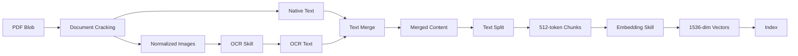
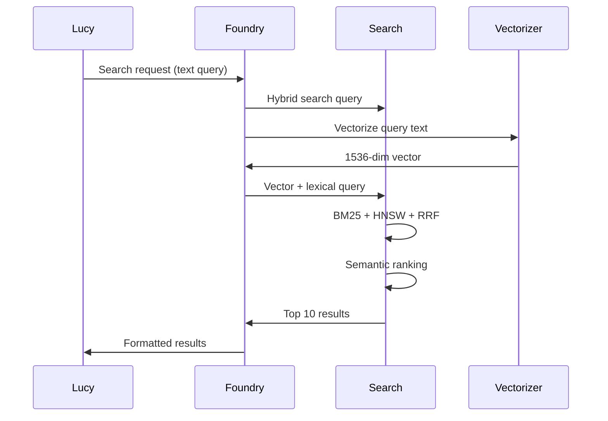

# Azure AI Search Integration Guide

**Document Version:** 1.0
**Last Updated:** 2026-01-25
**Target Audience:** Search engineers, ML engineers, data engineers
**Status:** Production

---

## Table of Contents

1. [Overview](#overview)
2. [Search Service Configuration](#search-service-configuration)
3. [Index Configuration](#index-configuration)
4. [Skillset & Indexing](#skillset--indexing)
5. [Query Patterns](#query-patterns)
6. [Integration with Lucy](#integration-with-lucy)
7. [Performance Tuning](#performance-tuning)
8. [Monitoring](#monitoring)
9. [Troubleshooting](#troubleshooting)
10. [Code Examples](#code-examples)

---

## 1. Overview

### Azure AI Search Role in Lucy

Lucy uses Azure AI Search to retrieve settlement notice PDFs for class action members. The search service enables:

- **Semantic Search:** Find documents by APEX ID, member name, or content
- **Hybrid Search:** Combine keyword (BM25) and vector (HNSW) search
- **OCR Processing:** Extract text from image-based PDFs
- **Chunk-Based Indexing:** Split large documents for precise matching
- **Semantic Ranking:** ML-powered re-ranking for better precision

### Search Service Details

**Service Configuration:**
- **Service Name:** `ailucyaisearch`
- **Region:** West US
- **Tier:** Standard (S1 equivalent)
- **Endpoint:** `https://ailucyaisearch.search.windows.net`
- **Index:** `lucy-notices-v2` (primary production index)

**Capacity:**
- **Partitions:** 1 (25 GB storage)
- **Replicas:** 1 (scalable for high availability)
- **Search Units:** 1 (partitions × replicas)

### Foundry Connection

**Connection Resolution:**

Lucy uses Azure AI Foundry v2 project connections for search integration:

```python
# Environment variable (preferred)
AI_SEARCH_PROJECT_CONNECTION_ID=/subscriptions/.../connections/lucy-search-connection

# Or connection name (resolved at runtime)
AI_SEARCH_PROJECT_CONNECTION_NAME=lucy-search-connection
```

**Connection Name Mapping:**

Foundry resolves connection names to IDs at runtime:

```python
def resolve_search_connection_id(project_client, connection_name: str) -> str:
    connections = project_client.connections.list()
    for conn in connections:
        if conn.name == connection_name:
            return conn.id

    # If not found, assume connection_name is already an ID
    return connection_name
```

**Why Connection-Based:**
- Managed identity authentication (no API keys)
- RBAC permissions (Search Index Data Reader)
- Simplified credential management
- Consistent with Foundry architecture

---

## 2. Search Service Configuration

### 2.1 Service Setup

**Create Search Service:**

```bash
az search service create \
  --name ailucyaisearch \
  --resource-group rg-apex-lucy-prd-01 \
  --location westus \
  --sku Standard \
  --partition-count 1 \
  --replica-count 1
```

**Configure Authentication:**

```bash
# Enable managed identity
az search service update \
  --name ailucyaisearch \
  --resource-group rg-apex-lucy-prd-01 \
  --identity-type SystemAssigned

# Assign role (for Foundry connection)
SEARCH_PRINCIPAL_ID=$(az search service show \
  --name ailucyaisearch \
  --resource-group rg-apex-lucy-prd-01 \
  --query identity.principalId -o tsv)

# Grant Storage Blob Data Reader (for indexing blobs)
az role assignment create \
  --assignee $SEARCH_PRINCIPAL_ID \
  --role "Storage Blob Data Reader" \
  --scope /subscriptions/<subscription-id>/resourceGroups/rg-apex-lucy-prd-01/providers/Microsoft.Storage/storageAccounts/aiagentlucyapex01
```

### 2.2 Service Tier and Capacity

**Tier Selection:**

| Tier | Storage/Partition | Max Partitions | Max Replicas | Use Case |
|------|-------------------|----------------|--------------|----------|
| Free | 50 MB | 1 | 1 | Development |
| Basic | 2 GB | 1 | 3 | Small production |
| Standard (S1) | 25 GB | 12 | 12 | **Lucy (current)** |
| Standard (S2) | 100 GB | 12 | 12 | Large production |
| Standard (S3) | 200 GB | 12 | 12 | Very large |

**Lucy Configuration:**
- **Tier:** Standard S1
- **Reason:** 25 GB sufficient for ~60,000 PDFs
- **Future:** Scale to S2 if index grows beyond 20 GB

**Scaling Strategy:**

```bash
# Scale partitions (storage)
az search service update \
  --name ailucyaisearch \
  --resource-group rg-apex-lucy-prd-01 \
  --partition-count 2

# Scale replicas (query performance + HA)
az search service update \
  --name ailucyaisearch \
  --resource-group rg-apex-lucy-prd-01 \
  --replica-count 2

# Search Units = Partitions × Replicas
# 2 partitions × 2 replicas = 4 search units
```

---

## 3. Index Configuration

### 3.1 Index Schema

**Index Name:** `lucy-notices-v2`

**Key Fields:**

```json
{
  "name": "chunk_id",
  "type": "Edm.String",
  "key": true,
  "filterable": true,
  "analyzer": "keyword"
}
```

**Content Fields:**

```json
{
  "name": "content",
  "type": "Edm.String",
  "searchable": true,
  "retrievable": true
},
{
  "name": "title",
  "type": "Edm.String",
  "searchable": true,
  "filterable": true,
  "retrievable": true
}
```

**Metadata Fields:**

```json
{
  "name": "metadata_storage_path",
  "type": "Edm.String",
  "retrievable": true
},
{
  "name": "file_extension",
  "type": "Edm.String",
  "filterable": true,
  "retrievable": true
}
```

**Vector Field:**

```json
{
  "name": "chunk_vector",
  "type": "Collection(Edm.Single)",
  "searchable": true,
  "retrievable": false,
  "dimensions": 1536,
  "vectorSearchProfile": "vector-profile-hnsw"
}
```

### 3.2 Vector Configuration

**Vectorizer:**

```json
{
  "vectorizers": [
    {
      "name": "openai-vectorizer",
      "kind": "azureOpenAI",
      "azureOpenAIParameters": {
        "resourceUri": "https://ai-az-agent-foundry-wus3.openai.azure.com",
        "deploymentId": "text-embedding-3-small",
        "modelName": "text-embedding-3-small"
      }
    }
  ]
}
```

**Embedding Model:**
- **Model:** `text-embedding-3-small`
- **Dimensions:** 1536 (standard output)
- **Max Input:** 8,191 tokens
- **Endpoint:** Azure OpenAI (Foundry deployment)

**Vector Search Profile:**

```json
{
  "vectorSearch": {
    "profiles": [
      {
        "name": "vector-profile-hnsw",
        "algorithm": "hnsw-config",
        "vectorizer": "openai-vectorizer"
      }
    ],
    "algorithms": [
      {
        "name": "hnsw-config",
        "kind": "hnsw",
        "hnswParameters": {
          "m": 4,
          "efConstruction": 400,
          "efSearch": 100,
          "metric": "cosine"
        }
      }
    ]
  }
}
```

**HNSW Parameters:**
- **m:** 4 (bi-directional links per node)
- **efConstruction:** 400 (indexing quality)
- **efSearch:** 100 (query accuracy)
- **metric:** cosine (similarity metric)

### 3.3 Semantic Configuration

**Semantic Ranking:**

```json
{
  "semantic": {
    "configurations": [
      {
        "name": "lucy-notices-v2-semantic",
        "prioritizedFields": {
          "titleField": {
            "fieldName": "title"
          },
          "prioritizedContentFields": [
            {
              "fieldName": "content"
            }
          ],
          "prioritizedKeywordsFields": []
        }
      }
    ]
  }
}
```

**Field Types:**
- **titleField:** `title` (APEX ID filename)
- **prioritizedContentFields:** `content` (chunk text)
- **prioritizedKeywordsFields:** None (no keyword fields)

**Why This Configuration:**
- Title (APEX ID) weighted higher for relevance
- Content used for caption/answer extraction
- No keyword fields (not needed for PDF search)

---

## 4. Skillset & Indexing

### 4.1 Skillset Pipeline

**Skillset Name:** `lucy-notices-v2-skillset`

**Pipeline Flow:**



### 4.2 OCR Skill

**Configuration:**

```json
{
  "@odata.type": "#Microsoft.Skills.Vision.OcrSkill",
  "name": "ocr-skill",
  "context": "/document/normalized_images/*",
  "defaultLanguageCode": "en",
  "detectOrientation": true,
  "inputs": [
    {
      "name": "image",
      "source": "/document/normalized_images/*"
    }
  ],
  "outputs": [
    {
      "name": "text",
      "targetName": "text"
    }
  ]
}
```

**Image Extraction:**
- **Mode:** `generateNormalizedImagePerPage`
- **Resolution:** 2000x2000 pixels (normalized)
- **Limit:** 1,000 images per document
- **Timeout:** 10 minutes per image

### 4.3 Text Split Skill

**Configuration:**

```json
{
  "@odata.type": "#Microsoft.Skills.Text.SplitSkill",
  "name": "split-skill",
  "textSplitMode": "pages",
  "maximumPageLength": 512,
  "pageOverlapLength": 100,
  "unit": "azureOpenAITokens",
  "azureOpenAITokenizerParameters": {
    "encoderModelName": "cl100k_base"
  },
  "context": "/document",
  "inputs": [
    {
      "name": "text",
      "source": "/document/merged_text"
    }
  ],
  "outputs": [
    {
      "name": "textItems",
      "targetName": "pages"
    }
  ]
}
```

**Chunking Strategy:**
- **Chunk Size:** 512 tokens
- **Overlap:** 100 tokens
- **Tokenizer:** cl100k_base (GPT-4, text-embedding-3-small)
- **Mode:** pages (respects sentence boundaries)

**Why 512 tokens:**
- Fits within embedding model limit (8,191 tokens)
- Balance between context and precision
- Standard for RAG systems

### 4.4 Embedding Skill

**Configuration:**

```json
{
  "@odata.type": "#Microsoft.Skills.Text.AzureOpenAIEmbeddingSkill",
  "name": "embedding-skill",
  "resourceUri": "https://ai-az-agent-foundry-wus3.openai.azure.com",
  "deploymentId": "text-embedding-3-small",
  "modelName": "text-embedding-3-small",
  "dimensions": 1536,
  "context": "/document/pages/*",
  "inputs": [
    {
      "name": "text",
      "source": "/document/pages/*"
    }
  ],
  "outputs": [
    {
      "name": "embedding",
      "targetName": "chunk_vector"
    }
  ]
}
```

**Output:**
- **Format:** Array of 1536 float32 values
- **Normalization:** Unit length (cosine similarity)
- **Storage:** ~6 KB per vector

### 4.5 Indexer Configuration

**Indexer Name:** `lucy-notices-v2-indexer`

**Data Source:**

```json
{
  "name": "lucy-notices-v2-datasource",
  "type": "azureblob",
  "credentials": {
    "connectionString": "DefaultEndpointsProtocol=https;AccountName=aiagentlucyapex01;..."
  },
  "container": {
    "name": "lucycmnotices",
    "query": null
  }
}
```

**Indexer Parameters:**

```json
{
  "parameters": {
    "batchSize": 100,
    "maxFailedItems": 10,
    "maxFailedItemsPerBatch": 5,
    "configuration": {
      "dataToExtract": "contentAndMetadata",
      "imageAction": "generateNormalizedImagePerPage",
      "indexedFileNameExtensions": ".pdf",
      "ocrTimeout": "00:10:00"
    }
  }
}
```

**Schedule:**

```json
{
  "schedule": {
    "interval": "PT1H",
    "startTime": "2026-01-01T02:00:00Z"
  }
}
```

**Index Projections:**

```json
{
  "indexProjections": {
    "selectors": [
      {
        "targetIndexName": "lucy-notices-v2",
        "parentKeyFieldName": "parent_id",
        "sourceContext": "/document/pages/*",
        "mappings": [
          {
            "name": "chunk",
            "source": "/document/pages/*"
          },
          {
            "name": "chunk_vector",
            "source": "/document/pages/*/chunk_vector"
          },
          {
            "name": "title",
            "source": "/document/metadata_storage_name"
          },
          {
            "name": "metadata_storage_path",
            "source": "/document/metadata_storage_path"
          },
          {
            "name": "file_extension",
            "source": "/document/metadata_storage_file_extension"
          }
        ]
      }
    ],
    "parameters": {
      "projectionMode": "skipIndexingParentDocuments"
    }
  }
}
```

**Why skipIndexingParentDocuments:**
- Avoids creating sparse parent documents
- Only indexes enriched chunks (child documents)
- Reduces index size and improves relevance

---

## 5. Query Patterns

### 5.1 Hybrid Search Query

**Query Type:** `vector_semantic_hybrid`

Lucy's default query combines:
1. **Lexical Search** (BM25)
2. **Vector Search** (HNSW)
3. **RRF Merge** (Reciprocal Rank Fusion)
4. **Semantic Ranking** (ML re-ranking)

**Example Query:**

```json
{
  "search": "APEX12345",
  "searchFields": "content,title,metadata_storage_name",
  "vectorQueries": [
    {
      "kind": "text",
      "text": "APEX12345",
      "fields": "chunk_vector",
      "k": 10
    }
  ],
  "$filter": "file_extension eq '.pdf'",
  "queryType": "semantic",
  "semanticConfiguration": "lucy-notices-v2-semantic",
  "$select": "chunk_id,content,title,metadata_storage_path,file_extension",
  "top": 10
}
```

### 5.2 Azure AI Search Tool in Foundry

**Tool Registration:**

```python
from foundry_v2 import build_ai_search_tool

ai_search_tool = build_ai_search_tool(
    connection_id=os.getenv("AI_SEARCH_PROJECT_CONNECTION_ID"),
    index_name="lucy-notices-v2",
    query_type="vector_semantic_hybrid",
    top_k=5
)
```

**Query Types:**

| Type | Description |
|------|-------------|
| `SIMPLE` | Lexical search only (BM25) |
| `SEMANTIC` | Lexical + semantic ranking |
| `VECTOR` | Vector search only (HNSW) |
| `VECTOR_SIMPLE_HYBRID` | Lexical + vector (RRF) |
| `VECTOR_SEMANTIC_HYBRID` | Lexical + vector + semantic (Lucy default) |

### 5.3 Request Flow

**From Lucy → Search → Results:**



### 5.4 Result Processing

**Search Result Structure:**

```json
{
  "@search.score": 0.0323,
  "@search.rerankerScore": 2.58,
  "chunk_id": "aa1b22c33_pages_0",
  "parent_id": "aa1b22c33",
  "content": "This is a settlement notice...",
  "title": "APEX12345.pdf",
  "metadata_storage_path": "https://aiagentlucyapex01.blob.core.windows.net/lucycmnotices/APEX12345.pdf",
  "file_extension": ".pdf"
}
```

**Parsing Blob Path:**

```python
def extract_blob_path(result: Dict) -> str:
    blob_path = result.get("metadata_storage_path", "")

    # Sanitize markdown artifacts
    blob_path = _sanitize_blob_url(blob_path)

    return blob_path

def _sanitize_blob_url(url: str) -> str:
    import re
    from urllib.parse import unquote

    # Strip markdown: [text](url) → url
    url = re.sub(r"\[([^\]]+)\]\(([^)]+)\)", r"\2", url)

    # Decode percent-encoding
    url = unquote(url)

    return url
```

---

## 6. Integration with Lucy

### 6.1 Tool Registration

**Foundry v2 Tool:**

```python
# From apex.py
from foundry_v2 import build_ai_search_tool

ai_search_tool = build_ai_search_tool(
    connection_id=resolve_search_connection_id(
        project_client,
        os.getenv("AI_SEARCH_PROJECT_CONNECTION_NAME", "")
    ),
    index_name=os.getenv("AI_SEARCH_INDEX_NAME"),
    query_type=os.getenv("SEARCH_QUERY_TYPE", "vector_semantic_hybrid"),
    top_k=int(os.getenv("SEARCH_TOP_K", "5"))
)
```

**Environment Variables:**

```bash
AI_SEARCH_PROJECT_CONNECTION_NAME=lucy-search-connection
AI_SEARCH_INDEX_NAME=lucy-notices-v2
SEARCH_QUERY_TYPE=vector_semantic_hybrid
SEARCH_TOP_K=5
```

### 6.2 Query Execution

**Automatic Tool Call (Foundry):**

When Lucy decides to search for a notice, Foundry automatically:
1. Calls `azure_ai_search` tool
2. Passes search query
3. Returns results to Lucy

**Custom Python Execution:**

```python
# From user_functions.py
async def find_notice_for_user(apex_id: str) -> Dict:
    # Try exact filename match first
    results = search_client.search(
        search_text=f"{apex_id}.pdf",
        search_fields=["metadata_storage_name"],
        filter="file_extension eq '.pdf'",
        top=1
    )

    if results:
        return results[0]

    # Fallback to content search
    results = search_client.search(
        search_text=apex_id,
        search_fields=["content", "title"],
        vector_queries=[{
            "kind": "text",
            "text": apex_id,
            "fields": "chunk_vector",
            "k": 10
        }],
        filter="file_extension eq '.pdf'",
        query_type="semantic",
        semantic_configuration_name="lucy-notices-v2-semantic",
        top=10
    )

    return results[0] if results else None
```

### 6.3 PDF Filter Strategy

**Dual-Layer Filtering:**

```python
# Layer 1: OData filter
filter="file_extension eq '.pdf'"

# Layer 2: Post-processing validation
def _filter_pdf_results(results):
    return [r for r in results if r.get("file_extension") == ".pdf"]

# Fallback: Retry without filter if no results
if not results:
    results = search_without_filter()
    results = _filter_pdf_results(results)
```

**Why Dual-Layer:**
- OData filter may fail (schema issues)
- Post-processing ensures PDF-only results
- Prevents non-PDF noise (CSV, XLSX, ZIP)

---

## 7. Performance Tuning

### 7.1 Query Optimization

**Field Selection:**

```python
# Always use $select to reduce payload
select=["chunk_id", "content", "title", "metadata_storage_path"]
```

**Result Limits:**

```python
# Lucy default: 10 results
top=10

# Vector search: 10 nearest neighbors
k=10
```

**Microsoft Recommendation:**
- Use k=50 for semantic ranking (more candidates)
- Lucy uses k=10 (sufficient for final top=10)

### 7.2 Index Optimization

**Analyzers:**

```json
{
  "analyzers": [
    {
      "name": "keyword",
      "@odata.type": "#Microsoft.Azure.Search.KeywordAnalyzer"
    }
  ]
}
```

**Field Configuration:**

```json
{
  "name": "title",
  "type": "Edm.String",
  "searchable": true,
  "filterable": true,
  "analyzer": "standard.lucene"
}
```

### 7.3 Caching

**Application-Level Cache:**

```python
from datetime import datetime, timedelta

_search_cache = {}
_cache_expiry = {}

def search_cached(query: str, ttl_minutes: int = 5):
    cache_key = f"search:{query}"

    # Check cache
    if cache_key in _search_cache:
        if datetime.utcnow() < _cache_expiry[cache_key]:
            return _search_cache[cache_key]

    # Fetch from search
    results = search_client.search(query)

    # Store in cache
    _search_cache[cache_key] = results
    _cache_expiry[cache_key] = datetime.utcnow() + timedelta(minutes=ttl_minutes)

    return results
```

---

## 8. Monitoring

### 8.1 Search Metrics

**Azure Portal Metrics:**

Navigate to: Azure AI Search → Monitoring → Metrics

**Key Metrics:**
- **Search Latency:** Average query duration (ms)
- **Search Queries Per Second:** Query rate
- **Throttled Search Queries Percentage:** % throttled
- **Storage Used:** Index size

**Lucy Baselines:**
- **Query Latency:** 200-450ms (hybrid + semantic)
- **QPS:** ~10-50 queries/minute (peak)
- **Storage:** ~5 GB (60,000 PDFs)

### 8.2 Search Logs

**Custom Logging:**

```python
import logging

logger = logging.getLogger("azure.search")

logger.info(f"Search query: {search_text}, apex_id: {apex_id}")
logger.info(f"Search results: {len(results)} found, top score: {results[0]['@search.score']}")
```

**OpenTelemetry Tracing:**

```python
from opentelemetry import trace

tracer = trace.get_tracer(__name__)

with tracer.start_as_current_span("search.query") as span:
    span.set_attribute("search.query", search_text)
    span.set_attribute("search.index", index_name)

    results = search_client.search(search_text)

    span.set_attribute("search.result_count", len(results))
    span.set_attribute("search.top_score", results[0]["@search.score"])
```

---

## 9. Troubleshooting

### 9.1 No Results Found

**Symptoms:** Query returns 0 results

**Diagnosis:**

```bash
# Check if blob exists
az storage blob exists \
  --account-name aiagentlucyapex01 \
  --container-name lucycmnotices \
  --name "APEX12345.pdf"

# Check if indexed
curl -X POST "https://ailucyaisearch.search.windows.net/indexes/lucy-notices-v2/docs/search?api-version=2024-07-01" \
  -H "api-key: <admin-key>" \
  -H "Content-Type: application/json" \
  -d '{
    "search": "APEX12345",
    "searchFields": "metadata_storage_name",
    "top": 10
  }'
```

**Causes:**
1. Blob not yet indexed
2. Filter too restrictive
3. OCR failed (check indexer warnings)

**Solutions:**
- Run indexer manually
- Retry without filter
- Check indexer status

### 9.2 Slow Queries

**Symptoms:** Query latency >1 second

**Diagnosis:**

```python
import time

start = time.time()
results = search_client.search(...)
latency = time.time() - start

print(f"Query latency: {latency:.2f}s")
```

**Causes:**
1. Large result set
2. Complex filter
3. Wildcard/fuzzy search
4. Cold start

**Solutions:**
- Reduce `top` to 10-20
- Use `searchFields` to limit fields
- Use exact match before fuzzy
- Add caching layer

---

## 10. Code Examples

### 10.1 Complete Search Example

```python
from azure.search.documents import SearchClient
from azure.core.credentials import AzureKeyCredential
import os

# Initialize client
search_client = SearchClient(
    endpoint=os.getenv("AZURE_SEARCH_ENDPOINT"),
    index_name="lucy-notices-v2",
    credential=AzureKeyCredential(os.getenv("AZURE_SEARCH_API_KEY"))
)

# Hybrid search
results = search_client.search(
    search_text="APEX12345",
    search_fields=["content", "title", "metadata_storage_name"],
    vector_queries=[{
        "kind": "text",
        "text": "APEX12345",
        "fields": "chunk_vector",
        "k": 10
    }],
    filter="file_extension eq '.pdf'",
    query_type="semantic",
    semantic_configuration_name="lucy-notices-v2-semantic",
    select=["chunk_id", "content", "title", "metadata_storage_path"],
    top=10
)

# Process results
for result in results:
    print(f"Title: {result['title']}")
    print(f"Score: {result['@search.score']}")
    print(f"Reranker Score: {result.get('@search.rerankerScore', 'N/A')}")
    print(f"Path: {result['metadata_storage_path']}")
    print()
```

### 10.2 Fallback Search Strategy

```python
def search_with_fallback(apex_id: str):
    """Multi-strategy search with fallback"""

    # Strategy 1: Exact filename match
    results = search_client.search(
        search_text=f"{apex_id}.pdf",
        search_fields=["metadata_storage_name"],
        filter="file_extension eq '.pdf'",
        top=1
    )

    if len(list(results)) > 0:
        return list(results)[0]

    # Strategy 2: Content search
    results = search_client.search(
        search_text=apex_id,
        search_fields=["content", "title"],
        vector_queries=[{
            "kind": "text",
            "text": apex_id,
            "fields": "chunk_vector",
            "k": 10
        }],
        filter="file_extension eq '.pdf'",
        query_type="semantic",
        semantic_configuration_name="lucy-notices-v2-semantic",
        top=10
    )

    results_list = list(results)
    if len(results_list) > 0:
        return results_list[0]

    # Strategy 3: Retry without filter
    results = search_client.search(
        search_text=apex_id,
        search_fields=["content", "title"],
        top=10
    )

    # Post-filter for PDFs
    pdf_results = [r for r in results if r.get("file_extension") == ".pdf"]

    return pdf_results[0] if pdf_results else None
```

---

**End of Azure AI Search Integration Guide**

**Related Documentation:**
- [Dynamics 365 Integration Guide](./dynamics365-integration.md)
- [Teams Integration Guide](./teams-integration.md)
- [RAG & Search Architecture](../architecture/rag-search-architecture.md)
- [Custom Tools Reference](../developer/custom-tools-reference.md)
