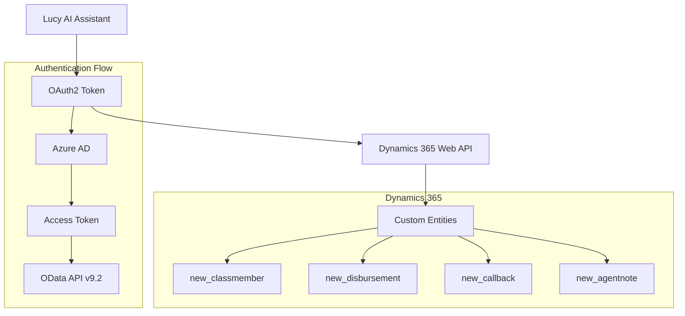
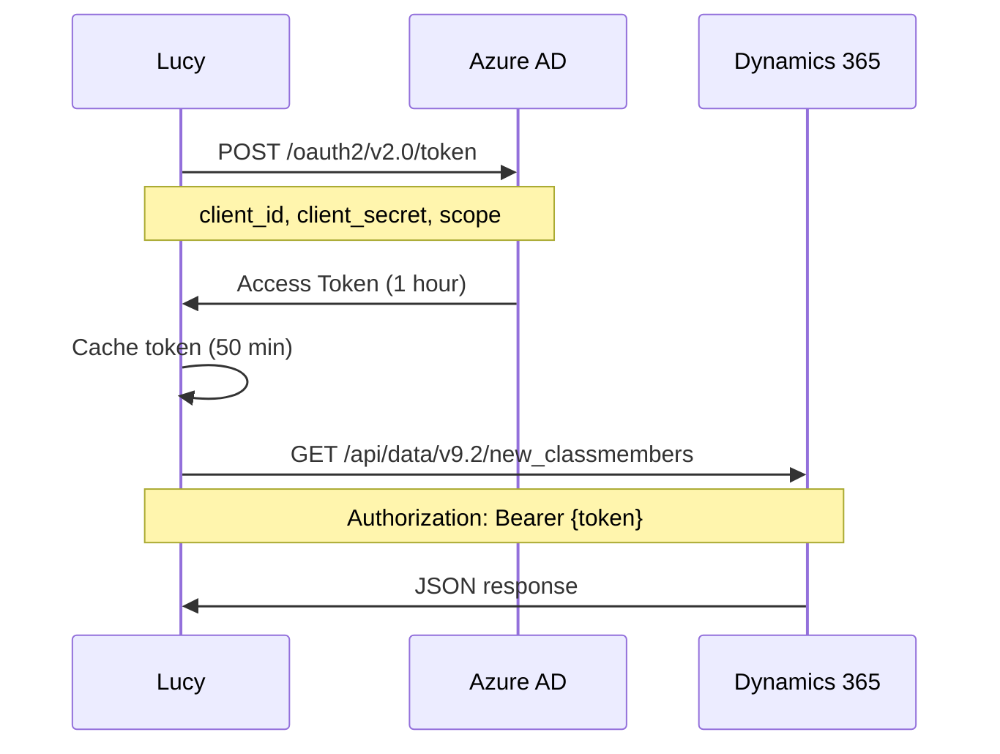

# Dynamics 365 Integration Guide

**Document Version:** 1.0
**Last Updated:** 2026-01-25
**Target Audience:** Integration developers, system administrators
**Status:** Production

---

## Table of Contents

1. [Overview](#overview)
2. [Dynamics 365 Setup](#dynamics-365-setup)
3. [Authentication](#authentication)
4. [OData Queries](#odata-queries)
5. [Entity Schema](#entity-schema)
6. [Lucy's D365 Tools](#lucys-d365-tools)
7. [Error Handling](#error-handling)
8. [Performance Optimization](#performance-optimization)
9. [Testing](#testing)
10. [Troubleshooting](#troubleshooting)
11. [Security Best Practices](#security-best-practices)
12. [Code Examples](#code-examples)

---

## 1. Overview

### What Dynamics 365 Provides to Lucy

Lucy integrates with Microsoft Dynamics 365 to access class action settlement member data. This integration enables:

- **Member Authentication:** Verify identity using name, APEX ID, and SSN
- **Profile Retrieval:** Access member contact information and settlement details
- **Disbursement Tracking:** Query payment history and status
- **Case Management:** Create notes, update profiles, track interactions
- **Entity Discovery:** Dynamically explore available entities and fields

### Integration Architecture



**Component Stack:**
- **Lucy Application:** Python (Chainlit + Azure AI Foundry)
- **Authentication:** OAuth2 Client Credentials Flow (Azure AD)
- **API Protocol:** OData v9.2 over HTTPS
- **Data Format:** JSON request/response
- **Dynamics Instance:** `apexclassaction.crm.dynamics.com`

### Authentication Model

Lucy uses **OAuth2 Client Credentials Flow** with service principal authentication:

1. **Service Principal:** Azure AD application with Dynamics API permissions
2. **Client Credentials:** Client ID + Client Secret (stored in Key Vault)
3. **Token Acquisition:** POST to Azure AD token endpoint
4. **Token Caching:** 50-minute cache (tokens valid for 1 hour)
5. **API Calls:** Bearer token in Authorization header

**Why Client Credentials:**
- Lucy runs as a service (no user context)
- Consistent permissions across all operations
- No interactive login required
- Suitable for server-to-server integration

---

## 2. Dynamics 365 Setup

### 2.1 Application Registration

**Step 1: Create Azure AD App Registration**

1. Navigate to Azure Portal → Azure Active Directory → App registrations
2. Click "New registration"
3. Configure:
   - **Name:** `lucy-dynamics-integration`
   - **Supported account types:** Single tenant
   - **Redirect URI:** None (service principal)
4. Click "Register"

**Step 2: Record Application Details**

After creation, record:
- **Application (client) ID:** `<GUID>` → Store as `D365_CLIENT_ID`
- **Directory (tenant) ID:** `<GUID>` → Store as `D365_TENANT_ID`

**Step 3: Create Client Secret**

1. Navigate to "Certificates & secrets" → "Client secrets"
2. Click "New client secret"
3. Configure:
   - **Description:** `lucy-d365-secret-YYYYMMDD`
   - **Expires:** 12 months (recommended for rotation)
4. Click "Add"
5. **Important:** Copy the secret value immediately
   - This is the only time you'll see it
   - Store as `D365_CLIENT_SECRET` in Key Vault

### 2.2 API Permissions

**Step 1: Add Dynamics 365 Permissions**

1. Navigate to "API permissions" → "Add a permission"
2. Select "Dynamics CRM" (or "Common Data Service")
3. Choose "Application permissions" (not Delegated)
4. Select:
   - `user_impersonation` - Read/write Dynamics data
5. Click "Add permissions"

**Step 2: Grant Admin Consent**

1. Click "Grant admin consent for [tenant]"
2. Confirm in the popup
3. Verify "Status" shows green checkmark

**Required Permissions:**

| Permission | Type | Description |
|------------|------|-------------|
| `user_impersonation` | Application | Read and write Dynamics data |

**Why Application Permissions:**
- Lucy needs consistent access (no user context)
- Service-to-service authentication
- Permissions apply to all API operations

### 2.3 Service Principal Configuration

**Step 1: Create Application User in Dynamics**

1. Navigate to Dynamics 365 → Settings → Security → Users
2. Switch view to "Application Users"
3. Click "New" → "Application User"
4. Configure:
   - **User Name:** `lucy-service@apexclassaction.com`
   - **Application ID:** `<D365_CLIENT_ID>`
   - **Full Name:** `Lucy AI Service`
   - **Primary Email:** `lucy-service@apexclassaction.com`
5. Click "Save"

**Step 2: Assign Security Roles**

1. Select the application user
2. Click "Manage Roles"
3. Assign roles:
   - **System Administrator** (full access) - OR -
   - **Custom Role** (least privilege - recommended)
4. Click "OK"

**Recommended Custom Role Permissions:**

| Entity | Create | Read | Write | Delete | Append | Append To |
|--------|--------|------|-------|--------|--------|-----------|
| new_classmember | ✓ | ✓ | ✓ | ✗ | ✓ | ✓ |
| new_disbursement | ✗ | ✓ | ✗ | ✗ | ✗ | ✗ |
| new_callback | ✓ | ✓ | ✓ | ✓ | ✓ | ✓ |
| new_agentnote | ✓ | ✓ | ✓ | ✗ | ✓ | ✓ |

**Step 3: Enable API Access**

1. Navigate to Settings → Administration → System Settings
2. Click "Customization" tab
3. Enable:
   - ☑ Enable OData API
   - ☑ Enable Web API
4. Click "OK"

### 2.4 Scopes and Roles

**OAuth2 Scopes:**

```
Scope: https://apexclassaction.crm.dynamics.com/.default
```

**Explanation:**
- `.default` suffix requests all permissions granted to the app
- No need to specify individual permissions in token request
- Simplifies token acquisition

**Token Payload (Example):**
```json
{
  "aud": "https://apexclassaction.crm.dynamics.com",
  "iss": "https://sts.windows.net/<tenant-id>/",
  "appid": "<client-id>",
  "roles": ["user_impersonation"],
  "exp": 1706198400
}
```

---

## 3. Authentication

### 3.1 OAuth2 Flow

Lucy uses **Client Credentials Flow** for server-to-server authentication:



### 3.2 Token Acquisition

**Python Implementation:**

```python
import requests
from datetime import datetime, timedelta
from typing import Optional

class DynamicsAuthenticator:
    def __init__(self):
        self.tenant_id = os.getenv("D365_TENANT_ID")
        self.client_id = os.getenv("D365_CLIENT_ID")
        self.client_secret = os.getenv("D365_CLIENT_SECRET")
        self.resource_url = os.getenv("D365_RESOURCE_URL")

        self.access_token: Optional[str] = None
        self.token_expiry: Optional[datetime] = None

    def get_access_token(self) -> str:
        """Get cached or acquire new access token"""
        # Check cache
        if self.access_token and self.token_expiry:
            if datetime.utcnow() < self.token_expiry:
                return self.access_token

        # Acquire new token
        auth_url = f"https://login.microsoftonline.com/{self.tenant_id}/oauth2/v2.0/token"

        data = {
            'grant_type': 'client_credentials',
            'client_id': self.client_id,
            'client_secret': self.client_secret,
            'scope': f'{self.resource_url}/.default'
        }

        response = requests.post(auth_url, data=data, timeout=10)
        response.raise_for_status()

        token_data = response.json()
        self.access_token = token_data['access_token']

        # Cache for 50 minutes (tokens valid for 60 minutes)
        expires_in = token_data.get('expires_in', 3600)
        self.token_expiry = datetime.utcnow() + timedelta(seconds=expires_in - 600)

        return self.access_token
```

**Token Request:**
```http
POST /oauth2/v2.0/token HTTP/1.1
Host: login.microsoftonline.com
Content-Type: application/x-www-form-urlencoded

grant_type=client_credentials
&client_id=<CLIENT_ID>
&client_secret=<CLIENT_SECRET>
&scope=https://apexclassaction.crm.dynamics.com/.default
```

**Token Response:**
```json
{
  "token_type": "Bearer",
  "expires_in": 3600,
  "access_token": "eyJ0eXAiOiJKV1QiLCJhbGci..."
}
```

### 3.3 Token Refresh

**Cache Strategy:**
- **Token Lifetime:** 60 minutes (3600 seconds)
- **Cache Duration:** 50 minutes (3000 seconds)
- **Refresh Window:** 10 minutes before expiration
- **Reason:** Prevents expired tokens mid-request

**Implementation:**
```python
def is_token_valid(self) -> bool:
    """Check if cached token is still valid"""
    if not self.access_token or not self.token_expiry:
        return False

    # Add 60-second buffer for clock skew
    return datetime.utcnow() + timedelta(seconds=60) < self.token_expiry
```

### 3.4 Token Caching

**In-Memory Cache:**
```python
# Global authenticator instance (per-process cache)
_dynamics_auth = DynamicsAuthenticator()

def get_dynamics_token() -> str:
    """Get cached or fresh token"""
    return _dynamics_auth.get_access_token()
```

**Multi-Process Considerations:**
- Each worker process has its own cache
- No shared cache across processes
- Acceptable for low-volume scenarios
- For high-volume, consider Redis cache

### 3.5 Configuration

**Environment Variables:**
```yaml
# Dynamics 365 Configuration
D365_RESOURCE_URL: https://apexclassaction.crm.dynamics.com
D365_CLIENT_ID: <client-id-from-app-registration>
D365_CLIENT_SECRET: <from-key-vault>
D365_TENANT_ID: <tenant-id>

# Optional: Managed Identity (alternative to client secret)
MANAGED_IDENTITY_CLIENT_ID: <managed-identity-client-id>
```

**Azure Container Apps Configuration:**
```bash
# Set as secrets (not plain env vars)
az containerapp secret set \
  -g agent-lucy-eus2 \
  -n agent-lucy-eus2 \
  --secrets d365-client-secret=<SECRET_VALUE>

# Reference secret in env vars
az containerapp update \
  -g agent-lucy-eus2 \
  -n agent-lucy-eus2 \
  --set-env-vars \
    D365_RESOURCE_URL=https://apexclassaction.crm.dynamics.com \
    D365_CLIENT_ID=<CLIENT_ID> \
    D365_TENANT_ID=<TENANT_ID> \
    D365_CLIENT_SECRET=secretref:d365-client-secret
```

### 3.6 Token Rotation (Zero-Downtime)

**Problem:** Client secrets expire after 12-24 months

**Solution:** Overlapping secret rotation

**Process:**

1. **Create New Secret:**
   ```bash
   az ad app credential reset \
     --id <D365_CLIENT_ID> \
     --append \
     --display-name "lucy-d365-$(date +%Y%m%d)"
   ```
   - `--append` keeps existing secret active

2. **Update Container Apps:**
   ```bash
   # Update secret
   az containerapp secret set \
     -g agent-lucy-eus2 \
     -n agent-lucy-eus2 \
     --secrets d365-client-secret=<NEW_SECRET>

   # Restart app to load new secret
   az containerapp update \
     -g agent-lucy-eus2 \
     -n agent-lucy-eus2 \
     --set-env-vars RESTART_TS=$(date +%s)
   ```

3. **Verify New Secret Works:**
   ```bash
   # Test token acquisition
   python test_dynamics_auth.py
   ```

4. **Delete Old Secret:**
   ```bash
   az ad app credential delete \
     --id <D365_CLIENT_ID> \
     --key-id <OLD_KEY_ID>
   ```

**Best Practices:**
- Rotate every 6-12 months (before expiration)
- Test new secret in staging first
- Keep both secrets active during transition
- Monitor for auth failures after rotation
- Document rotation dates

**Recent Issues (2026-01-21):**
- Token rotation caused temporary auth failures
- **Root Cause:** Apps not restarted after secret update
- **Fix:** Always restart apps after updating secrets
- **Reference:** `docs/plans/2026-01-21-dynamics-token-rotation.md`

---

## 4. OData Queries

### 4.1 Query Structure

Dynamics 365 Web API uses **OData v4.0** for queries:

```
GET https://apexclassaction.crm.dynamics.com/api/data/v9.2/{entity}
  ?$select=field1,field2
  &$filter=field eq 'value'
  &$orderby=field asc
  &$top=10
```

**Key Components:**

| Component | Description | Example |
|-----------|-------------|---------|
| **Base URL** | Dynamics instance | `https://apexclassaction.crm.dynamics.com` |
| **API Path** | OData endpoint | `/api/data/v9.2/` |
| **Entity Set** | Collection name | `new_classmembers` |
| **$select** | Field projection | `$select=new_apexid,new_fullname` |
| **$filter** | Row filtering | `$filter=new_state eq 'CA'` |
| **$orderby** | Sorting | `$orderby=new_lastname asc` |
| **$top** | Limit results | `$top=100` |

### 4.2 Common Query Patterns Used by Lucy

**Pattern 1: Member Lookup by APEX ID**
```http
GET /api/data/v9.2/new_classmembers
  ?$select=new_apexid,new_fullname,new_shortsocial,new_mailingaddress
  &$filter=new_apexid eq 'APEX12345'
  &$top=1
```

**Pattern 2: Member Authentication (Multi-Field)**
```http
GET /api/data/v9.2/new_classmembers
  ?$select=new_classmemberid,new_apexid,new_fullname,new_shortsocial
  &$filter=new_firstname eq 'John' and new_lastname eq 'Smith' and new_shortsocial eq '1234'
  &$top=10
```

**Pattern 3: Disbursement History**
```http
GET /api/data/v9.2/new_disbursements
  ?$select=new_amount,new_date,new_status,new_checknum
  &$filter=_new_memberid_value eq '<member-guid>'
  &$orderby=new_date desc
```

**Pattern 4: Entity Discovery**
```http
GET /api/data/v9.2/EntityDefinitions
  ?$select=LogicalName,DisplayName,EntitySetName
  &$filter=startswith(LogicalName,'new_')
```

**Pattern 5: Field Discovery**
```http
GET /api/data/v9.2/EntityDefinitions(LogicalName='new_classmember')
  ?$expand=Attributes($select=LogicalName,DisplayName,AttributeType)
```

### 4.3 Query Optimization

**Field Selection:**
```http
# Bad: Returns all fields (slower, larger payload)
GET /api/data/v9.2/new_classmembers?$filter=new_apexid eq 'APEX12345'

# Good: Returns only needed fields
GET /api/data/v9.2/new_classmembers
  ?$select=new_apexid,new_fullname,new_email
  &$filter=new_apexid eq 'APEX12345'
```

**Filtering:**
```http
# Use indexed fields in filters
$filter=new_apexid eq 'APEX12345'  # new_apexid is indexed

# Avoid functions in filters (prevents index use)
$filter=contains(new_fullname,'Smith')  # Full table scan
```

**Pagination:**
```http
# Initial request
GET /api/data/v9.2/new_classmembers?$top=100

# Response includes @odata.nextLink
{
  "@odata.nextLink": "...&$skiptoken=<token>",
  "value": [...]
}

# Next page
GET /api/data/v9.2/new_classmembers?$top=100&$skiptoken=<token>
```

**Batch Operations:**
```http
POST /api/data/v9.2/$batch
Content-Type: multipart/mixed; boundary=batch_id

--batch_id
Content-Type: application/http
Content-Transfer-Encoding: binary

GET /api/data/v9.2/new_classmembers('guid1') HTTP/1.1

--batch_id
Content-Type: application/http
Content-Transfer-Encoding: binary

GET /api/data/v9.2/new_classmembers('guid2') HTTP/1.1

--batch_id--
```

### 4.4 OData Operators

**Comparison Operators:**

| Operator | Description | Example |
|----------|-------------|---------|
| `eq` | Equal | `new_state eq 'CA'` |
| `ne` | Not equal | `new_status ne 'inactive'` |
| `gt` | Greater than | `new_amount gt 1000` |
| `ge` | Greater than or equal | `new_amount ge 1000` |
| `lt` | Less than | `new_amount lt 1000` |
| `le` | Less than or equal | `new_amount le 1000` |

**Logical Operators:**

| Operator | Description | Example |
|----------|-------------|---------|
| `and` | Logical AND | `new_state eq 'CA' and new_city eq 'Los Angeles'` |
| `or` | Logical OR | `new_state eq 'CA' or new_state eq 'NY'` |
| `not` | Logical NOT | `not (new_state eq 'CA')` |

**String Functions:**

| Function | Description | Example |
|----------|-------------|---------|
| `contains` | Substring match | `contains(new_fullname,'Smith')` |
| `startswith` | Prefix match | `startswith(new_apexid,'APEX')` |
| `endswith` | Suffix match | `endswith(new_email,'@example.com')` |

**Date Functions:**

| Function | Description | Example |
|----------|-------------|---------|
| `year` | Extract year | `year(new_date) eq 2026` |
| `month` | Extract month | `month(new_date) eq 1` |
| `day` | Extract day | `day(new_date) eq 25` |

---

## 5. Entity Schema

### 5.1 Member Entities

**Primary Entity: `new_classmember`**

| Field | Type | Description | Example |
|-------|------|-------------|---------|
| `new_classmemberid` | Guid | Primary key | `12345678-1234-1234-1234-123456789012` |
| `new_apexid` | String(50) | APEX ID (unique) | `APEX12345` |
| `new_firstname` | String(100) | First name | `John` |
| `new_lastname` | String(100) | Last name | `Smith` |
| `new_middlename` | String(100) | Middle name/initial | `M` |
| `new_fullname` | String(300) | Full name | `John M Smith` |
| `new_shortsocial` | String(4) | Last 4 SSN | `1234` |
| `new_mailingaddress` | String(200) | Street address | `123 Main St` |
| `new_city` | String(100) | City | `Los Angeles` |
| `new_state` | String(2) | State code | `CA` |
| `new_zipcode` | String(10) | ZIP code | `90001` |
| `new_email` | String(100) | Email address | `john@example.com` |
| `new_phone` | String(20) | Phone number | `555-0123` |

**Entity Set Name:** `new_classmembers`

**Primary ID Field:** `new_classmemberid`

**Primary Name Field:** `new_fullname`

### 5.2 Data Mapping

**Dynamics Fields → Lucy Data Model:**

```python
# Lucy member object structure
{
    "apex_id": "APEX12345",              # new_apexid
    "full_name": "John M Smith",         # new_fullname
    "first_name": "John",                # new_firstname
    "last_name": "Smith",                # new_lastname
    "middle_name": "M",                  # new_middlename
    "ssn_last_4": "1234",                # new_shortsocial
    "address": {
        "street": "123 Main St",         # new_mailingaddress
        "city": "Los Angeles",           # new_city
        "state": "CA",                   # new_state
        "zip": "90001"                   # new_zipcode
    },
    "contact": {
        "email": "john@example.com",     # new_email
        "phone": "555-0123"              # new_phone
    }
}
```

### 5.3 Custom Fields

**Name Field Patterns:**

Lucy's authentication handles complex name patterns:

1. **Standard Pattern:** `new_firstname + new_lastname`
   - Example: "John" + "Smith" = "John Smith"

2. **Middle Initial Pattern:** `new_firstname + new_middlename + new_lastname`
   - Example: "John" + "M" + "Smith" = "John M Smith"

3. **Full Name Pattern:** `new_fullname` (stored separately)
   - Example: "John M Smith" (may not match parts)
   - Used when firstname + lastname don't combine correctly

4. **Complex Names:** Multiple middle names, hyphens, spaces
   - Example: "Maria" + "De La Cruz" (lastname with spaces)
   - Example: "John Paul" + "Smith-Jones" (compound names)

**Why This Matters:**
- Member data entry inconsistent across different sources
- Some names have middle name in lastname field
- Full name field doesn't always match first + last
- Lucy's agentic authenticator tries 50+ query variations

### 5.4 Calculated Fields

**Lucy Computes:**
- **Display Name:** Formatted name for UI
  ```python
  display_name = f"{first_name} {last_name}"
  if middle_name:
      display_name = f"{first_name} {middle_name} {last_name}"
  ```

- **Masked SSN:** Full SSN display
  ```python
  masked_ssn = f"***-**-{ssn_last_4}"
  ```

- **Full Address:** Formatted address string
  ```python
  full_address = f"{street}\n{city}, {state} {zip}"
  ```

---

## 6. Lucy's D365 Tools

Lucy has **15 Dynamics 365 tools** registered with Azure AI Foundry:

### 6.1 Authentication Tools

**Tool: `authenticate_member_sync()`**

**Purpose:** Authenticate class member using name and SSN

**Parameters:**
```python
{
  "first_name": "John",      # Optional
  "last_name": "Smith",      # Optional
  "apex_id": "APEX12345",    # Optional
  "last_four_ssn": "1234",   # Required
  "full_name": "John Smith"  # Optional
}
```

**Query Pattern:**
Generates 50+ query variations:
1. Exact: `firstname + lastname + SSN`
2. Full name: `fullname + SSN`
3. Middle initial: `firstname + middle + lastname + SSN`
4. Flexible: `startswith(fullname, 'John') and contains(fullname, 'Smith')`

**Returns:**
```json
{
  "success": true,
  "member": {
    "new_apexid": "APEX12345",
    "new_fullname": "John M Smith",
    "new_shortsocial": "1234"
  },
  "match_type": "exact_with_middle_initial",
  "query_used": "..."
}
```

### 6.2 Member Profile Tools

**Tool: `get_class_member_details_sync()`**

**Purpose:** Retrieve member profile

**Parameters:**
```python
{
  "apex_id": "APEX12345",
  "info_type": "all"  # Options: all, settlement, employment, earnings, disbursements
}
```

**OData Query:**
```http
GET /api/data/v9.2/new_classmembers
  ?$select=new_apexid,new_fullname,new_mailingaddress,new_city,new_state,new_zipcode
  &$filter=new_apexid eq 'APEX12345'
```

**Returns:** JSON with member details

### 6.3 Disbursement Tools

**Tool: `get_member_disbursements_sync()`**

**Purpose:** Get payment history

**Parameters:**
```python
{
  "apex_id": "APEX12345"
}
```

**OData Query:**
```http
GET /api/data/v9.2/new_disbursements
  ?$select=new_amount,new_date,new_status,new_checknum
  &$filter=_new_memberid_value eq '<member-guid>'
  &$orderby=new_date desc
```

**Returns:**
```json
[
  {
    "amount": 1250.00,
    "date": "2025-10-15",
    "status": "paid",
    "method": "check",
    "check_number": "123456"
  }
]
```

### 6.4 Generic Query Tools

**Tool: `query_entity_sync()`**

**Purpose:** Generic OData query

**Parameters:**
```python
{
  "entity": "new_classmember",
  "filter_str": "new_state eq 'CA'",
  "select": "new_apexid,new_fullname"
}
```

**Usage:**
```python
results = query_entity_sync(
    entity="new_classmember",
    filter_str="new_state eq 'CA' and new_city eq 'Los Angeles'",
    select="new_apexid,new_fullname,new_email"
)
```

### 6.5 CRUD Tools

**Create:**
```python
create_entity_sync(
    entity="new_agentnote",
    data={
        "new_memberid": "APEX12345",
        "new_note": "Member called about payment",
        "new_category": "inquiry"
    }
)
```

**Update:**
```python
update_entity_sync(
    entity="new_classmember",
    entity_id="<guid>",
    data={
        "new_email": "newemail@example.com",
        "new_phone": "555-9999"
    }
)
```

**Delete:**
```python
delete_entity_sync(
    entity="new_agentnote",
    entity_id="<guid>"
)
```

### 6.6 Discovery Tools

**Discover Entities:**
```python
discover_entities_sync(prefix="new_")
# Returns: ["new_classmember", "new_disbursement", ...]
```

**Discover Fields:**
```python
discover_entity_fields_sync(entity_name="new_classmember")
# Returns: Field metadata (name, type, required, relationships)
```

**Auto-Discover:**
```python
auto_discover_entity_sync(entity_hint="member")
# Returns: "new_classmember" (smart entity finder)
```

### 6.7 Error Handling

All tools return JSON with consistent error format:

```json
{
  "success": false,
  "error": "Authentication failed",
  "details": "Invalid credentials",
  "code": "AUTH_FAILED"
}
```

---

## 7. Error Handling

### 7.1 Common Errors

**401 Unauthorized**

**Causes:**
- Expired token
- Invalid client secret
- Missing permissions

**Solution:**
```python
try:
    response = requests.get(url, headers=headers)
    response.raise_for_status()
except requests.exceptions.HTTPError as e:
    if e.response.status_code == 401:
        # Refresh token
        token = get_fresh_token()
        headers['Authorization'] = f'Bearer {token}'
        # Retry
        response = requests.get(url, headers=headers)
```

**403 Forbidden**

**Causes:**
- Insufficient permissions
- Application user not assigned role
- Entity-level security

**Solution:**
- Check application user security roles
- Verify entity permissions in Dynamics
- Grant required permissions

**404 Not Found**

**Causes:**
- Entity doesn't exist
- Wrong entity set name
- Record deleted

**Solution:**
```python
try:
    response = requests.get(url)
    response.raise_for_status()
except requests.exceptions.HTTPError as e:
    if e.response.status_code == 404:
        return {"success": False, "error": "Member not found"}
```

**429 Rate Limit**

**Causes:**
- Too many requests per minute
- Exceeded API throttling limits

**Solution:**
```python
from tenacity import retry, stop_after_attempt, wait_exponential

@retry(
    stop=stop_after_attempt(3),
    wait=wait_exponential(multiplier=1, min=2, max=10)
)
def query_dynamics(url):
    response = requests.get(url)
    response.raise_for_status()
    return response.json()
```

**500 Server Error**

**Causes:**
- Dynamics service issue
- Invalid query syntax
- Database timeout

**Solution:**
- Retry with exponential backoff
- Simplify query (remove complex filters)
- Contact Dynamics admin

### 7.2 Retry Logic

**Exponential Backoff:**
```python
import time

def retry_dynamics_request(func, max_retries=3):
    for attempt in range(max_retries):
        try:
            return func()
        except requests.exceptions.HTTPError as e:
            if e.response.status_code == 429:  # Rate limit
                wait_time = 2 ** attempt  # 1, 2, 4 seconds
                time.sleep(wait_time)
            elif e.response.status_code >= 500:  # Server error
                time.sleep(2 ** attempt)
            else:
                raise  # Don't retry 4xx errors

    raise Exception("Max retries exceeded")
```

---

## 8. Performance Optimization

### 8.1 Query Performance

**Field Projection:**
```python
# Always use $select to limit fields returned
params = {
    "$select": "new_apexid,new_fullname,new_shortsocial",
    "$filter": "new_apexid eq 'APEX12345'"
}
```

**Indexing:**
- Ensure `new_apexid` is indexed in Dynamics
- Use indexed fields in `$filter` clauses
- Avoid `contains()` on large text fields

**Pagination:**
```python
def fetch_all_members(state):
    url = f"{DYNAMICS_URL}/api/data/v9.2/new_classmembers"
    params = {
        "$select": "new_apexid,new_fullname",
        "$filter": f"new_state eq '{state}'",
        "$top": 100
    }

    results = []
    while url:
        response = requests.get(url, params=params, headers=headers)
        data = response.json()
        results.extend(data['value'])

        url = data.get('@odata.nextLink')  # Next page
        params = {}  # nextLink includes all params

    return results
```

### 8.2 Caching Strategy

**Token Caching:**
```python
# Cache token for 50 minutes
class TokenCache:
    def __init__(self):
        self.token = None
        self.expiry = None

    def get_token(self):
        if self.token and datetime.utcnow() < self.expiry:
            return self.token

        # Acquire new token
        self.token = fetch_new_token()
        self.expiry = datetime.utcnow() + timedelta(minutes=50)
        return self.token
```

**Member Data Caching:**
```python
from functools import lru_cache
from datetime import datetime, timedelta

# Cache member data for 15 minutes
_member_cache = {}
_cache_expiry = {}

def get_member_cached(apex_id):
    cache_key = f"member:{apex_id}"

    # Check cache
    if cache_key in _member_cache:
        if datetime.utcnow() < _cache_expiry[cache_key]:
            return _member_cache[cache_key]

    # Fetch from Dynamics
    member = fetch_member_from_dynamics(apex_id)

    # Store in cache
    _member_cache[cache_key] = member
    _cache_expiry[cache_key] = datetime.utcnow() + timedelta(minutes=15)

    return member
```

### 8.3 Rate Limiting

**Request Throttling:**
```python
import time
from collections import deque

class RateLimiter:
    def __init__(self, max_requests=60, window_seconds=60):
        self.max_requests = max_requests
        self.window_seconds = window_seconds
        self.requests = deque()

    def wait_if_needed(self):
        now = time.time()

        # Remove old requests outside window
        while self.requests and self.requests[0] < now - self.window_seconds:
            self.requests.popleft()

        # Check if at limit
        if len(self.requests) >= self.max_requests:
            sleep_time = self.window_seconds - (now - self.requests[0])
            if sleep_time > 0:
                time.sleep(sleep_time)

        self.requests.append(now)

# Usage
limiter = RateLimiter(max_requests=60, window_seconds=60)

def query_dynamics(url):
    limiter.wait_if_needed()
    return requests.get(url, headers=headers)
```

### 8.4 Batch Operations

**Batch Requests:**
```python
def batch_get_members(apex_ids):
    """Fetch multiple members in single request"""

    batch_requests = []
    for i, apex_id in enumerate(apex_ids):
        batch_requests.append({
            "id": str(i),
            "method": "GET",
            "url": f"/api/data/v9.2/new_classmembers?$filter=new_apexid eq '{apex_id}'"
        })

    response = requests.post(
        f"{DYNAMICS_URL}/api/data/v9.2/$batch",
        headers={
            "Authorization": f"Bearer {token}",
            "Content-Type": "application/json"
        },
        json={"requests": batch_requests}
    )

    batch_response = response.json()

    members = []
    for resp in batch_response['responses']:
        if resp['status'] == 200:
            members.append(resp['body']['value'][0])

    return members
```

---

## 9. Testing

### 9.1 Local Testing

**Test Token Acquisition:**
```python
# test_dynamics_auth.py
import os
from dotenv import load_dotenv
import requests

load_dotenv()

def test_token_acquisition():
    tenant_id = os.getenv("D365_TENANT_ID")
    client_id = os.getenv("D365_CLIENT_ID")
    client_secret = os.getenv("D365_CLIENT_SECRET")
    resource_url = os.getenv("D365_RESOURCE_URL")

    auth_url = f"https://login.microsoftonline.com/{tenant_id}/oauth2/v2.0/token"

    data = {
        'grant_type': 'client_credentials',
        'client_id': client_id,
        'client_secret': client_secret,
        'scope': f'{resource_url}/.default'
    }

    response = requests.post(auth_url, data=data)

    assert response.status_code == 200, f"Auth failed: {response.text}"

    token_data = response.json()
    assert 'access_token' in token_data
    assert token_data['token_type'] == 'Bearer'

    print("✅ Token acquisition successful")
    print(f"Token expires in: {token_data.get('expires_in')} seconds")

    return token_data['access_token']

if __name__ == "__main__":
    token = test_token_acquisition()
```

**Test Member Query:**
```python
def test_member_query(token):
    url = f"{os.getenv('D365_RESOURCE_URL')}/api/data/v9.2/new_classmembers"

    params = {
        "$select": "new_apexid,new_fullname",
        "$top": 1
    }

    headers = {
        "Authorization": f"Bearer {token}",
        "Accept": "application/json",
        "OData-MaxVersion": "4.0",
        "OData-Version": "4.0"
    }

    response = requests.get(url, params=params, headers=headers)

    assert response.status_code == 200, f"Query failed: {response.text}"

    data = response.json()
    assert 'value' in data
    assert len(data['value']) > 0

    print(f"✅ Query successful, found {len(data['value'])} records")
    print(f"Sample record: {data['value'][0]}")

if __name__ == "__main__":
    token = test_token_acquisition()
    test_member_query(token)
```

### 9.2 Integration Tests

**Test Authentication Flow:**
```python
import pytest
from user_functions import authenticate_member_sync
import json

def test_authenticate_exact_match():
    """Test exact match authentication"""
    result = authenticate_member_sync(
        first_name="John",
        last_name="Smith",
        last_four_ssn="1234"
    )

    data = json.loads(result)
    assert data['success'] == True
    assert 'member' in data
    assert data['member']['new_shortsocial'] == '1234'

def test_authenticate_full_name():
    """Test full name authentication"""
    result = authenticate_member_sync(
        full_name="John M Smith",
        last_four_ssn="1234"
    )

    data = json.loads(result)
    assert data['success'] == True

def test_authenticate_invalid_ssn():
    """Test authentication with wrong SSN"""
    result = authenticate_member_sync(
        first_name="John",
        last_name="Smith",
        last_four_ssn="9999"  # Wrong SSN
    )

    data = json.loads(result)
    assert data['success'] == False
```

### 9.3 Production Testing

**Smoke Test:**
```bash
# Test Dynamics connectivity from production
curl -X POST https://login.microsoftonline.com/<TENANT_ID>/oauth2/v2.0/token \
  -d "grant_type=client_credentials" \
  -d "client_id=<CLIENT_ID>" \
  -d "client_secret=<SECRET>" \
  -d "scope=https://apexclassaction.crm.dynamics.com/.default"

# Expected: HTTP 200 with access_token
```

**Data Integrity Check:**
```python
def validate_member_data():
    """Validate member data quality"""

    # Query sample members
    members = query_entity_sync(
        entity="new_classmember",
        select="new_apexid,new_fullname,new_shortsocial",
        filter_str="new_state eq 'CA'"
    )

    issues = []

    for member in json.loads(members):
        # Check APEX ID format
        if not re.match(r'^[A-Z]{2,4}\d{2,4}$', member['new_apexid']):
            issues.append(f"Invalid APEX ID: {member['new_apexid']}")

        # Check SSN length
        if len(member['new_shortsocial']) != 4:
            issues.append(f"Invalid SSN length: {member['new_shortsocial']}")

    assert len(issues) == 0, f"Data integrity issues: {issues}"
```

---

## 10. Troubleshooting

### 10.1 Authentication Failures

**Symptom:** HTTP 401 Unauthorized

**Diagnosis:**
```bash
# Check if secret is correct
az ad app credential list --id <CLIENT_ID>

# Test token acquisition
python test_dynamics_auth.py

# Check application user in Dynamics
# Navigate to Dynamics → Settings → Security → Users → Application Users
```

**Common Causes:**
1. **Expired Secret:** Rotate secret (see Section 3.6)
2. **Wrong Tenant ID:** Verify tenant ID matches Dynamics instance
3. **Missing Permissions:** Grant `user_impersonation` permission
4. **App User Not Created:** Create application user in Dynamics

### 10.2 Permission Errors

**Symptom:** HTTP 403 Forbidden

**Diagnosis:**
```python
# Try to read entity
response = requests.get(
    f"{DYNAMICS_URL}/api/data/v9.2/new_classmembers?$top=1",
    headers={"Authorization": f"Bearer {token}"}
)

if response.status_code == 403:
    print("Permission denied - check security roles")
```

**Solution:**
1. Navigate to Dynamics → Settings → Security → Users
2. Find application user
3. Click "Manage Roles"
4. Assign required roles (System Administrator or custom role)

### 10.3 Query Errors

**Symptom:** HTTP 400 Bad Request

**Diagnosis:**
```python
try:
    response = requests.get(url, params=params)
    response.raise_for_status()
except requests.exceptions.HTTPError as e:
    error_data = e.response.json()
    print(f"Error: {error_data['error']['message']}")
```

**Common Causes:**
1. **Invalid OData Syntax:** Check filter, select, orderby
2. **Unknown Field:** Verify field exists in entity
3. **Type Mismatch:** Check field types (string vs. int)

**Solution:**
```python
# Validate query before execution
def validate_odata_query(entity, filter_str, select):
    # Check entity exists
    entities = discover_entities_sync()
    assert entity in json.loads(entities), f"Entity {entity} not found"

    # Check fields exist
    fields = discover_entity_fields_sync(entity)
    field_names = [f['name'] for f in json.loads(fields)['fields']]

    for field in select.split(','):
        assert field in field_names, f"Field {field} not found"
```

### 10.4 Performance Issues

**Symptom:** Queries taking >5 seconds

**Diagnosis:**
```python
import time

start = time.time()
response = requests.get(url, params=params, headers=headers)
latency = time.time() - start

print(f"Query latency: {latency:.2f}s")
```

**Common Causes:**
1. **Large Result Set:** Add `$top` parameter
2. **No Field Projection:** Add `$select` parameter
3. **Complex Filter:** Simplify filter or add indexes

**Solution:**
```python
# Optimize query
params = {
    "$select": "new_apexid,new_fullname",  # Only needed fields
    "$filter": "new_apexid eq 'APEX12345'",  # Use indexed field
    "$top": 10  # Limit results
}
```

---

## 11. Security Best Practices

### 11.1 Secret Management

**Use Azure Key Vault:**
```bash
# Store secret in Key Vault
az keyvault secret set \
  --vault-name lucy-keyvault \
  --name d365-client-secret \
  --value <SECRET>

# Reference in Container App
az containerapp update \
  -g agent-lucy-eus2 \
  -n agent-lucy-eus2 \
  --set-env-vars D365_CLIENT_SECRET=secretref:d365-client-secret \
  --secrets d365-client-secret=keyvaultref:<key-vault-url>,identityref:<identity-id>
```

**Never Log Secrets:**
```python
# Bad
logger.info(f"Token: {access_token}")

# Good
logger.info(f"Token acquired, expires in {expires_in}s")
```

### 11.2 Least Privilege Access

**Custom Security Role (Recommended):**

Create custom role with minimal permissions:
- **new_classmember:** Read, Write (no Delete)
- **new_disbursement:** Read only
- **new_callback:** Read, Write, Delete
- **new_agentnote:** Read, Write, Create

**Avoid System Administrator:**
- Too broad (access to all entities)
- Security risk (can modify system settings)
- Compliance issues (audit trails)

### 11.3 Audit Logging

**Log All API Calls:**
```python
import logging

logger = logging.getLogger("dynamics.api")

def log_api_call(method, url, params, status_code):
    logger.info(
        f"Dynamics API: {method} {url} params={params} status={status_code}"
    )

# Usage
response = requests.get(url, params=params, headers=headers)
log_api_call("GET", url, params, response.status_code)
```

**Enable Dynamics Audit Log:**
1. Navigate to Settings → Auditing
2. Enable "Start Auditing"
3. Configure entities to audit
4. Review audit log regularly

### 11.4 Input Validation

**Sanitize User Input:**
```python
def sanitize_odata_value(value):
    """Prevent OData injection"""
    # Escape single quotes
    value = value.replace("'", "''")

    # Remove dangerous characters
    value = re.sub(r"[;\\]", "", value)

    return value

# Usage
apex_id = sanitize_odata_value(user_input)
filter_str = f"new_apexid eq '{apex_id}'"
```

**Validate Field Names:**
```python
ALLOWED_FIELDS = {
    "new_apexid", "new_fullname", "new_firstname",
    "new_lastname", "new_shortsocial"
}

def validate_select_fields(select):
    fields = select.split(',')
    for field in fields:
        assert field in ALLOWED_FIELDS, f"Invalid field: {field}"
```

---

## 12. Code Examples

### 12.1 Complete Authentication Example

```python
import os
import requests
from datetime import datetime, timedelta
from typing import Optional, Dict
import json

class DynamicsClient:
    def __init__(self):
        self.tenant_id = os.getenv("D365_TENANT_ID")
        self.client_id = os.getenv("D365_CLIENT_ID")
        self.client_secret = os.getenv("D365_CLIENT_SECRET")
        self.resource_url = os.getenv("D365_RESOURCE_URL")

        self.access_token: Optional[str] = None
        self.token_expiry: Optional[datetime] = None

    def get_access_token(self) -> str:
        """Get cached or acquire new access token"""
        if self.access_token and self.token_expiry:
            if datetime.utcnow() < self.token_expiry:
                return self.access_token

        auth_url = f"https://login.microsoftonline.com/{self.tenant_id}/oauth2/v2.0/token"

        data = {
            'grant_type': 'client_credentials',
            'client_id': self.client_id,
            'client_secret': self.client_secret,
            'scope': f'{self.resource_url}/.default'
        }

        response = requests.post(auth_url, data=data, timeout=10)
        response.raise_for_status()

        token_data = response.json()
        self.access_token = token_data['access_token']

        expires_in = token_data.get('expires_in', 3600)
        self.token_expiry = datetime.utcnow() + timedelta(seconds=expires_in - 600)

        return self.access_token

    def get_headers(self) -> Dict[str, str]:
        """Get request headers with auth token"""
        return {
            "Authorization": f"Bearer {self.get_access_token()}",
            "Accept": "application/json",
            "OData-MaxVersion": "4.0",
            "OData-Version": "4.0"
        }

    def query_members(self, apex_id: str) -> Optional[Dict]:
        """Query member by APEX ID"""
        url = f"{self.resource_url}/api/data/v9.2/new_classmembers"

        params = {
            "$select": "new_apexid,new_fullname,new_shortsocial,new_mailingaddress",
            "$filter": f"new_apexid eq '{apex_id}'",
            "$top": 1
        }

        response = requests.get(url, params=params, headers=self.get_headers())
        response.raise_for_status()

        data = response.json()
        return data['value'][0] if data['value'] else None

# Usage
client = DynamicsClient()
member = client.query_members("APEX12345")
print(json.dumps(member, indent=2))
```

### 12.2 Batch Query Example

```python
def batch_query_members(apex_ids: list) -> list:
    """Fetch multiple members in single batch request"""

    client = DynamicsClient()

    # Build batch requests
    batch_requests = []
    for i, apex_id in enumerate(apex_ids):
        batch_requests.append({
            "id": str(i),
            "method": "GET",
            "url": f"/api/data/v9.2/new_classmembers?$select=new_apexid,new_fullname&$filter=new_apexid eq '{apex_id}'"
        })

    # Execute batch
    response = requests.post(
        f"{client.resource_url}/api/data/v9.2/$batch",
        headers={
            **client.get_headers(),
            "Content-Type": "application/json"
        },
        json={"requests": batch_requests}
    )
    response.raise_for_status()

    # Parse responses
    batch_response = response.json()

    members = []
    for resp in batch_response['responses']:
        if resp['status'] == 200 and resp['body']['value']:
            members.append(resp['body']['value'][0])

    return members

# Usage
apex_ids = ["APEX12345", "APEX67890", "APEX11111"]
members = batch_query_members(apex_ids)
for member in members:
    print(f"{member['new_apexid']}: {member['new_fullname']}")
```

### 12.3 Error Handling Example

```python
from tenacity import retry, stop_after_attempt, wait_exponential, retry_if_exception_type

class DynamicsError(Exception):
    """Base Dynamics error"""
    pass

class DynamicsAuthError(DynamicsError):
    """Authentication error"""
    pass

class DynamicsPermissionError(DynamicsError):
    """Permission error"""
    pass

class DynamicsRateLimitError(DynamicsError):
    """Rate limit error"""
    pass

@retry(
    stop=stop_after_attempt(3),
    wait=wait_exponential(multiplier=1, min=2, max=10),
    retry=retry_if_exception_type((DynamicsRateLimitError, requests.exceptions.Timeout))
)
def query_with_retry(client, apex_id):
    """Query with automatic retry on transient errors"""
    try:
        url = f"{client.resource_url}/api/data/v9.2/new_classmembers"
        params = {
            "$select": "new_apexid,new_fullname",
            "$filter": f"new_apexid eq '{apex_id}'"
        }

        response = requests.get(url, params=params, headers=client.get_headers(), timeout=10)

        if response.status_code == 401:
            raise DynamicsAuthError("Authentication failed")
        elif response.status_code == 403:
            raise DynamicsPermissionError("Permission denied")
        elif response.status_code == 429:
            raise DynamicsRateLimitError("Rate limit exceeded")

        response.raise_for_status()

        data = response.json()
        return data['value'][0] if data['value'] else None

    except requests.exceptions.Timeout:
        raise DynamicsRateLimitError("Request timeout")

# Usage
try:
    member = query_with_retry(client, "APEX12345")
    print(f"Found: {member['new_fullname']}")
except DynamicsAuthError:
    print("Authentication failed - check credentials")
except DynamicsPermissionError:
    print("Permission denied - check security roles")
except DynamicsRateLimitError:
    print("Rate limit exceeded - try again later")
```

---

**End of Dynamics 365 Integration Guide**

**Related Documentation:**
- [Azure Search Integration Guide](./azure-search-integration.md)
- [Teams Integration Guide](./teams-integration.md)
- [Custom Tools Reference](../developer/custom-tools-reference.md)
- [Architecture Overview](../architecture/architecture-overview.md)
