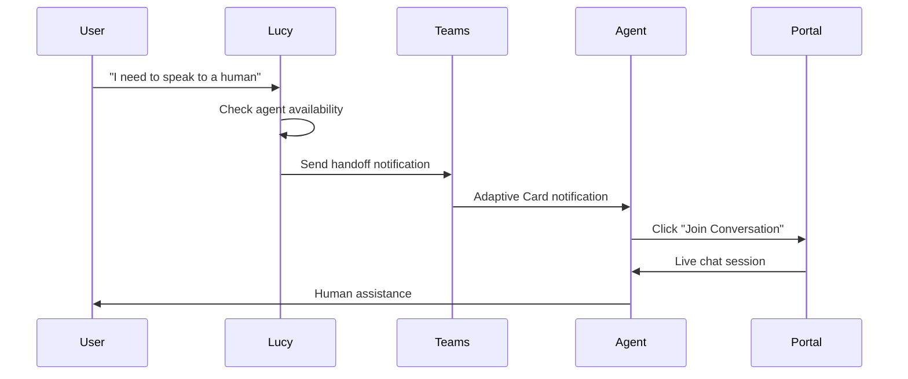
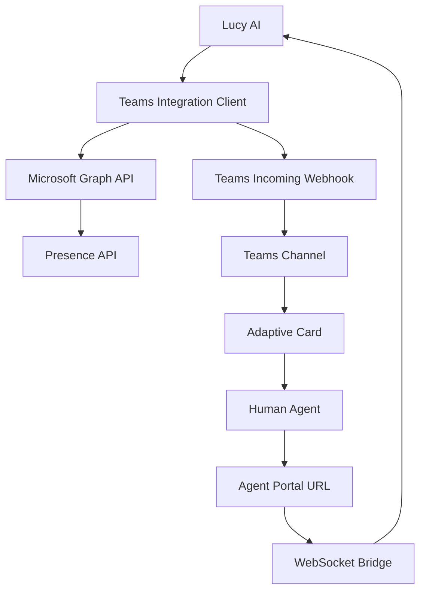

# Microsoft Teams Integration Guide

**Document Version:** 1.0
**Last Updated:** 2026-01-25
**Target Audience:** Integration developers, system administrators
**Status:** Production

---

## Table of Contents

1. [Overview](#overview)
2. [Teams App Setup](#teams-app-setup)
3. [Adaptive Cards](#adaptive-cards)
4. [Notification Flow](#notification-flow)
5. [Teams Integration Code](#teams-integration-code)
6. [Availability Checking](#availability-checking)
7. [Error Handling](#error-handling)
8. [Testing](#testing)
9. [Troubleshooting](#troubleshooting)
10. [Security](#security)
11. [Code Examples](#code-examples)

---

## 1. Overview

### Microsoft Teams Role in Lucy

Lucy integrates with Microsoft Teams to escalate conversations to human agents when AI assistance is insufficient. The integration enables:

- **Agent Availability Checking:** Query Microsoft Graph API for agent presence status
- **Handoff Notifications:** Send Adaptive Cards to notify agents of escalation requests
- **Portal Deep Linking:** Direct agents to live chat sessions via URL
- **Workflow Guidance:** Clear instructions to prevent Teams reply confusion

### When Teams is Used (Escalation)

**Escalation Triggers:**
1. User explicitly requests human assistance
2. Lucy cannot resolve the issue
3. Sensitive situations requiring human judgment
4. Complex cases beyond AI capabilities

**Escalation Workflow:**



### Integration Architecture

**Components:**



**Technology Stack:**
- **Authentication:** OAuth2 Client Credentials (Azure AD)
- **Presence API:** Microsoft Graph API (Presence.Read.All)
- **Notifications:** Incoming Webhook + Adaptive Cards
- **Deep Linking:** Agent Portal HTTPS URLs

---

## 2. Teams App Setup

### 2.1 App Registration

**Step 1: Create Azure AD App**

1. Navigate to Azure Portal → Azure Active Directory → App registrations
2. Click "New registration"
3. Configure:
   - **Name:** `lucy-teams-integration`
   - **Supported account types:** Single tenant
   - **Redirect URI:** None (service principal)
4. Click "Register"

**Step 2: Record Application Details**

- **Application (client) ID:** `<GUID>` → Store as `TEAMS_APP_ID`
- **Directory (tenant) ID:** `<GUID>` → Store as `TEAMS_TENANT_ID`

**Step 3: Create Client Secret**

1. Navigate to "Certificates & secrets" → "Client secrets"
2. Click "New client secret"
3. Configure:
   - **Description:** `lucy-teams-secret-YYYYMMDD`
   - **Expires:** 12 months
4. Click "Add"
5. Copy secret value → Store as `TEAMS_APP_PASSWORD`

### 2.2 Required Permissions

**Microsoft Graph API Permissions:**

1. Navigate to "API permissions" → "Add a permission"
2. Select "Microsoft Graph"
3. Choose "Application permissions" (not Delegated)
4. Add permissions:
   - `Presence.Read.All` - Read presence of all users
   - `User.Read.All` - Read user profiles
5. Click "Add permissions"

**Grant Admin Consent:**

1. Click "Grant admin consent for [tenant]"
2. Confirm in popup
3. Verify "Status" shows green checkmark

**Permission Table:**

| Permission | Type | Description | Required For |
|------------|------|-------------|--------------|
| `Presence.Read.All` | Application | Read all users' presence | Availability checking |
| `User.Read.All` | Application | Read all user profiles | Agent lookup |

**Why Application Permissions:**
- Lucy runs as service (no user context)
- Needs to check presence of all agents
- No interactive login

### 2.3 Webhook Configuration

**Step 1: Create Incoming Webhook in Teams**

1. Navigate to Teams channel (e.g., "Lucy Escalations")
2. Click "..." → "Connectors"
3. Search for "Incoming Webhook"
4. Click "Add" → "Configure"
5. Configure:
   - **Name:** `Lucy AI Escalations`
   - **Upload image:** (Optional) Lucy logo
6. Click "Create"
7. Copy webhook URL → Store as `TEAMS_WEBHOOK_URL`

**Webhook URL Format:**
```
https://outlook.office.com/webhook/<GUID>@<GUID>/IncomingWebhook/<GUID>/<GUID>
```

**Security Considerations:**
- Webhook URL is secret (treat like password)
- Anyone with URL can post to channel
- Use HTTPS only
- Store in Key Vault (not plaintext)

**Step 2: Configure Environment Variables**

```bash
# Teams Configuration
TEAMS_WEBHOOK_URL=<webhook-url-from-step-7>
TEAMS_APP_ID=<client-id>
TEAMS_APP_PASSWORD=<client-secret>
TEAMS_TENANT_ID=<tenant-id>

# Agent Configuration
TEAMS_AGENT_EMAILS=agent1@company.com,agent2@company.com,agent3@company.com
```

---

## 3. Adaptive Cards

### 3.1 Card Structure

Adaptive Cards are JSON-based UI components displayed in Teams:

```json
{
  "@type": "MessageCard",
  "@context": "http://schema.org/extensions",
  "themeColor": "D63384",
  "summary": "Customer Handoff - Member APEX12345",
  "sections": [...],
  "potentialAction": [...]
}
```

**Key Components:**
- **themeColor:** Color accent (hex code)
- **summary:** Notification text
- **sections:** Content blocks
- **potentialAction:** Action buttons

### 3.2 Lucy's Escalation Card

**Handoff Notification Card:**

```json
{
  "@type": "MessageCard",
  "@context": "http://schema.org/extensions",
  "themeColor": "D63384",
  "summary": "🔴 URGENT: Customer Handoff - Member APEX12345",
  "sections": [{
    "activityTitle": "**🚨 CUSTOMER HANDOFF REQUEST**",
    "text": "**IMPORTANT: Do NOT reply in Teams. Use the Agent Portal link below.**",
    "facts": [
      {"name": "👤 Member ID:", "value": "APEX12345"},
      {"name": "📝 Reason:", "value": "User needs help with payment status"},
      {"name": "⏰ Time:", "value": "2026-01-25 10:30 UTC"},
      {"name": "🔗 Conversation ID:", "value": "conv-abc123..."},
      {"name": "📋 Instructions:", "value": "Click 'Join Conversation' below - customer is waiting"}
    ],
    "markdown": true
  }],
  "potentialAction": [
    {
      "@type": "OpenUri",
      "name": "🔴 Join Conversation NOW",
      "targets": [{"os": "default", "uri": "http://portal.apexclassaction.com/agent/conversation/550e8400"}]
    },
    {
      "@type": "OpenUri",
      "name": "📊 View Agent Dashboard",
      "targets": [{"os": "default", "uri": "http://portal.apexclassaction.com/agent/portal"}]
    }
  ]
}
```

### 3.3 Action Buttons

**Join Conversation Button:**

```json
{
  "@type": "OpenUri",
  "name": "🔴 Join Conversation NOW",
  "targets": [
    {
      "os": "default",
      "uri": "http://portal.apexclassaction.com/agent/conversation/<conversation-id>"
    }
  ]
}
```

**Parameters:**
- **conversation_id:** UUID for WebSocket session
- **Portal URL:** Agent portal base URL
- **Deep Link:** Constructed as `{portal_url}/agent/conversation/{conversation_id}`

**Portal URL Construction:**

```python
def build_portal_url(conversation_id: str, portal_base_url: str) -> str:
    return f"{portal_base_url}/agent/conversation/{conversation_id}"

# Example
portal_url = build_portal_url(
    conversation_id="550e8400-e29b-41d4-a716-446655440000",
    portal_base_url="http://portal.apexclassaction.com"
)
# Result: http://portal.apexclassaction.com/agent/conversation/550e8400-e29b-41d4-a716-446655440000
```

**Parameter Passing:**

URL query parameters can be appended:
```
http://portal.apexclassaction.com/agent/conversation/550e8400?apex_id=APEX12345&agent=agent1@company.com
```

---

## 4. Notification Flow

### 4.1 Escalation Trigger

**When Lucy Escalates:**

```python
# From apex.py
if user_wants_human_assistance:
    # Check agent availability
    availability = check_teams_availability_sync()

    if availability["available"]:
        # Send handoff notification
        send_handoff_notification_email_sync(
            conversation_id=conversation_id,
            user_info={
                "apex_id": apex_id,
                "full_name": full_name
            },
            message="User needs help with payment status"
        )
```

### 4.2 Notification Delivery

**Teams Webhook POST:**

```python
async def send_handoff_notification(
    agent_email: str,
    apex_id: str,
    reason: str,
    portal_url: str,
    conversation_id: str
) -> bool:
    if not TEAMS_WEBHOOK_URL:
        logger.error("Teams webhook URL not configured")
        return False

    # Create Adaptive Card
    card = {
        "@type": "MessageCard",
        "@context": "http://schema.org/extensions",
        "themeColor": "D63384",
        "summary": f"🔴 URGENT: Customer Handoff - Member {apex_id}",
        "sections": [{
            "activityTitle": "**🚨 CUSTOMER HANDOFF REQUEST**",
            "text": "**IMPORTANT: Do NOT reply in Teams. Use the Agent Portal link below.**",
            "facts": [
                {"name": "👤 Member ID:", "value": apex_id},
                {"name": "📝 Reason:", "value": reason},
                {"name": "⏰ Time:", "value": datetime.utcnow().strftime("%Y-%m-%d %H:%M UTC")},
                {"name": "🔗 Conversation ID:", "value": conversation_id[:8] + "..."}
            ],
            "markdown": True
        }],
        "potentialAction": [
            {
                "@type": "OpenUri",
                "name": "🔴 Join Conversation NOW",
                "targets": [{"os": "default", "uri": portal_url}]
            }
        ]
    }

    # Send to Teams webhook
    async with aiohttp.ClientSession() as session:
        async with session.post(TEAMS_WEBHOOK_URL, json=card) as response:
            if response.status == 200:
                logger.info(f"Teams notification sent to {agent_email}")
                return True
            else:
                logger.error(f"Failed to send Teams notification: {response.status}")
                return False
```

### 4.3 Agent Response

**Agent Workflow:**

1. **Receive Notification:** Teams desktop/mobile notification
2. **Read Card:** See member ID, reason, conversation ID
3. **Click Button:** "Join Conversation NOW"
4. **Portal Opens:** Browser navigates to `{portal_url}/agent/conversation/{conversation_id}`
5. **WebSocket Connect:** Portal establishes WebSocket to Lucy
6. **Live Chat:** Agent messages routed to user in Lucy

**Important:** Agents must NOT reply in Teams. All communication happens via portal.

---

## 5. Teams Integration Code

### 5.1 teams_integration.py

**File Location:** `/portal/app/teams_integration.py`

**Key Classes:**

```python
class TeamsIntegration:
    def __init__(self):
        self.webhook_url = TEAMS_WEBHOOK_URL
        self.app_id = TEAMS_APP_ID
        self.app_password = TEAMS_APP_PASSWORD
        self.tenant_id = TEAMS_TENANT_ID
        self.access_token = None
        self.token_expiry = None

    async def get_access_token(self) -> Optional[str]:
        """Get Microsoft Graph API access token"""
        # OAuth2 client credentials flow
        # Returns Bearer token for Graph API calls

    async def get_agent_presence(self, user_emails: List[str]) -> Dict[str, str]:
        """Get presence status for multiple users"""
        # Batch request to /users/{email}/presence
        # Returns dict of email -> presence status

    async def find_available_agent(self, agent_emails: List[str]) -> Optional[Tuple[str, str]]:
        """Find first available agent from list"""
        # Checks presence for all agents
        # Returns (email, name) of first available

    async def send_handoff_notification(
        self,
        agent_email: str,
        apex_id: str,
        reason: str,
        portal_url: str,
        conversation_id: str
    ) -> bool:
        """Send Teams notification to specific agent"""
        # Posts Adaptive Card to webhook
        # Returns True if successful
```

### 5.2 Sending Notifications

**Sync Wrapper for Foundry Tools:**

```python
def send_teams_handoff_notification_sync(
    agent_email: str,
    apex_id: str,
    reason: str,
    portal_url: str,
    conversation_id: str
) -> str:
    """Sync wrapper for Foundry compatibility"""
    try:
        loop = asyncio.new_event_loop()
        asyncio.set_event_loop(loop)
        success = loop.run_until_complete(
            teams_integration.send_handoff_notification(
                agent_email, apex_id, reason, portal_url, conversation_id
            )
        )
        loop.close()

        return json.dumps({
            "success": success,
            "message": "Notification sent" if success else "Failed to send notification"
        })

    except Exception as e:
        logger.error(f"Error sending Teams notification: {str(e)}")
        return json.dumps({
            "success": False,
            "error": str(e)
        })
```

---

## 6. Availability Checking

### 6.1 Graph API Integration

**Presence API Endpoint:**

```
GET https://graph.microsoft.com/v1.0/users/{email}/presence
```

**Batch Request (Multiple Users):**

```python
async def get_agent_presence(self, user_emails: List[str]) -> Dict[str, str]:
    token = await self.get_access_token()
    if not token:
        return {}

    headers = {
        "Authorization": f"Bearer {token}",
        "Content-Type": "application/json"
    }

    # Build batch request
    batch_requests = []
    for i, email in enumerate(user_emails):
        batch_requests.append({
            "id": str(i),
            "method": "GET",
            "url": f"/users/{email}/presence"
        })

    batch_data = {"requests": batch_requests}

    # Execute batch
    async with aiohttp.ClientSession() as session:
        async with session.post(
            f"{GRAPH_API_BASE}/$batch",
            headers=headers,
            json=batch_data
        ) as response:
            result = await response.json()

            presence_status = {}
            for resp in result.get("responses", []):
                if resp["status"] == 200:
                    idx = int(resp["id"])
                    email = user_emails[idx]
                    presence = resp["body"]["availability"]
                    presence_status[email] = presence

            return presence_status
```

### 6.2 Availability Logic

**Presence States:**

| State | Meaning | Available for Handoff? |
|-------|---------|------------------------|
| `Available` | At desk, ready | ✅ Yes (priority 1) |
| `AvailableIdle` | At desk, idle | ✅ Yes (priority 2) |
| `Busy` | In meeting/call | ⚠️ Yes (priority 3) |
| `BusyIdle` | Busy but idle | ⚠️ Yes (priority 4) |
| `Away` | Away from desk | ❌ No |
| `BeRightBack` | Briefly away | ❌ No |
| `DoNotDisturb` | Do not disturb | ❌ No |
| `Offline` | Not signed in | ❌ No |

**Finding Available Agent:**

```python
async def find_available_agent(self, agent_emails: List[str]) -> Optional[Tuple[str, str]]:
    if not agent_emails:
        return None

    # Get presence for all agents
    presence_status = await self.get_agent_presence(agent_emails)

    # Priority order
    availability_priority = ["Available", "AvailableIdle", "Busy", "BusyIdle"]

    for status in availability_priority:
        for email in agent_emails:
            if presence_status.get(email) == status:
                name = email.split("@")[0].replace(".", " ").title()
                logger.info(f"Found available agent: {name} ({email}) - Status: {status}")
                return (email, name)

    return None
```

### 6.3 Checking Agent Presence

**Sync Wrapper:**

```python
def check_teams_availability_sync(agent_emails: List[str] = None) -> str:
    """Check Teams availability of agents"""
    try:
        # Default agent list from environment
        if not agent_emails:
            agent_list = os.getenv("TEAMS_AGENT_EMAILS", "").split(",")
            agent_emails = [email.strip() for email in agent_list if email.strip()]

        if not agent_emails:
            return json.dumps({
                "available": False,
                "error": "No agent emails configured"
            })

        # Run async function
        loop = asyncio.new_event_loop()
        asyncio.set_event_loop(loop)
        result = loop.run_until_complete(
            teams_integration.find_available_agent(agent_emails)
        )
        loop.close()

        if result:
            email, name = result
            return json.dumps({
                "available": True,
                "agent_email": email,
                "agent_name": name
            })
        else:
            return json.dumps({
                "available": False,
                "message": "No agents currently available"
            })

    except Exception as e:
        logger.error(f"Error checking Teams availability: {str(e)}")
        return json.dumps({
            "available": False,
            "error": str(e)
        })
```

---

## 7. Error Handling

### 7.1 Webhook Failures

**Network Errors:**

```python
try:
    async with session.post(webhook_url, json=card) as response:
        if response.status == 200:
            return True
        else:
            logger.error(f"Webhook failed: HTTP {response.status}")
            return False
except aiohttp.ClientError as e:
    logger.error(f"Network error sending to Teams: {str(e)}")
    return False
```

**Invalid Card Schema:**

```python
# Validate card before sending
def validate_adaptive_card(card: Dict) -> bool:
    required_fields = ["@type", "@context", "sections"]
    return all(field in card for field in required_fields)

if not validate_adaptive_card(card):
    logger.error("Invalid Adaptive Card schema")
    return False
```

**Teams Service Down:**

```python
# Retry with exponential backoff
from tenacity import retry, stop_after_attempt, wait_exponential

@retry(
    stop=stop_after_attempt(3),
    wait=wait_exponential(multiplier=1, min=2, max=10)
)
async def send_with_retry(webhook_url, card):
    async with aiohttp.ClientSession() as session:
        async with session.post(webhook_url, json=card) as response:
            response.raise_for_status()
            return True
```

### 7.2 Fallback Mechanisms

**Email Fallback:**

```python
async def send_handoff_notification_with_fallback(
    agent_email: str,
    apex_id: str,
    reason: str,
    portal_url: str
) -> bool:
    # Try Teams first
    teams_success = await send_teams_notification(
        agent_email, apex_id, reason, portal_url
    )

    if teams_success:
        return True

    # Fallback to email
    logger.warning("Teams notification failed, falling back to email")

    email_success = await send_email_notification(
        agent_email,
        subject=f"URGENT: Customer Handoff - {apex_id}",
        body=f"Reason: {reason}\nPortal: {portal_url}"
    )

    return email_success
```

### 7.3 Permission Errors

**403 Forbidden (Missing Permissions):**

```python
if response.status == 403:
    error_data = await response.json()
    error_msg = error_data.get('error', {}).get('message', 'Permission denied')

    if 'privilege' in error_msg.lower():
        logger.error(f"Missing permission: {error_msg}")
        logger.error("Required: Presence.Read.All - Run setup_teams_permissions.py")
    else:
        logger.error(f"Permission error: {error_msg}")

    return "PERMISSION_ERROR"
```

---

## 8. Testing

### 8.1 Local Testing

**Test Webhook Delivery:**

```python
import asyncio
import aiohttp

async def test_webhook():
    webhook_url = "https://outlook.office.com/webhook/..."

    card = {
        "@type": "MessageCard",
        "@context": "http://schema.org/extensions",
        "summary": "Test notification",
        "sections": [{
            "activityTitle": "Test",
            "text": "This is a test notification"
        }]
    }

    async with aiohttp.ClientSession() as session:
        async with session.post(webhook_url, json=card) as response:
            print(f"Status: {response.status}")
            print(f"Response: {await response.text()}")

if __name__ == "__main__":
    asyncio.run(test_webhook())
```

**Expected Output:**
```
Status: 200
Response: 1
```

### 8.2 Validating Card Rendering

**Test Card in Teams:**

1. Send test notification via webhook
2. Check Teams channel for card
3. Verify:
   - Card displays correctly
   - Buttons are clickable
   - Links navigate to correct URLs
   - Colors and formatting correct

**Common Issues:**
- JSON syntax errors → Card not displayed
- Invalid URLs → Buttons don't work
- Missing fields → Card incomplete

### 8.3 Action Button Testing

**Test Deep Links:**

```python
# Test portal URL construction
conversation_id = "550e8400-e29b-41d4-a716-446655440000"
portal_base_url = "http://localhost:8001"

portal_url = f"{portal_base_url}/agent/conversation/{conversation_id}"

# Verify URL is valid
import requests
response = requests.get(portal_url)
assert response.status_code == 200
```

### 8.4 Production Testing

**End-to-End Escalation Test:**

1. **User:** Request human assistance in Lucy
2. **Lucy:** Check agent availability
3. **Lucy:** Send Teams notification
4. **Agent:** Receive notification in Teams
5. **Agent:** Click "Join Conversation"
6. **Portal:** WebSocket connects to Lucy
7. **Agent:** Send test message
8. **User:** Receive agent message in Lucy

**Verification:**
- Notification received within 5 seconds
- Portal URL navigates correctly
- WebSocket establishes connection
- Messages route bidirectionally

---

## 9. Troubleshooting

### 9.1 Common Teams Integration Issues

**Symptom:** Webhook returns HTTP 400

**Causes:**
1. Invalid JSON syntax
2. Missing required fields
3. Invalid card schema

**Solution:**
```python
# Validate JSON
import json
try:
    json.dumps(card)
except json.JSONDecodeError as e:
    print(f"Invalid JSON: {e}")

# Validate required fields
assert "@type" in card
assert "@context" in card
assert "sections" in card
```

**Symptom:** Presence API returns 403 Forbidden

**Causes:**
1. Missing `Presence.Read.All` permission
2. Admin consent not granted
3. Wrong token scope

**Solution:**
```bash
# Verify permissions
az ad app permission list --id <TEAMS_APP_ID>

# Grant admin consent
az ad app permission admin-consent --id <TEAMS_APP_ID>
```

**Symptom:** No agents found available

**Causes:**
1. All agents offline/busy
2. Wrong email addresses
3. Presence API timeout

**Solution:**
```python
# Debug presence check
presence = await teams_integration.get_agent_presence([
    "agent1@company.com",
    "agent2@company.com"
])

print(f"Presence status: {presence}")
# Expected: {"agent1@company.com": "Available", ...}
```

### 9.2 Notification Latency

**Symptom:** Notifications delayed >10 seconds

**Diagnosis:**
```python
import time

start = time.time()
success = await send_handoff_notification(...)
latency = time.time() - start

print(f"Notification latency: {latency:.2f}s")
```

**Causes:**
1. Network latency
2. Teams service slow
3. Webhook rate limit

**Solution:**
- Check network connectivity
- Retry with timeout
- Use async/await properly

---

## 10. Security

### 10.1 Webhook URL Protection

**Treat as Secret:**
```python
# Store in Key Vault
az keyvault secret set \
  --vault-name lucy-keyvault \
  --name teams-webhook-url \
  --value "<webhook-url>"

# Reference in Container App
az containerapp update \
  -g agent-lucy-eus2 \
  -n agent-lucy-eus2 \
  --set-env-vars TEAMS_WEBHOOK_URL=secretref:teams-webhook-url
```

**Never Log Webhook URL:**
```python
# Bad
logger.info(f"Sending to webhook: {webhook_url}")

# Good
logger.info("Sending Teams notification")
```

### 10.2 Card Content Sanitization

**Prevent Injection:**

```python
def sanitize_card_content(text: str) -> str:
    """Sanitize text for Adaptive Card"""
    # Escape markdown special characters
    text = text.replace("*", "\\*")
    text = text.replace("_", "\\_")
    text = text.replace("`", "\\`")

    # Remove potential XSS
    text = re.sub(r'<script.*?</script>', '', text, flags=re.DOTALL)

    return text

# Usage
reason = sanitize_card_content(user_input_reason)
```

### 10.3 Access Control

**Restrict Webhook Access:**
- Only Lucy should have webhook URL
- Webhook URL stored in Key Vault
- No public access to webhook endpoint

**Agent Portal Authentication:**
- Agents must authenticate to portal
- Portal validates agent email
- Session tokens for WebSocket

---

## 11. Code Examples

### 11.1 Complete Handoff Example

```python
import asyncio
import aiohttp
from datetime import datetime
import logging

logger = logging.getLogger(__name__)

class TeamsHandoff:
    def __init__(self, webhook_url: str):
        self.webhook_url = webhook_url

    async def send_handoff_notification(
        self,
        agent_email: str,
        apex_id: str,
        reason: str,
        portal_url: str,
        conversation_id: str
    ) -> bool:
        """Send Teams notification for handoff"""

        card = {
            "@type": "MessageCard",
            "@context": "http://schema.org/extensions",
            "themeColor": "D63384",
            "summary": f"Customer Handoff - {apex_id}",
            "sections": [{
                "activityTitle": "**🚨 CUSTOMER HANDOFF REQUEST**",
                "text": "**IMPORTANT: Do NOT reply in Teams. Use the Agent Portal link below.**",
                "facts": [
                    {"name": "👤 Member ID:", "value": apex_id},
                    {"name": "📝 Reason:", "value": reason},
                    {"name": "⏰ Time:", "value": datetime.utcnow().strftime("%Y-%m-%d %H:%M UTC")},
                    {"name": "🔗 Conversation ID:", "value": conversation_id[:8] + "..."}
                ],
                "markdown": True
            }],
            "potentialAction": [
                {
                    "@type": "OpenUri",
                    "name": "🔴 Join Conversation NOW",
                    "targets": [{"os": "default", "uri": portal_url}]
                }
            ]
        }

        try:
            async with aiohttp.ClientSession() as session:
                async with session.post(self.webhook_url, json=card) as response:
                    if response.status == 200:
                        logger.info(f"Teams notification sent to {agent_email}")
                        return True
                    else:
                        logger.error(f"Failed to send Teams notification: {response.status}")
                        return False
        except Exception as e:
            logger.error(f"Error sending Teams notification: {str(e)}")
            return False

# Usage
async def main():
    handoff = TeamsHandoff(webhook_url="https://outlook.office.com/webhook/...")

    success = await handoff.send_handoff_notification(
        agent_email="agent1@company.com",
        apex_id="APEX12345",
        reason="User needs help with payment status",
        portal_url="http://portal.apexclassaction.com/agent/conversation/550e8400",
        conversation_id="550e8400-e29b-41d4-a716-446655440000"
    )

    print(f"Notification sent: {success}")

if __name__ == "__main__":
    asyncio.run(main())
```

### 11.2 Availability Check Example

```python
import aiohttp
from typing import List, Dict, Optional

GRAPH_API_BASE = "https://graph.microsoft.com/v1.0"

class TeamsAvailability:
    def __init__(self, access_token: str):
        self.access_token = access_token

    async def get_agent_presence(self, user_emails: List[str]) -> Dict[str, str]:
        """Get presence status for multiple users"""

        headers = {
            "Authorization": f"Bearer {self.access_token}",
            "Content-Type": "application/json"
        }

        # Build batch request
        batch_requests = []
        for i, email in enumerate(user_emails):
            batch_requests.append({
                "id": str(i),
                "method": "GET",
                "url": f"/users/{email}/presence"
            })

        batch_data = {"requests": batch_requests}

        async with aiohttp.ClientSession() as session:
            async with session.post(
                f"{GRAPH_API_BASE}/$batch",
                headers=headers,
                json=batch_data
            ) as response:
                result = await response.json()

                presence_status = {}
                for resp in result.get("responses", []):
                    if resp["status"] == 200:
                        idx = int(resp["id"])
                        email = user_emails[idx]
                        presence = resp["body"]["availability"]
                        presence_status[email] = presence

                return presence_status

    async def find_available_agent(self, agent_emails: List[str]) -> Optional[tuple]:
        """Find first available agent"""

        presence_status = await self.get_agent_presence(agent_emails)

        availability_priority = ["Available", "AvailableIdle", "Busy", "BusyIdle"]

        for status in availability_priority:
            for email in agent_emails:
                if presence_status.get(email) == status:
                    name = email.split("@")[0].replace(".", " ").title()
                    return (email, name)

        return None

# Usage
async def main():
    # Get access token first (OAuth2 flow)
    access_token = await get_graph_access_token()

    availability = TeamsAvailability(access_token)

    agent_emails = [
        "agent1@company.com",
        "agent2@company.com",
        "agent3@company.com"
    ]

    result = await availability.find_available_agent(agent_emails)

    if result:
        email, name = result
        print(f"Available agent: {name} ({email})")
    else:
        print("No agents available")

if __name__ == "__main__":
    asyncio.run(main())
```

---

**End of Microsoft Teams Integration Guide**

**Related Documentation:**
- [Dynamics 365 Integration Guide](./dynamics365-integration.md)
- [Azure Search Integration Guide](./azure-search-integration.md)
- [Custom Tools Reference](../developer/custom-tools-reference.md)
- [Architecture Overview](../architecture/architecture-overview.md)
