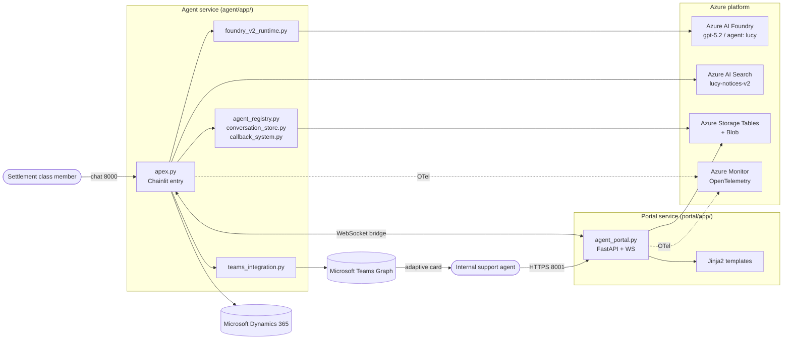
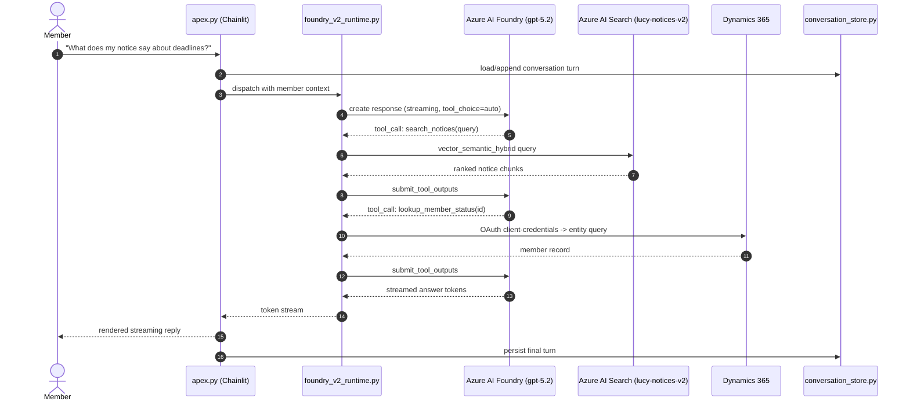
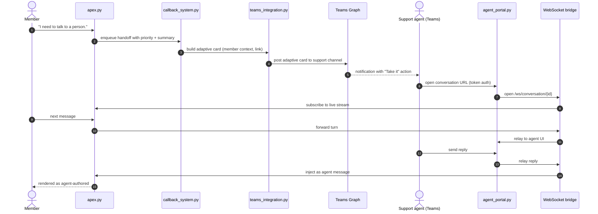

# System Architecture (Condensed)

This is the *condensed* tour of Lucy's architecture, anchored in three Mermaid diagrams. The full deep-dive — including failure modes, scaling notes, and historical decisions — lives in [`docs/architecture/architecture-overview.md`](architecture/architecture-overview.md). When this document and the deep-dive disagree, trust the deep-dive.

---

## Synopsis

Lucy is a two-service Python system: a Chainlit-based **agent** that talks to settlement-class members and a FastAPI **portal** that lets internal support agents take over conversations when escalation is required. The agent grounds responses in Azure AI Search over the curated `lucy-notices-v2` notice corpus and looks up class-member status in Microsoft Dynamics 365. Conversations, agent registrations, and callbacks persist in Azure Storage Tables (with an in-memory fallback). Handoff travels through a Microsoft Teams adaptive card on the agent side and a WebSocket bridge on the portal side. Everything emits OpenTelemetry traces and metrics into Azure Monitor.

---

## Component relationship diagram

The agent is the only component that talks to Foundry, Search, and D365. The portal reads shared state through Azure Tables and joins live conversations through the WebSocket bridge.

---

## Request / data flow — typical member query

The exact tool surface and retrieval ranking strategy live in [`docs/architecture/foundry-v2-implementation.md`](architecture/foundry-v2-implementation.md) and [`docs/architecture/rag-search-architecture.md`](architecture/rag-search-architecture.md).

---

## Escalation / human-handoff sequence

The bidirectional bridge is the contract that keeps the member and the human agent on the same conversation. Detailed lifecycle and reconnection rules live in [`docs/architecture/human-escalation-architecture.md`](architecture/human-escalation-architecture.md).

---

## Storage & state model

| Store | Backed by | Purpose | Fallback |
|---|---|---|---|
| Agent registry | Azure Storage Tables (`agent_registry.py`) | Tracks active support-agent registrations and Teams identities | In-memory dict |
| Conversation store | Azure Storage Tables (`conversation_store.py`) | Persists turns, status, and member context per conversation | In-memory dict |
| Callback queue | Azure Storage Tables (`callback_system.py`) | Priority-ordered queue with AI summarization | In-memory list |
| Notice corpus | Azure AI Search index `lucy-notices-v2` | Source of grounded retrieval; vector + semantic hybrid | None — required |
| Artifacts | Azure Blob Storage | Notice PDFs and OCR outputs | None — required |

The in-memory fallback exists so the service can boot without Azure Tables (useful for local development and degraded-mode operation), but in production all three stores expect Tables to be reachable.

---

## Observability path

- Both services initialize `azure-monitor-opentelemetry` through `tracing_config.py` at startup.
- Spans wrap Foundry calls, retrieval calls, D365 calls, Teams Graph calls, and WebSocket lifecycle events.
- Custom metrics from `real_metrics_system.py` capture queue depth, callback wait times, tool-call counts, and per-conversation token usage.
- Logs and traces converge in Azure Monitor / Application Insights; queries against the trace tree should follow span names emitted by the runtime modules.

---

## Configuration surface

The agent and portal each ship a `.env.example` that enumerates the contract:

- `agent/app/.env.example` — Foundry endpoint, model deployment (`gpt-5.2`), agent name (`lucy`), `USE_FOUNDRY_V2`, Responses API toggles, Search index name, search query type, D365 resource URL, Teams webhook URL, portal-enabled flag, Azure Storage connection string.
- `portal/app/.env.example` — portal port (`8001`), portal API token, debug-endpoint flag, Teams app credentials, support-agent emails, D365 OAuth credentials, Azure Search settings, Storage account/container/key, search top-K, log level.

Production never reads `.env` directly — secrets come from Azure Container Apps secrets or Key Vault references.

---

## See also

- [`docs/architecture/architecture-overview.md`](architecture/architecture-overview.md) — full architecture deep-dive
- [`docs/architecture/foundry-v2-implementation.md`](architecture/foundry-v2-implementation.md) — Foundry v2 runtime detail
- [`docs/architecture/rag-search-architecture.md`](architecture/rag-search-architecture.md) — RAG, hybrid search, OCR, scale
- [`docs/architecture/human-escalation-architecture.md`](architecture/human-escalation-architecture.md) — full handoff lifecycle
- [`docs/architecture/authentication-architecture.md`](architecture/authentication-architecture.md) — member auth + D365 + caching
- [`docs/architecture/foundry-v2-registration-reset-2026-04-17.md`](architecture/foundry-v2-registration-reset-2026-04-17.md) — runtime ops rules
- [`docs/integrations/azure-search-integration.md`](integrations/azure-search-integration.md)
- [`docs/integrations/dynamics365-integration.md`](integrations/dynamics365-integration.md)
- [`docs/integrations/teams-integration.md`](integrations/teams-integration.md)
- [`docs/portal-guide/portal-user-guide.md`](portal-guide/portal-user-guide.md)
- [`docs/project-overview-pdr.md`](project-overview-pdr.md)
- [`docs/codebase-summary.md`](codebase-summary.md)
- [`docs/code-standards.md`](code-standards.md)
